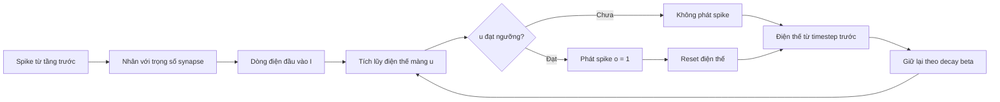
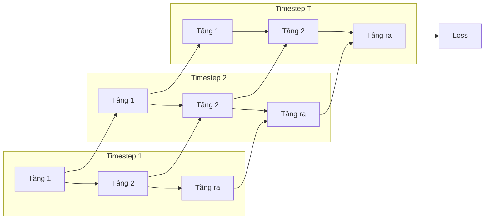
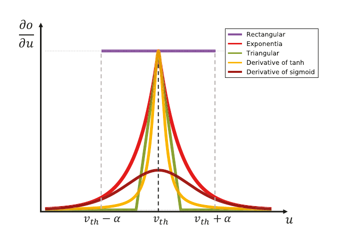
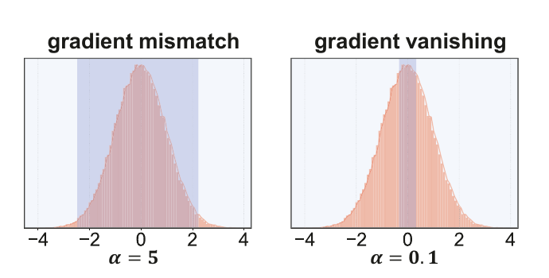
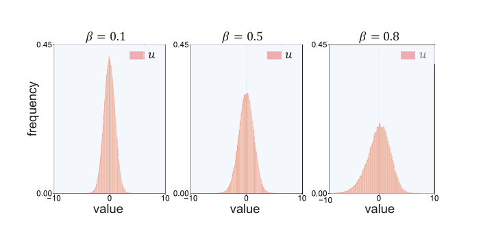
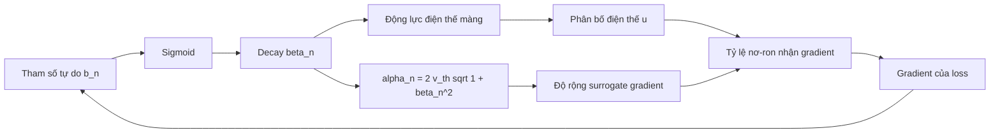
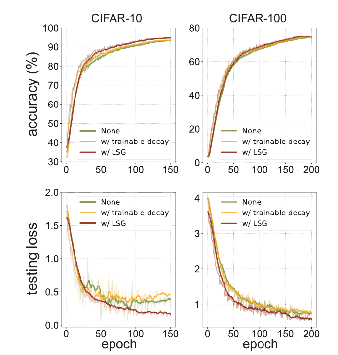
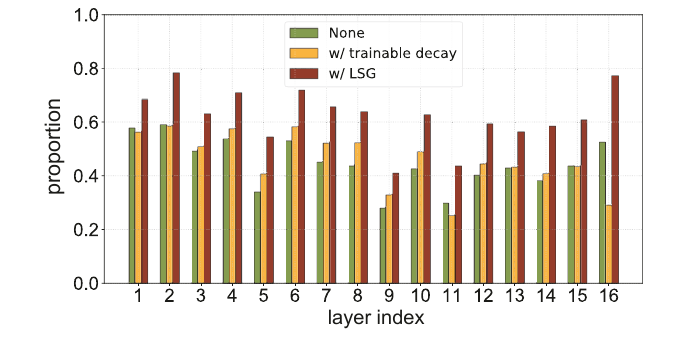
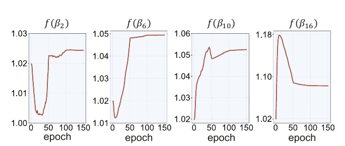
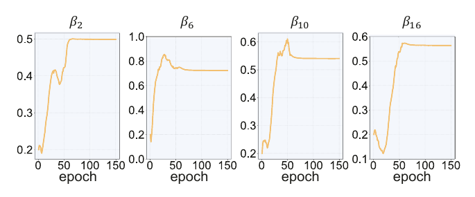

# BÁO CÁO PAPER 2: LEARNABLE SURROGATE GRADIENT CHO HUẤN LUYỆN TRỰC TIẾP MẠNG NƠ-RON XUNG

> **Paper:** *Learnable Surrogate Gradient for Direct Training Spiking Neural Networks*  
> **Tác giả:** Shuang Lian, Jiangrong Shen, Qianhui Liu, Ziming Wang, Rui Yan và Huajin Tang  
> **Công bố:** Proceedings of the Thirty-Second International Joint Conference on Artificial Intelligence (IJCAI 2023), trang 3002-3010  
> **Mục tiêu báo cáo:** Giải thích paper theo lộ trình dành cho người mới, từ nguyên lý SNN và surrogate gradient đến phương pháp Learnable Surrogate Gradient (LSG), thí nghiệm, đóng góp và giới hạn.

---

## Mục lục

1. [Paper này đang nghiên cứu điều gì?](#1-paper-này-đang-nghiên-cứu-điều-gì)
2. [Kiến thức nền: từ ANN đến SNN](#2-kiến-thức-nền-từ-ann-đến-snn)
3. [Nơ-ron LIF và động lực điện thế màng](#3-nơ-ron-lif-và-động-lực-điện-thế-màng)
4. [Huấn luyện trực tiếp SNN](#4-huấn-luyện-trực-tiếp-snn)
5. [Vì sao hàm spike gây khó khăn cho backpropagation?](#5-vì-sao-hàm-spike-gây-khó-khăn-cho-backpropagation)
6. [Surrogate gradient: giải pháp và giới hạn](#6-surrogate-gradient-giải-pháp-và-giới-hạn)
7. [Động cơ của paper: độ rộng SG không nên cố định](#7-động-cơ-của-paper-độ-rộng-sg-không-nên-cố-định)
8. [Phương pháp Learnable Surrogate Gradient](#8-phương-pháp-learnable-surrogate-gradient)
9. [Quy trình huấn luyện hoàn chỉnh](#9-quy-trình-huấn-luyện-hoàn-chỉnh)
10. [Thiết kế thí nghiệm](#10-thiết-kế-thí-nghiệm)
11. [Kết quả và cách diễn giải](#11-kết-quả-và-cách-diễn-giải)
12. [Đóng góp, chi phí và hạn chế](#12-đóng-góp-chi-phí-và-hạn-chế)
13. [Câu hỏi thảo luận cho nhóm nghiên cứu](#13-câu-hỏi-thảo-luận-cho-nhóm-nghiên-cứu)
14. [Kết luận](#14-kết-luận)
15. [Thuật ngữ và ký hiệu](#15-thuật-ngữ-và-ký-hiệu)

---

## 1. Paper này đang nghiên cứu điều gì?

Spiking Neural Network (SNN) là một loại mạng nơ-ron mô phỏng gần hơn cách hệ thần kinh sinh học truyền thông tin. Thay vì liên tục truyền các số thực như mạng nơ-ron nhân tạo thông thường (ANN), nơ-ron trong SNN phát các sự kiện nhị phân gọi là **spike** theo thời gian.

Đặc điểm này đem lại hai triển vọng:

- **Tính thưa theo sự kiện:** khi không có spike, phần cứng hướng sự kiện có thể không cần thực hiện phép tính tương ứng.
- **Xử lý thông tin thời gian:** thời điểm phát spike và quá trình tích lũy điện thế màng có thể mang thông tin, phù hợp với dữ liệu camera sự kiện hoặc cảm biến thần kinh.

Tuy nhiên, spike được sinh ra bởi một hàm bước rời rạc. Hàm này gần như không có đạo hàm sử dụng được, trong khi backpropagation cần đạo hàm để cập nhật trọng số. Một cách phổ biến là giữ hàm spike trong lượt truyền xuôi nhưng thay đạo hàm của nó trong lượt truyền ngược bằng **surrogate gradient (SG)**.

Paper tập trung vào một chi tiết tưởng nhỏ nhưng có ảnh hưởng lớn: **độ rộng của vùng surrogate gradient**. Các phương pháp trước thường đặt độ rộng này thành một siêu tham số cố định. Tác giả chỉ ra rằng:

- SG quá hẹp làm nhiều nơ-ron không nhận được gradient, dẫn đến **gradient vanishing**.
- SG quá rộng cấp gradient cho cả những nơ-ron ở rất xa ngưỡng phát spike, dẫn đến **gradient mismatch**.
- Phân bố điện thế màng khác nhau giữa các tầng và thay đổi trong quá trình học, nên một độ rộng cố định khó phù hợp ở mọi nơi.

Giải pháp được đề xuất là **Learnable Surrogate Gradient (LSG)**: học hệ số suy giảm điện thế màng của từng tầng và dùng hệ số đó để tự điều chỉnh độ rộng SG.

### 1.1 Câu hỏi nghiên cứu

Có thể phát biểu câu hỏi trung tâm của paper như sau:

> Làm thế nào để độ rộng surrogate gradient thích nghi với động lực điện thế màng của từng tầng, qua đó duy trì đường truyền gradient mà không làm sai lệch quá mức gradient xấp xỉ?

### 1.2 Kết luận ngắn của paper

Theo kết quả được báo cáo, LSG:

- tăng tỷ lệ nơ-ron nằm trong vùng có gradient, nhất là ở các tầng sâu;
- hội tụ tốt hơn so với SG cố định và trường hợp chỉ học decay factor;
- đạt độ chính xác cạnh tranh trên CIFAR-10, CIFAR-100 và CIFAR-DVS với số timestep thấp;
- chỉ bổ sung một tham số decay theo tầng thay vì một hệ tham số lớn theo từng nơ-ron.

---

## 2. Kiến thức nền: từ ANN đến SNN

### 2.1 Nơ-ron trong ANN

Một nơ-ron ANN điển hình tính tổng có trọng số rồi đưa kết quả qua hàm kích hoạt:

$$
z_i = \sum_j w_{ij}x_j + b_i, \qquad y_i = \phi(z_i).
$$

Với các hàm như ReLU, sigmoid hoặc tanh, đầu ra thường là số thực. Trong huấn luyện, đạo hàm $\partial y_i/\partial z_i$ được dùng để lan truyền sai số về phía trước của mạng.

### 2.2 Nơ-ron trong SNN

SNN thêm chiều thời gian. Tại mỗi timestep, nơ-ron:

1. nhận spike từ tầng trước;
2. biến spike thành dòng điện đầu vào qua trọng số synapse;
3. cộng dòng điện vào điện thế màng đang có;
4. làm rò một phần điện thế cũ;
5. so sánh điện thế mới với ngưỡng;
6. phát spike nếu vượt ngưỡng và thực hiện reset.



### 2.3 Khác biệt quan trọng

| Khía cạnh | ANN thông thường | SNN |
|---|---|---|
| Tín hiệu | Giá trị thực liên tục | Spike nhị phân theo thời gian |
| Trạng thái nội tại | Thường không có ở lớp feed-forward | Có điện thế màng được duy trì qua timestep |
| Hàm kích hoạt | Thường có đạo hàm hoặc đạo hàm từng đoạn | Hàm bước không khả vi tại ngưỡng |
| Tính toán | Thường thực hiện ở mọi phần tử | Có tiềm năng hướng sự kiện và thưa |
| Huấn luyện | Backpropagation chuẩn | Cần surrogate gradient hoặc phương pháp khác |
| Số bước xử lý một mẫu | Thường một lượt theo tầng | Nhiều timestep |

Lưu ý rằng tiềm năng tiết kiệm năng lượng chủ yếu xuất hiện khi inference được thực hiện trên phần cứng có khả năng khai thác spike thưa. Việc mô phỏng và huấn luyện SNN bằng BPTT trên GPU không tự động tiết kiệm năng lượng.

---

## 3. Nơ-ron LIF và động lực điện thế màng

Paper sử dụng nơ-ron **iterative Leaky Integrate-and-Fire (LIF)** làm đơn vị tính toán cơ bản.

### 3.1 Dòng điện đầu vào

Với nơ-ron thứ $i$ ở tầng $n+1$ và timestep $t+1$:

$$
I_i^{n+1,t+1}=\sum_{j=1}^{L^{(n)}}w_{ij}^{n}o_j^{n,t+1}.
$$

Trong đó:

- $o_j^{n,t+1}\in\{0,1\}$ là spike của nơ-ron tiền synapse;
- $w_{ij}^{n}$ là trọng số kết nối;
- $I_i^{n+1,t+1}$ là tổng dòng điện nhận được.

### 3.2 Cập nhật điện thế màng

$$
u_i^{n+1,t+1}
=
\beta u_i^{n+1,t}(1-o_i^{n+1,t})
+I_i^{n+1,t+1}.
$$

Ba thành phần quan trọng là:

- $\beta u_t$: phần điện thế cũ được giữ lại;
- $(1-o_t)$: nếu timestep trước đã phát spike thì phần điện thế cũ bị reset;
- $I_{t+1}$: tín hiệu mới được tích lũy.

### 3.3 Sinh spike

$$
o_i^{n+1,t+1}=\Theta(u_i^{n+1,t+1}-v_{th}),
$$

với:

$$
\Theta(x)=
\begin{cases}
0, & x<0,\\
1, & x\ge 0.
\end{cases}
$$

### 3.4 Ví dụ số nhỏ

Giả sử $v_{th}=1$, $\beta=0.8$ và điện thế ban đầu bằng 0:

| Timestep | Đầu vào $I_t$ | Cách tính | $u_t$ trước khi xét ngưỡng | Spike |
|---:|---:|---|---:|---:|
| 1 | 0,40 | $0.8\times0+0.40$ | 0,40 | 0 |
| 2 | 0,50 | $0.8\times0.40+0.50$ | 0,82 | 0 |
| 3 | 0,40 | $0.8\times0.82+0.40$ | 1,056 | 1 |
| 4 | 0,25 | Do timestep 3 đã spike nên phần cũ bị reset | 0,25 | 0 |

Spike tại timestep 3 không chỉ do đầu vào 0,40 ở timestep đó. Nó còn phụ thuộc vào lượng điện thế được tích lũy từ hai timestep trước. Vì vậy, lỗi ở hiện tại có thể liên quan đến tín hiệu xảy ra từ nhiều thời điểm trước.

### 3.5 Ý nghĩa của decay factor $\beta$

- $\beta$ nhỏ: nơ-ron quên nhanh, phụ thuộc nhiều vào đầu vào gần nhất.
- $\beta$ lớn: nơ-ron giữ lịch sử lâu hơn và tích lũy tín hiệu qua nhiều timestep.

$\beta$ do đó vừa điều khiển khả năng ghi nhớ thời gian, vừa ảnh hưởng đến độ phân tán của điện thế màng. Mối quan hệ thứ hai là điểm paper sử dụng để xây dựng LSG.

---

## 4. Huấn luyện trực tiếp SNN

### 4.1 Hai hướng huấn luyện phổ biến

**ANN-to-SNN conversion** huấn luyện ANN trước rồi ánh xạ activation của ANN sang firing rate của SNN. Cách này tránh phải đạo hàm trực tiếp qua hàm spike, nhưng thường cần nhiều timestep để firing rate xấp xỉ activation của ANN. Paper nhận xét điều này làm tăng latency và energy consumption khi inference.

**Direct training** dùng SNN ngay trong forward pass và tối ưu trọng số của nó bằng backpropagation. Cách này khai thác được temporal dynamics và có thể đạt latency thấp, nhưng phải xử lý tính không khả vi của spike.

### 4.2 SNN được trải theo thời gian

Trong direct training, có thể xem mỗi trạng thái $(n,t)$ là một nút trong lưới hai chiều:

- chiều dọc: lan truyền giữa các tầng;
- chiều ngang: lan truyền trạng thái giữa các timestep.



Paper sử dụng spatial-temporal backpropagation. Gradient phải đi ngược qua cả chiều không gian và chiều thời gian. Điều này làm SNN nhạy với gradient vanishing hoặc exploding hơn một mạng feed-forward nông.

### 4.3 Đầu ra và loss trong paper

Tầng cuối không phát spike như các tầng ẩn. Paper tích lũy đầu ra từ tầng trước trong toàn bộ $T$ timestep:

$$
u_i=\frac{1}{T}\sum_{t=1}^{T}\sum_{j=1}^{L^{(N-1)}}w_{ij}^{n}o_j^{n,t},
\qquad i\in\{1,\ldots,c\},
$$

trong đó $c$ là số lớp phân loại. Sau đó áp dụng softmax và cross-entropy:

$$
p_i=\frac{e^{u_i}}{\sum_{j=1}^{c}e^{u_j}},
\qquad
\mathcal{L}=-\sum_{i=1}^{c}y_i\log p_i.
$$

---

## 5. Vì sao hàm spike gây khó khăn cho backpropagation?

Backpropagation cần tính đạo hàm của loss theo trọng số:

$$
\frac{\partial \mathcal{L}}{\partial w}
=
\frac{\partial \mathcal{L}}{\partial o}
\frac{\partial o}{\partial u}
\frac{\partial u}{\partial w}.
$$

Vấn đề nằm ở $\partial o/\partial u$. Vì $o=\Theta(u-v_{th})$ nên:

- đạo hàm bằng 0 ở gần như mọi $u$;
- đạo hàm không xác định tại đúng $u=v_{th}$.

Nếu sử dụng đạo hàm thật bằng 0, gradient theo trọng số cũng bằng 0 và mạng không học được.

### 5.1 Cách nhìn qua bề mặt loss

Giả sử tăng một trọng số rất nhỏ:

- nếu điện thế vẫn nằm dưới ngưỡng, spike vẫn bằng 0;
- nếu điện thế vẫn nằm trên ngưỡng, spike vẫn bằng 1;
- chỉ khi thay đổi làm điện thế vượt qua ngưỡng thì spike mới đổi đột ngột.

Do đó, đầu ra theo trọng số có dạng bậc thang: nhiều vùng phẳng xen kẽ các điểm nhảy. Gradient descent lại cần tín hiệu thay đổi cục bộ để biết nên tăng hay giảm trọng số.

### 5.2 Credit assignment theo thời gian

Một spike hiện tại có thể do nhiều input trước đó tích lũy lại. Khi dự đoán sai, thuật toán phải trả lời đồng thời:

- tầng nào chịu trách nhiệm;
- nơ-ron nào chịu trách nhiệm;
- spike ở timestep nào chịu trách nhiệm;
- nên thay đổi trọng số hay động lực điện thế màng.

Hàm spike rời rạc làm đường truyền tín hiệu trách nhiệm này bị chặn.

---

## 6. Surrogate gradient: giải pháp và giới hạn

### 6.1 Nguyên tắc forward thật, backward xấp xỉ

Surrogate gradient sử dụng hai phép toán khác nhau:

- **Forward:** vẫn dùng spike nhị phân thật $o=\Theta(u-v_{th})$.
- **Backward:** thay đạo hàm thật bằng một hàm xấp xỉ $h(u)$.

$$
\frac{\partial o}{\partial u}\approx h(u).
$$

Điều này không làm hàm spike thật sự khả vi. Nó tạo ra một hướng cập nhật hữu ích để optimizer có thể làm việc.

### 6.2 Các dạng surrogate gradient



*Hình 1. Các dạng SG phổ biến: rectangular, exponential, triangular, đạo hàm tanh và đạo hàm sigmoid. Nguồn: Figure 1 của paper.*

Paper nhận xét SNN tương đối robust với **hình dạng** SG, nhưng các tham số điều khiển độ rộng hoặc độ sắc của SG có ảnh hưởng quan trọng, nhất là khi huấn luyện mạng sâu.

### 6.3 Rectangular surrogate gradient

Paper tập trung vào dạng chữ nhật:

$$
h(u_i^{n,t})
=
\frac{1}{\alpha}
\operatorname{sign}
\left(
|u_i^{n,t}-v_{th}|<\frac{\alpha}{2}
\right).
$$

Trong ngữ cảnh công thức này, biểu thức `sign(điều kiện)` đóng vai trò indicator: bằng 1 nếu điều kiện đúng và bằng 0 nếu sai. Vì vậy:

$$
h(u)=
\begin{cases}
1/\alpha, & |u-v_{th}|<\alpha/2,\\
0, & \text{ngược lại.}
\end{cases}
$$

Khoảng có gradient là:

$$
\left[v_{th}-\frac{\alpha}{2},\;v_{th}+\frac{\alpha}{2}\right].
$$

### 6.4 Ví dụ về độ rộng

Giả sử $v_{th}=1$:

| $\alpha$ | Vùng có gradient | Ý nghĩa |
|---:|---|---|
| 0,1 | $[0,95;1,05]$ | Rất chính xác quanh ngưỡng nhưng phần lớn nơ-ron có thể không nhận gradient |
| 1,0 | $[0,5;1,5]$ | Thỏa hiệp rộng hơn |
| 5,0 | $[-1,5;3,5]$ | Nhiều trạng thái rất xa ngưỡng vẫn nhận gradient |

### 6.5 Gradient vanishing khi SG quá hẹp

Nếu chỉ một tỷ lệ nhỏ điện thế màng nằm trong vùng SG, phần lớn $h(u)$ bằng 0. Khi gradient phải đi qua nhiều tầng và timestep, việc liên tục nhân với các Jacobian nhỏ hoặc bằng 0 làm tín hiệu giảm nhanh.

Ví dụ, nếu tại bốn tầng liên tiếp chỉ còn hệ số hiệu dụng khoảng 0,1:

$$
0.1^4=0.0001.
$$

Các tầng đầu gần như không nhận được tín hiệu học. Trong SNN, reset sau spike và quá trình lan truyền qua thời gian làm vấn đề phức tạp hơn.

### 6.6 Gradient mismatch khi SG quá rộng

Giả sử $v_{th}=1$:

- nơ-ron A có $u=0.99$, chỉ cần thay đổi nhỏ là có thể đổi quyết định phát spike;
- nơ-ron B có $u=0.10$, thay đổi nhỏ gần như không thể làm nó vượt ngưỡng.

Nếu SG quá rộng và cấp gradient cho cả A lẫn B, backward pass hành xử như thể cả hai đều nhạy với một thay đổi nhỏ. Điều này không khớp với forward pass thực tế, nơi spike của B gần như chắc chắn không đổi. Kết quả là trọng số có thể được cập nhật theo tín hiệu xấp xỉ kém chính xác.



*Hình 2. Vùng tô xanh là khoảng có gradient. Bên trái, khoảng quá rộng gây mismatch; bên phải, khoảng quá hẹp bỏ sót phần lớn phân bố điện thế và gây vanishing. Nguồn: Figure 2 của paper.*

### 6.7 Vì sao không tồn tại một $\alpha$ cố định tốt cho mọi tầng?

Phân bố $u$ phụ thuộc vào trọng số, input, firing rate, lịch sử thời gian và decay factor. Các đại lượng này khác nhau giữa các tầng và tiếp tục thay đổi trong khi học. Vì vậy, một độ rộng được chọn trước có thể:

- vừa đủ ở tầng nông nhưng quá hẹp ở tầng sâu;
- phù hợp đầu quá trình học nhưng không phù hợp sau khi trọng số thay đổi;
- phù hợp một dataset nhưng không phù hợp dataset khác.

Đây là động cơ trực tiếp để tác giả thiết kế LSG.

---

## 7. Động cơ của paper: độ rộng SG không nên cố định

### 7.1 Vai trò của threshold-dependent Batch Normalization

Batch Normalization chuẩn được thiết kế chủ yếu cho dữ liệu không gian của ANN. Paper sử dụng threshold-dependent Batch Normalization (tdBN) từ công trình trước để chuẩn hóa đầu vào tiền synapse trong cả miền không gian và thời gian.

Với feature map thứ $k$:

$$
\hat I_k=\frac{\eta v_{th}(I_k-E[I_k])}{\sqrt{\operatorname{var}[I_k]+\epsilon}},
\qquad
\bar I_k=\gamma\hat I_k+\mu.
$$

Trong đó $\gamma$ và $\mu$ học được, còn $\eta$ là siêu tham số giúp tránh over-firing hoặc under-firing. Phân tích của paper giả định đầu vào sau chuẩn hóa gần phân bố:

$$
I\sim\mathcal N(0,v_{th}^2).
$$

### 7.2 Định lý 1: decay ảnh hưởng đến phân bố điện thế màng

Với LIF lặp và giả định đầu vào ở trên, paper phát biểu:

$$
u\sim\mathcal N(0,\sigma_{mem}^2),
$$

$$
\sigma_{mem}^2=g(\beta)v_{th}^2,
\qquad
g(\beta)\approx1+\beta^2.
$$

Điểm cần nhớ không phải là phân bố luôn Gaussian hoàn hảo, mà là quan hệ mà tác giả muốn khai thác:

> Khi $\beta$ tăng, nơ-ron giữ nhiều điện thế cũ hơn; phân bố điện thế màng có xu hướng rộng hơn.



*Hình 3. Với cùng phân bố đầu vào, tăng $\beta$ từ 0,1 lên 0,8 làm phân bố điện thế màng rộng hơn. Nguồn: Figure 3 của paper.*

### 7.3 Ví dụ trực giác

Xét hai nơ-ron nhận cùng chuỗi input:

- Nơ-ron A có $\beta=0.1$: gần như quên điện thế cũ sau mỗi timestep; $u$ chủ yếu phản ánh input mới.
- Nơ-ron B có $\beta=0.8$: giữ lại phần lớn lịch sử; nhiều input có thể cộng dồn hoặc triệt tiêu nhau, làm miền giá trị $u$ rộng hơn.

Nếu vẫn dùng cùng vùng SG hẹp cho cả hai, xác suất nơ-ron B nằm ngoài vùng có gradient sẽ cao hơn. Do đó, tác giả đề xuất ràng buộc $\alpha$ theo $\beta$.

---

## 8. Phương pháp Learnable Surrogate Gradient

### 8.1 Ba nguyên tắc thiết kế

Paper đưa ra ba quy tắc:

1. Decay factor $\beta$ của LIF trở thành tham số có thể học thay vì hằng số chọn thủ công.
2. Hàm ánh xạ $\alpha=f(\beta)$ được xác định trước và tăng trực tiếp theo $\beta$.
3. Các nơ-ron trong cùng tầng dùng chung một $\beta_n$, còn các tầng khác nhau có $\beta_n$ khác nhau.

Cách chia sẻ theo tầng giữ số tham số bổ sung nhỏ, đồng thời vẫn cho phép SG thích nghi theo độ sâu.

### 8.2 Tham số hóa decay factor

Thay vì tối ưu trực tiếp $\beta_n$, tác giả tối ưu tham số không bị chặn $b_n$ rồi đưa qua sigmoid:

$$
\beta_n=k(b_n)=\frac{1}{1+e^{-b_n}}.
$$

Nhờ đó:

$$
0<\beta_n<1.
$$

Paper khởi tạo $\beta_n=0.2$ cho mọi tầng.

### 8.3 Từ decay factor đến độ rộng SG

Dựa trên xấp xỉ phương sai, paper chọn:

$$
\boxed{\alpha_n=f(\beta_n)=2v_{th}\sqrt{1+\beta_n^2}}.
$$

Rectangular SG trở thành:

$$
h(u_i^{n,t})
=
\frac{1}{2v_{th}\sqrt{1+\beta_n^2}}
\operatorname{sign}
\left(
|u_i^{n,t}-v_{th}|<v_{th}\sqrt{1+\beta_n^2}
\right).
$$

Vùng có gradient là:

$$
\left[
v_{th}-v_{th}\sqrt{1+\beta_n^2},
\quad
v_{th}+v_{th}\sqrt{1+\beta_n^2}
\right].
$$

### 8.4 Ví dụ số

Giả sử paper dùng $v_{th}=0.5$:

| $\beta_n$ | $\alpha_n=2v_{th}\sqrt{1+\beta_n^2}$ | Nhận xét |
|---:|---:|---|
| 0,2 | 1,0198 | Gần độ rộng thực nghiệm cơ sở $\alpha=1$ |
| 0,5 | 1,1180 | Vùng gradient mở rộng |
| 0,8 | 1,2806 | Phù hợp phân bố điện thế rộng hơn |
| 1,0 (giới hạn) | 1,4142 | Độ rộng tối đa theo tham số hóa này |

Điều này cũng cho thấy LSG không cho $\alpha$ tăng tùy ý lên 5 hoặc 10 trong thiết lập $v_{th}=0.5$. Hàm ánh xạ tạo một miền thích nghi có kiểm soát.

### 8.5 Định lý 2

Với thiết lập thực nghiệm $\alpha=1$ và $v_{th}=0.5$, paper phát biểu rằng xác suất nơ-ron rơi vào trường hợp dẫn đến gradient vanishing khi dùng LSG nhỏ hơn khi không dùng LSG. Chứng minh chi tiết được đặt trong supplementary material, không nằm trong PDF chính được phân tích ở báo cáo này.

### 8.6 Điều gì thực sự được “học”?

Tên LSG có thể làm người mới hiểu rằng optimizer trực tiếp cập nhật mọi điểm của hàm surrogate. Thực tế:

- optimizer học $b_n$;
- sigmoid biến $b_n$ thành $\beta_n$;
- công thức cố định $f$ biến $\beta_n$ thành $\alpha_n$;
- $\alpha_n$ quyết định độ rộng và biên độ rectangular SG.



LSG vì vậy là một cơ chế học độ rộng **gián tiếp và có cấu trúc**, không phải tìm kiếm tự do một hàm surrogate bất kỳ.

---

## 9. Quy trình huấn luyện hoàn chỉnh

### 9.1 Forward pass

Với mỗi tầng và timestep:

1. tính dòng điện tiền synapse bằng convolution hoặc phép nhân trọng số;
2. chuẩn hóa dòng điện bằng tdBN;
3. cập nhật điện thế màng;
4. tạo spike bằng hàm bước;
5. tính $\alpha_n=f(\beta_n)$ cho SG của tầng;
6. tại tầng cuối, tích lũy đầu ra qua các timestep.

Sau cùng, tính cross-entropy từ điện thế tích lũy ở tầng ra.

### 9.2 Backward pass

Paper dùng STBP để truyền gradient ngược từ timestep $T$ về 1 và từ tầng cuối về tầng đầu. Với spike và điện thế tại vị trí $(n,t)$:

$$
\frac{\partial\mathcal L}{\partial o_i^{n,t}}
=
\sum_j
\frac{\partial\mathcal L}{\partial u_j^{n+1,t}}
\frac{\partial u_j^{n+1,t}}{\partial o_i^{n,t}}
+
\frac{\partial\mathcal L}{\partial u_i^{n,t+1}}
\frac{\partial u_i^{n,t+1}}{\partial o_i^{n,t}},
$$

$$
\frac{\partial\mathcal L}{\partial u_i^{n,t}}
=
\frac{\partial\mathcal L}{\partial o_i^{n,t}}
\frac{\partial o_i^{n,t}}{\partial u_i^{n,t}}
+
\frac{\partial\mathcal L}{\partial u_i^{n,t+1}}
\frac{\partial u_i^{n,t+1}}{\partial u_i^{n,t}}.
$$

Hạng thứ nhất thể hiện ảnh hưởng không gian qua spike; hạng thứ hai thể hiện ảnh hưởng thời gian qua trạng thái màng. Tại đây, $\partial o/\partial u$ được thay bằng LSG.

Gradient cuối cùng cập nhật cả trọng số và tham số decay:

$$
\frac{\partial\mathcal L}{\partial w_{ij}^{n}}
=
\sum_{t=1}^{T}
\frac{\partial\mathcal L}{\partial u_i^{n,t}}
\frac{\partial u_i^{n,t}}{\partial I_i^{n,t}}
\frac{\partial I_i^{n,t}}{\partial w_{ij}^{n}},
$$

$$
\frac{\partial\mathcal L}{\partial b_n}
=
\sum_{t=1}^{T}
\frac{\partial\mathcal L}{\partial u_i^{n,t}}
\frac{\partial u_i^{n,t}}{\partial b_n}.
$$

### 9.3 Pseudocode diễn giải

```text
Khởi tạo trọng số w và decay beta_n = 0.2 cho mỗi tầng

Lặp trên từng mini-batch:
    Forward:
        Với từng timestep t:
            Với từng tầng n:
                Tính input I
                Chuẩn hóa I bằng tdBN
                Cập nhật điện thế u
                Sinh spike o
                Tính alpha_n từ beta_n
        Tích lũy đầu ra qua T timestep
        Tính cross-entropy loss

    Backward:
        Truyền gradient từ tầng cuối về đầu
        Truyền gradient từ timestep T về timestep 1
        Thay đạo hàm hàm spike bằng LSG
        Tính gradient cho w và b_n
        Optimizer cập nhật w và b_n
```

---

## 10. Thiết kế thí nghiệm

### 10.1 Dataset

| Dataset | Loại dữ liệu | Vai trò trong paper |
|---|---|---|
| CIFAR-10 | Ảnh tĩnh, 10 lớp | Đánh giá cơ bản, ablation và phân tích gradient |
| CIFAR-100 | Ảnh tĩnh, 100 lớp | Bài toán phân loại khó hơn |
| CIFAR-DVS | Dữ liệu camera sự kiện | Kiểm tra trên dữ liệu neuromorphic có cấu trúc thời gian tự nhiên |

Với CIFAR-DVS, tác giả giảm kích thước từ $128\times128$ xuống $48\times48$ và lấy một lát thời gian mỗi 5 ms để giảm độ phân giải thời gian.

### 10.2 Backbone và timestep

| Thí nghiệm | Backbone | Timestep |
|---|---|---:|
| Ablation CIFAR-10/100 | ResNet-19 | 2 |
| Ablation CIFAR-DVS | VGGSNN | 10 |
| So sánh CIFAR-10/100 | ResNet-19 | 2, 4 hoặc 6 |
| So sánh CIFAR-DVS | Table 3 ghi ResNet-19; phần mô tả ghi VGGSNN | 10 |

> **Chú ý khi đọc:** Paper cho biết chi tiết hyperparameter, cấu trúc mạng và tiền xử lý đầy đủ nằm trong supplementary material. Vì supplementary không đi kèm file PDF hiện có, báo cáo không tự suy đoán các thiết lập còn thiếu. Riêng CIFAR-DVS, Table 3 và đoạn mô tả của paper không nhất quán về backbone của LSG; đây có thể là lỗi trình bày và cần kiểm tra mã nguồn hoặc supplementary trước khi tái lập.

### 10.3 Ba cấu hình ablation chính

- **None:** baseline, không học decay và không dùng LSG.
- **w/ trainable decay:** học $\beta$ nhưng SG vẫn không được liên kết thích nghi theo $\beta$.
- **w/ LSG:** học $\beta$ và dùng $\alpha=f(\beta)$.

So sánh này giúp phân biệt hai nguồn cải thiện:

1. lợi ích do neuron dynamics linh hoạt hơn;
2. lợi ích bổ sung do độ rộng SG được điều chỉnh theo dynamics.

---

## 11. Kết quả và cách diễn giải

### 11.1 Ablation: LSG có tốt hơn chỉ học decay không?

**Bảng 1. Ablation study của LSG trên ba dataset.**

| Dataset | Phương pháp | Accuracy |
|---|---|---:|
| CIFAR-10 | None | 92,68% |
| CIFAR-10 | Trainable decay | 93,16% |
| CIFAR-10 | **LSG** | **94,41%** |
| CIFAR-100 | None | 73,87% |
| CIFAR-100 | Trainable decay | 74,12% |
| CIFAR-100 | **LSG** | **76,22%** |
| CIFAR-DVS | None | 73,80% |
| CIFAR-DVS | Trainable decay | 75,40% |
| CIFAR-DVS | **LSG** | **77,50%** |

So với baseline, LSG tăng:

- 1,73 điểm phần trăm trên CIFAR-10;
- 2,35 điểm phần trăm trên CIFAR-100;
- 3,70 điểm phần trăm trên CIFAR-DVS.

So với chỉ học decay, LSG vẫn tăng tương ứng 1,25; 2,10 và 2,10 điểm phần trăm. Điều này hỗ trợ kết luận rằng cải thiện không chỉ đến từ việc làm $\beta$ học được, mà còn từ mối liên kết giữa $\beta$ và độ rộng SG.

> **Sai khác ngay trong paper:** Table 1 ghi accuracy CIFAR-10 của LSG là **94,41%**, trong khi đoạn văn ngay dưới bảng ghi **94,89%**. Báo cáo dùng 94,41% vì con số này xuất hiện nhất quán ở Table 1, Table 2 và kết quả LSG với $T=2$ trong Table 3.

### 11.2 Đường cong huấn luyện



*Hình 4. Accuracy (hàng trên) và testing loss (hàng dưới) trên CIFAR-10/100 với 2 timestep. Nguồn: Figure 4 của paper.*

Các đường cong cho thấy:

- ba phương pháp tăng accuracy nhanh ở giai đoạn đầu;
- LSG đạt accuracy cuối cao hơn;
- testing loss của LSG tiếp tục giảm và thấp hơn rõ ở cuối quá trình;
- chỉ học decay không tạo ra xu hướng ổn định bằng LSG.

Việc loss thấp hơn nhưng chênh lệch accuracy không quá lớn có thể gợi ý rằng LSG làm dự đoán đúng tự tin hơn. Tuy nhiên, paper không báo cáo calibration metric nên đây chỉ là diễn giải, chưa phải kết luận đã được đo trực tiếp.

### 11.3 Độ rộng SG cố định ảnh hưởng thế nào?

**Bảng 2. So sánh các độ rộng SG trên CIFAR-10, ResNet-19, $T=2$.**

| Phương pháp | Accuracy |
|---|---:|
| SG, $\alpha=0.5$ | 92,12% |
| SG, $\alpha=1.0$ | 92,68% |
| SG, $\alpha=2.5$ | 90,68% |
| SG, $\alpha=5.0$ | 61,54% |
| SG, $\alpha=10.0$ | 30,82% |
| **LSG** | **94,41%** |

Kết quả này minh họa hai điểm:

1. độ rộng SG là một siêu tham số rất nhạy;
2. tăng độ rộng không phải giải pháp đơn giản cho gradient vanishing.

Khi $\alpha\ge5$, accuracy sụt mạnh. Điều này phù hợp với lập luận gradient mismatch: vùng backward quá rộng không còn phản ánh tốt hành vi phát spike của forward pass.

### 11.4 Tỷ lệ nơ-ron nằm trong vùng có gradient



*Hình 5. Tỷ lệ nơ-ron rơi vào gradient-available interval ở 16 convolutional layer. Nguồn: Figure 5 của paper.*

Quan sát chính:

- cột LSG thường cao hơn ở hầu hết tầng;
- khác biệt đáng chú ý ở các tầng sâu như tầng 11 và 16;
- chỉ học decay đôi khi còn làm tỷ lệ thấp hơn baseline;
- LSG duy trì nhiều nơ-ron có gradient hơn mà không cần mở rộng SG một cách không kiểm soát.

Đây là bằng chứng gần cơ chế nhất của paper: LSG không chỉ tăng accuracy mà còn thay đổi trực tiếp tỷ lệ phần tử tham gia truyền gradient.

### 11.5 Độ rộng học được có khác nhau giữa các tầng không?



*Hình 6. Biến thiên $f(\beta_n)$ tại các tầng 2, 6, 10 và 16 khi dùng LSG trên CIFAR-10. Nguồn: Figure 6 của paper.*

Các tầng hội tụ về giá trị $f(\beta_n)$ khác nhau. Paper lưu ý rằng độ rộng có xu hướng lớn hơn ở tầng sâu, giúp duy trì tỷ lệ nơ-ron có gradient tại nơi gradient dễ suy giảm hơn.

Đường cong không đơn điệu trong giai đoạn đầu. Đây là hành vi hợp lý vì optimizer đồng thời thay đổi trọng số, phân bố đầu vào, decay và độ rộng SG trước khi đạt trạng thái ổn định.

### 11.6 Tại sao chỉ học decay chưa đủ?



*Hình 7. Biến thiên $\beta_n$ khi dùng trainable decay nhưng không có liên kết LSG trên CIFAR-10. Nguồn: Figure 7 của paper.*

Trainable decay cũng học các giá trị khác nhau giữa các tầng, nhưng không tạo ra xu hướng độ rộng thích nghi theo độ sâu như LSG. Nói cách khác, học neuron dynamics và bảo vệ đường truyền gradient là hai mục tiêu có liên quan nhưng không hoàn toàn giống nhau.

### 11.7 So sánh với các phương pháp khác

**Bảng 3a. Kết quả trên CIFAR-10.**

Paper cho biết các kết quả thực nghiệm tổng hợp trong phần so sánh được lấy trung bình qua 5 lần chạy. Dấu `±` chỉ được paper cung cấp cho các hàng LSG.

| Phương pháp | Kiến trúc | Timestep | Accuracy |
|---|---|---:|---:|
| STBP-tdBN | ResNet-19 | 6 | 93,16% |
| Conversion | ResNet-44 | 350 | 92,37% |
| Dspike | ResNet-18 | 6 | 94,25% |
| PLIF | 7-layer CNN | 8 | 93,50% |
| TET | ResNet-19 | 6 | 94,50% |
| MLF | ResNet-19 | 4 | 94,25% |
| RecDis-SNN | ResNet-19 | 2 | 93,64% |
| TEBN | ResNet-19 | 6 | 94,71% |
| IM-Loss | ResNet-19 | 6 | 95,49% |
| **LSG** | **ResNet-19** | **6** | **95,52 ± 0,05%** |
| **LSG** | **ResNet-19** | **4** | **95,17 ± 0,05%** |
| **LSG** | **ResNet-19** | **2** | **94,41 ± 0,08%** |

Ở $T=2$, LSG cao hơn RecDis-SNN 0,77 điểm phần trăm trong bảng của paper. Ở $T=6$, chênh lệch so với IM-Loss chỉ 0,03 điểm phần trăm, nhỏ hơn độ lệch chuẩn được báo cáo cho LSG; vì vậy nên gọi là “cạnh tranh” thay vì khẳng định ưu thế lớn.

**Bảng 3b. Kết quả trên CIFAR-100.**

| Phương pháp | Kiến trúc | Timestep | Accuracy |
|---|---|---:|---:|
| Conversion | VGG-11 | 100 | 64,98% |
| DCT | VGG-11 | 48 | 68,30% |
| STBP-tdBN | ResNet-19 | 6 | 71,12% |
| Dspike | ResNet-18 | 6 | 74,24% |
| SEW ResNet | ResNet-34 | 4 | 67,04% |
| TET | ResNet-19 | 6 | 74,72% |
| RecDis-SNN | ResNet-19 | 4 | 76,10% |
| TEBN | ResNet-19 | 6 | 76,41% |
| IM-Loss | VGG-16 | 5 | 70,18% |
| **LSG** | **ResNet-19** | **6** | **77,13 ± 0,07%** |
| **LSG** | **ResNet-19** | **4** | **76,85 ± 0,10%** |
| **LSG** | **ResNet-19** | **2** | **76,32 ± 0,12%** |

LSG đạt 77,13% ở $T=6$. Đáng chú ý, ở $T=2$ phương pháp vẫn đạt 76,32%, gần kết quả của TEBN ở $T=6$ và RecDis-SNN ở $T=4$.

**Bảng 3c. Kết quả trên CIFAR-DVS.**

| Phương pháp | Kiến trúc | Timestep | Accuracy |
|---|---|---:|---:|
| STBP-tdBN | ResNet-19 | 10 | 67,80% |
| PLIF | 7-layer CNN | 20 | 74,80% |
| Dspike | ResNet-18 | 6 | 75,45% |
| TET | VGGSNN | 10 | 77,40% |
| MLF | ResNet-19 | 10 | 70,36% |
| RecDis-SNN | ResNet-19 | 10 | 72,42% |
| TEBN | 7-layer CNN | 10 | 75,10% |
| IM-Loss | ResNet-19 | 10 | 72,60% |
| **LSG** | **ResNet-19 theo Table 3; VGGSNN theo phần mô tả** | **10** | **77,90 ± 0,15%** |
| **LSG + TET loss + augmentation** | **Như trên** | **10** | **83,70 ± 0,15%** |

Dấu sao ở kết quả 83,70% trong paper biểu thị việc dùng thêm TET loss và data augmentation. Vì vậy, không nên quy toàn bộ mức tăng này cho riêng LSG.

### 11.8 Accuracy và timestep

Timestep thấp là một điểm mạnh thực nghiệm:

- CIFAR-10 giảm từ 6 xuống 2 timestep: accuracy LSG giảm từ 95,52% xuống 94,41%.
- CIFAR-100 giảm từ 6 xuống 2 timestep: accuracy giảm từ 77,13% xuống 76,32%.

Điều này gợi ý trade-off tốt giữa accuracy và latency. Tuy nhiên, paper không đo latency trên phần cứng hoặc năng lượng thực tế. Timestep thấp chỉ là một proxy hợp lý, chưa phải phép đo hệ thống hoàn chỉnh.

---

## 12. Đóng góp, chi phí và hạn chế

### 12.1 Các đóng góp chính

1. **Đặt lại vấn đề thiết kế SG:** không chỉ chọn hình dạng SG mà cần chú ý độ rộng vùng có gradient.
2. **Liên kết dynamics và optimization:** kết nối decay factor của LIF với phân bố điện thế màng và độ rộng SG.
3. **Cơ chế thích nghi theo tầng:** mỗi tầng học một decay riêng, từ đó có độ rộng SG riêng.
4. **Bằng chứng cơ chế:** đo tỷ lệ nơ-ron nằm trong vùng có gradient, không chỉ báo cáo accuracy.
5. **Hiệu quả ở timestep thấp:** đạt kết quả cạnh tranh trên ảnh tĩnh và dữ liệu sự kiện.

### 12.2 Chi phí bổ sung

Về số tham số, LSG khá nhẹ vì các nơ-ron cùng tầng chia sẻ $\beta_n$. Với mạng có $N$ tầng, số tham số decay bổ sung xấp xỉ $N$, rất nhỏ so với hàng triệu trọng số convolution.

Tuy nhiên, paper không đưa bảng đo riêng cho:

- thời gian huấn luyện mỗi epoch;
- peak GPU memory;
- số phép toán bổ sung;
- firing rate hoặc số spike;
- năng lượng trên chip neuromorphic.

Do đó, kết luận hợp lý là **overhead tham số nhỏ**, còn overhead hệ thống và năng lượng chưa được định lượng đầy đủ.

### 12.3 Giả định lý thuyết

- Input tiền synapse sau tdBN được giả định gần Gaussian.
- $g(\beta)\approx1+\beta^2$ là một xấp xỉ.
- Chứng minh chi tiết của hai định lý nằm trong supplementary material.
- Phân bố thật trong mạng sâu có thể lệch Gaussian do spike, reset, convolution và thay đổi trọng số.

Lý thuyết vì thế cung cấp động cơ có cấu trúc cho $f(\beta)$, nhưng không chứng minh rằng đây là ánh xạ tối ưu duy nhất.

### 12.4 Phạm vi thực nghiệm

- Chỉ có ba benchmark: CIFAR-10, CIFAR-100 và CIFAR-DVS.
- Chưa thử nghiệm trên ImageNet hoặc tác vụ phức tạp như detection, segmentation và temporal prediction.
- Kết quả so sánh tổng hợp nhiều công trình với kiến trúc và pipeline khác nhau.
- Một số chênh lệch accuracy nhỏ; cần cẩn thận khi khẳng định ý nghĩa thống kê.
- Kết quả CIFAR-DVS cao nhất dùng thêm loss và augmentation từ phương pháp khác.

### 12.5 Giới hạn của cách tham số hóa

- Mỗi tầng chỉ có một $\beta_n$, nên không mô hình hóa khác biệt giữa channel hoặc từng nơ-ron.
- LSG được xây dựng và kiểm chứng chủ yếu với rectangular SG.
- $\alpha$ không được học tự do mà bị ràng buộc bởi hàm $f(\beta)$.
- Cùng một $\beta$ đồng thời ảnh hưởng neuron dynamics và gradient estimator; hai vai trò này có thể có mục tiêu tối ưu khác nhau.

### 12.6 Surrogate gradient mismatch chưa biến mất hoàn toàn

Forward vẫn dùng hàm bước, backward vẫn dùng một hàm xấp xỉ. LSG chỉ làm vùng xấp xỉ phù hợp hơn với phân bố điện thế; nó không biến surrogate gradient thành đạo hàm thật.

### 12.7 Bảng đánh giá tổng hợp

| Tiêu chí | Đánh giá |
|---|---|
| Ý tưởng | Đơn giản, có trực giác và gắn với dynamics của LIF |
| Số tham số bổ sung | Rất nhỏ do chia sẻ theo tầng |
| Bằng chứng thực nghiệm | Có ablation, đường cong học và phân tích theo tầng |
| Tính tổng quát | Chưa đủ bằng chứng ngoài classification trên ba benchmark |
| Hiệu quả phần cứng | Chưa được đo trực tiếp |
| Độ chặt lý thuyết | Có định lý nhưng dựa trên giả định/xấp xỉ; chứng minh nằm ở supplementary |
| Khả năng mở rộng nghiên cứu | Cao: có thể thử theo channel, theo thời gian hoặc với các SG khác |

---

## 13. Câu hỏi thảo luận cho nhóm nghiên cứu

### 13.1 Nhóm kiến thức nền

1. Nếu forward dùng hàm bước nhưng backward dùng hàm khác, gradient đang tối ưu chính xác đại lượng nào?
2. Reset điện thế ảnh hưởng thế nào đến gradient qua thời gian?
3. Decay factor lớn có luôn tốt cho việc ghi nhớ thời gian không?
4. Tại sao giảm timestep thường làm giảm accuracy?

### 13.2 Nhóm phân tích paper

1. Vì sao tác giả chọn $f(\beta)=2v_{th}\sqrt{1+\beta^2}$ thay vì học trực tiếp $\alpha$?
2. Figure 5 có đủ để chứng minh LSG giảm gradient vanishing không, hay cần đo thêm norm của gradient?
3. Kết quả sẽ thay đổi thế nào nếu không dùng tdBN?
4. Quan hệ $g(\beta)\approx1+\beta^2$ có còn đúng khi firing rate cao và reset thường xuyên?
5. Vì sao trainable decay đơn thuần đôi khi cho tỷ lệ nơ-ron trong vùng gradient thấp hơn baseline?

### 13.3 Hướng thực nghiệm tiếp theo

1. So sánh LSG với việc học trực tiếp $\alpha$ nhưng không liên kết với $\beta$.
2. Học $\alpha$ theo channel thay vì theo layer.
3. Cho $\alpha$ thay đổi theo timestep.
4. Áp dụng ý tưởng cho triangular, sigmoid hoặc arctan surrogate gradient.
5. Đo gradient norm theo tầng/timestep để kiểm chứng trực tiếp gradient vanishing và exploding.
6. Đo firing rate, số spike, latency và năng lượng thực tế.
7. Kiểm tra độ bền khi thay đổi threshold, timestep và cách reset.
8. Thử nghiệm trên ImageNet, DVS Gesture hoặc tác vụ detection.

### 13.4 Gợi ý chia phần cho nhóm newbie

| Thành viên/nhóm | Phần tìm hiểu | Sản phẩm nên trình bày |
|---|---|---|
| Nhóm A | ANN vs SNN, spike, LIF | Ví dụ mô phỏng điện thế qua 5-10 timestep |
| Nhóm B | Backpropagation và BPTT | Sơ đồ gradient theo tầng và thời gian |
| Nhóm C | Surrogate gradient | So sánh các shape và ảnh hưởng của $\alpha$ |
| Nhóm D | LSG và hai định lý | Diễn giải công thức $\beta\rightarrow\alpha$ |
| Nhóm E | Ablation và kết quả | Phân tích Tables 1-3, Figures 4-7 |
| Nhóm F | Hạn chế và research gap | Đề xuất thí nghiệm kiểm chứng tiếp theo |

---

## 14. Kết luận

Vấn đề khởi đầu của paper là tính không khả vi của spike. Surrogate gradient cho phép direct training bằng cách giữ spike rời rạc trong forward nhưng thay đạo hàm trong backward. Tuy nhiên, chất lượng huấn luyện phụ thuộc mạnh vào vùng điện thế được phép nhận gradient.

Một vùng quá hẹp làm đường truyền gradient bị chặn; vùng quá rộng làm gradient xấp xỉ kém phù hợp với hành vi phát spike. Vì phân bố điện thế màng thay đổi theo decay factor, tầng mạng và quá trình học, một độ rộng SG cố định khó đáp ứng mọi trường hợp.

LSG giải quyết vấn đề bằng chuỗi liên kết:

$$
b_n
\longrightarrow
\beta_n
\longrightarrow
\text{phân bố điện thế màng}
\longrightarrow
\alpha_n=f(\beta_n)
\longrightarrow
\text{vùng có gradient thích nghi}.
$$

Kết quả cho thấy cơ chế này cải thiện accuracy, testing loss và tỷ lệ nơ-ron nhận gradient, đặc biệt ở các tầng sâu và trong thiết lập ít timestep. Đóng góp đáng chú ý nhất không chỉ là một bảng accuracy cao hơn, mà là cách paper kết nối **dynamics của nơ-ron** với **thiết kế gradient estimator**.

Tuy vậy, LSG vẫn là một surrogate estimator, dựa trên giả định phân bố và chưa được xác minh đầy đủ về hiệu quả phần cứng, độ tổng quát trên bài toán lớn hoặc các dạng SG khác. Đây cũng chính là những hướng nghiên cứu tiếp theo có giá trị.

---

## 15. Thuật ngữ và ký hiệu

### 15.1 Thuật ngữ

| Thuật ngữ | Giải thích ngắn |
|---|---|
| ANN | Artificial Neural Network, mạng nơ-ron nhân tạo thông thường |
| SNN | Spiking Neural Network, mạng truyền thông tin bằng spike |
| Spike | Sự kiện nhị phân do nơ-ron phát ra |
| LIF | Leaky Integrate-and-Fire, mô hình tích lũy-rò-phát spike |
| Membrane potential | Điện thế màng, trạng thái tích lũy nội tại của nơ-ron |
| Threshold | Ngưỡng điện thế để nơ-ron phát spike |
| Decay factor | Hệ số quyết định lượng điện thế cũ được giữ lại |
| BPTT | Backpropagation Through Time |
| STBP | Spatial-Temporal Backpropagation |
| SG | Surrogate Gradient |
| LSG | Learnable Surrogate Gradient |
| tdBN | Threshold-dependent Batch Normalization |
| Gradient vanishing | Gradient suy giảm gần về 0 khi truyền qua mạng |
| Gradient mismatch | Gradient xấp xỉ không phản ánh tốt thay đổi thật của spike |
| Timestep | Một bước mô phỏng thời gian của SNN |
| Neuromorphic data | Dữ liệu hoặc hệ thống mô phỏng cách xử lý hướng sự kiện của thần kinh |

### 15.2 Ký hiệu

| Ký hiệu | Ý nghĩa |
|---|---|
| $n$ | Chỉ số tầng |
| $t$ | Chỉ số timestep |
| $i,j$ | Chỉ số nơ-ron |
| $I_i^{n,t}$ | Dòng điện đầu vào |
| $u_i^{n,t}$ | Điện thế màng |
| $o_i^{n,t}$ | Spike đầu ra |
| $w_{ij}^{n}$ | Trọng số synapse |
| $v_{th}$ | Ngưỡng phát spike |
| $\beta_n$ | Decay factor của tầng $n$ |
| $b_n$ | Tham số tự do dùng để sinh $\beta_n$ qua sigmoid |
| $\alpha_n$ | Độ rộng surrogate gradient |
| $h(u)$ | Hàm surrogate gradient |
| $T$ | Tổng số timestep |
| $\mathcal L$ | Hàm loss |

---

## Tài liệu nguồn

Lian, S., Shen, J., Liu, Q., Wang, Z., Yan, R., & Tang, H. (2023). *Learnable Surrogate Gradient for Direct Training Spiking Neural Networks*. Proceedings of the Thirty-Second International Joint Conference on Artificial Intelligence (IJCAI-23), 3002-3010.

Các hình và số liệu trong báo cáo được trích từ paper trên. Phần giải thích trực giác, ví dụ số, sơ đồ tiếng Việt, phép tính chênh lệch và phần đánh giá giới hạn được bổ sung để hỗ trợ người mới; chúng không phải nguyên văn của tác giả.
