# Từ nền tảng Spiking Neural Network đến năm paper trong project

> Tài liệu nhập môn có phân tích phương pháp, mục tiêu tối ưu, kết quả, ưu điểm và hạn chế của từng paper. Thuật ngữ chuẩn tiếng Anh được giữ trong ngoặc ở lần xuất hiện quan trọng.

## 0. Cách đọc tài liệu

Tài liệu này được viết cho sinh viên mới học **Spiking Neural Network (SNN)**. Cách đọc được khuyến nghị:

1. Đọc Phần I để hiểu nơ-ron phát xung, chiều thời gian và cách huấn luyện SNN.
2. Đọc Paper 1 như bản đồ tổng quan của lĩnh vực.
3. Đọc Paper 2 đến Paper 5 theo từng nút thắt: gradient, độ sâu, sai số gradient và tính thưa.
4. Cuối cùng xem bảng so sánh để thấy các paper bổ sung cho nhau như thế nào.

Các kết quả định lượng trong tài liệu là số được tác giả báo cáo; project này chưa tái lập toàn bộ thí nghiệm. Vì kiến trúc, augmentation, optimizer và số timestep có thể khác nhau, không nên so hai con số accuracy như một phép đối chứng tuyệt đối nếu cấu hình không đồng nhất.

### 0.1. Năm paper và vai trò của chúng

| Paper | Câu hỏi trung tâm | Nút thắt được xử lý |
|---|---|---|
| 1. *Direct learning-based deep SNNs: a review* | Lĩnh vực direct-training SNN đang giải quyết những gì? | Bản đồ tổng quan: accuracy, efficiency, temporal dynamics |
| 2. *Learnable Surrogate Gradient* | Độ rộng surrogate gradient nên chọn thế nào? | Gradient vanishing và gradient mismatch |
| 3. *Deep Residual Learning in SNNs* | Làm sao huấn luyện SNN rất sâu? | Identity mapping và gradient qua nhiều residual block |
| 4. *Surrogate Module Learning* | Làm sao giảm ảnh hưởng tích lũy của sai số surrogate gradient? | Thêm đường gradient phụ bằng ANN module và self-distillation |
| 5. *Sparse Surrogate Gradient* | Làm sao dùng SG nhưng vẫn giữ cập nhật gradient thưa và khai thác thời gian? | Masked Surrogate Gradient (MSG) và Temporally Weighted Output (TWO) |

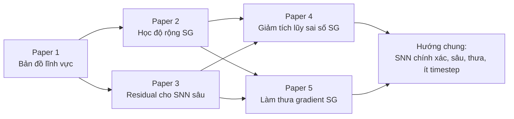

---

# Phần I. Nền tảng Spiking Neural Network

## 1. Từ ANN đến SNN

Trong **Artificial Neural Network (ANN)**, một nơ-ron thường nhận vector số thực, tính tổng có trọng số rồi qua activation:

$$
z_i=\sum_j w_{ij}x_j+b_i,\qquad y_i=\phi(z_i).
$$

Trong **Spiking Neural Network (SNN)**, tín hiệu giữa các nơ-ron thường là spike nhị phân theo thời gian:

$$
s_i[t]\in\{0,1\}.
$$

SNN không chỉ có các lớp $l=1,2,\ldots,L$ mà còn có các bước thời gian $t=1,2,\ldots,T$. Mỗi nơ-ron giữ một trạng thái nội tại gọi là **điện thế màng (membrane potential)**. Vì vậy SNN vừa giống mạng feed-forward theo chiều sâu, vừa giống mạng hồi quy khi được trải theo thời gian.

| Khía cạnh | ANN thông thường | SNN |
|---|---|---|
| Tín hiệu trung gian | Số thực | Thường là spike 0/1 |
| Trạng thái qua thời gian | Không bắt buộc | Điện thế màng được lưu qua timestep |
| Activation | ReLU, sigmoid, GELU... | Hàm phát spike dạng bước |
| Tính toán | Dense, thường dùng MAC | Có thể event-driven, dùng cộng khi có spike |
| Huấn luyện | Backpropagation trực tiếp | Cần SG, conversion, STDP hoặc phương pháp khác |
| Lợi thế tiềm năng | Hệ sinh thái trưởng thành, accuracy cao | Temporal processing và năng lượng thấp trên phần cứng phù hợp |
| Khó khăn chính | Chi phí và quy mô | Không khả vi, biểu diễn nhị phân, mô phỏng theo thời gian |

> **Điểm phải nhớ:** spike bằng 0 không tự làm một chương trình PyTorch dense bỏ qua phép tính. Lợi ích event-driven chỉ xuất hiện rõ khi phần mềm/phần cứng thật sự khai thác được tính thưa.

## 2. Nơ-ron IF và LIF

### 2.1. Trực giác “chiếc cốc bị rò”

Hãy xem điện thế màng như lượng nước trong một chiếc cốc:

- Spike đầu vào làm nước tăng lên.
- Mỗi timestep, một phần nước bị rò đi.
- Khi nước vượt vạch ngưỡng, nơ-ron phát một spike.
- Sau đó điện thế được reset hoàn toàn hoặc trừ đi ngưỡng, tùy mô hình.

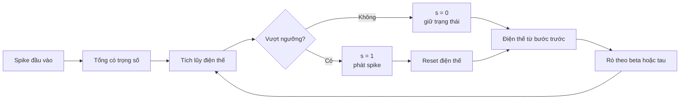

### 2.2. Một dạng phương trình LIF rời rạc

Một cách viết phổ biến là:

$$
\tilde u_i[t]=\beta u_i[t-1]+\sum_j w_{ij}s_j[t],
$$

$$
s_i[t]=\Theta(\tilde u_i[t]-V_{th}),
$$

$$
u_i[t]=\tilde u_i[t](1-s_i[t]).
$$

Trong đó:

- $\tilde u_i[t]$: điện thế trước reset;
- $u_i[t]$: điện thế sau reset;
- $\beta\in(0,1)$: **decay factor**, phần điện thế cũ được giữ lại;
- $V_{th}$: firing threshold;
- $\Theta(\cdot)$: hàm bước Heaviside;
- $s_i[t]$: spike đầu ra.

Nếu không có rò, mô hình gần với **Integrate-and-Fire (IF)**. Khi có rò, ta có **Leaky Integrate-and-Fire (LIF)**.

### 2.3. Ví dụ số

Cho $\beta=0.5$, $V_{th}=1$ và input mỗi bước là $0.6$:

| $t$ | Điện thế cũ | Điện thế trước reset | Spike | Điện thế sau reset |
|---:|---:|---:|---:|---:|
| 1 | 0 | $0.5\times0+0.6=0.6$ | 0 | 0.6 |
| 2 | 0.6 | $0.5\times0.6+0.6=0.9$ | 0 | 0.9 |
| 3 | 0.9 | $0.5\times0.9+0.6=1.05$ | 1 | 0 |
| 4 | 0 | $0.5\times0+0.6=0.6$ | 0 | 0.6 |

Chuỗi spike là $[0,0,1,0]$. Input ở bước 3 không lớn hơn các bước khác; nơ-ron phát spike vì đã tích lũy lịch sử. Đây là **temporal dynamics**.

## 3. Mã hóa đầu vào và đọc đầu ra

### 3.1. Input encoding

Một số cách đưa dữ liệu vào SNN:

- **Direct encoding:** cùng ảnh số thực được đưa vào tầng đầu ở mỗi timestep; tầng đầu tạo spike.
- **Rate coding:** giá trị lớn được biểu diễn bằng nhiều spike hơn trong một cửa sổ thời gian.
- **Temporal coding:** thông tin nằm trong thời điểm phát spike, ví dụ spike sớm biểu thị cường độ lớn.
- **Event frames:** dữ liệu camera sự kiện được chia thành các frame thời gian rồi đưa trực tiếp vào mạng.

Không có encoding tốt nhất cho mọi bài toán. Rate coding dễ dùng nhưng thường cần nhiều timestep; temporal coding ít spike hơn nhưng khó học; dữ liệu DVS đã có cấu trúc thời gian tự nhiên.

### 3.2. Output decoding

Các cách đọc đầu ra thường gặp:

- đếm số spike của lớp cuối;
- lấy trung bình điện thế hoặc dòng điện qua $T$ timestep;
- tính loss tại từng timestep rồi cộng/trung bình;
- dùng trọng số khác nhau cho các timestep, như TWO trong Paper 5.

Tăng $T$ có thể tăng lượng thông tin và accuracy, nhưng cũng làm tăng latency, số phép mô phỏng, memory của BPTT và có thể làm gradient khó ổn định hơn.

## 4. Ba hướng huấn luyện SNN

### 4.1. Học cục bộ theo sinh học

**Spike-Timing-Dependent Plasticity (STDP)** cập nhật synapse dựa trên thứ tự thời gian giữa spike trước và sau synapse. STDP có tính sinh học nhưng khó mở rộng thành cơ chế supervised end-to-end có độ chính xác cao trên mạng rất sâu.

### 4.2. ANN-to-SNN conversion

Quy trình điển hình:

1. Huấn luyện ANN.
2. Thay activation ANN bằng spiking neuron.
3. Chuẩn hóa trọng số/ngưỡng để firing rate xấp xỉ activation ANN.

Ưu điểm là tận dụng một ANN đã tối ưu tốt. Nhược điểm là thường dựa vào rate coding, cần nhiều timestep, tăng latency và không khai thác đầy đủ temporal dynamics.

### 4.3. Direct training bằng surrogate gradient

Forward vẫn dùng spike thật:

$$
s=\Theta(u-V_{th}).
$$

Nhưng backward thay đạo hàm không sử dụng được bằng một hàm xấp xỉ:

$$
\frac{\partial s}{\partial u}\approx h(u-V_{th}).
$$

Các $h$ thường dùng gồm rectangular, triangular, sigmoid derivative, arctan derivative và piecewise linear. Đây là ý tưởng **forward rời rạc, backward trơn**.

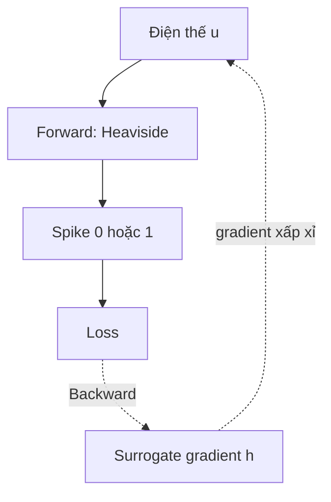

## 5. Backpropagation Through Time trong SNN

Khi trải SNN theo thời gian, điện thế ở $t$ ảnh hưởng $t+1$. **Backpropagation Through Time (BPTT)** phải lan truyền gradient:

- qua các lớp: spatial credit assignment;
- qua các timestep: temporal credit assignment.

Một biểu thức rút gọn cho gradient theo điện thế là:

$$
\frac{\partial L}{\partial u_i^t}
=
\frac{\partial L}{\partial s_i^t}
\frac{\partial s_i^t}{\partial u_i^t}
+
\frac{\partial L}{\partial u_i^{t+1}}
\frac{\partial u_i^{t+1}}{\partial u_i^t}.
$$

Thừa số $\partial s/\partial u$ chính là chỗ surrogate gradient được dùng. Với mạng sâu và $T$ lớn, gradient phải đi qua một chuỗi dài Jacobian, nên dễ vanishing/exploding và tốn memory để lưu trạng thái.

## 6. Bốn vấn đề tối ưu quan trọng

### 6.1. Non-differentiability

Đạo hàm thường của hàm bước bằng 0 gần như mọi nơi và không xác định tại ngưỡng. Nếu dùng nguyên đạo hàm này, gradient descent không nhận được tín hiệu hữu ích.

### 6.2. Gradient vanishing và exploding

Nếu mỗi lớp chỉ truyền lại hệ số khoảng $0.1$, qua bốn lớp ta còn:

$$0.1^4=0.0001.$$

Ngược lại, nếu các hệ số lớn hơn 1, tích của chúng có thể bùng nổ. Trong SNN, hiện tượng này xảy ra theo cả chiều sâu và thời gian.

### 6.3. Gradient mismatch

Surrogate gradient không phải đạo hàm thật của spike. Ví dụ với $V_{th}=1$:

- nơ-ron A có $u=0.99$: thay đổi nhỏ có thể đổi spike;
- nơ-ron B có $u=0.10$: thay đổi nhỏ hầu như không đổi spike.

Nếu SG rất rộng và cấp gradient tương tự cho cả A và B, backward đang đánh giá quá cao độ nhạy của B. Đây là **gradient mismatch**.

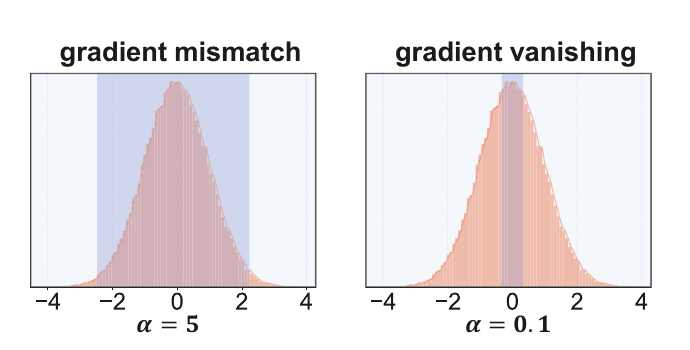

*Vùng SG quá rộng gây mismatch; vùng quá hẹp khiến phần lớn nơ-ron không nhận gradient. Hình từ Figure 2 của Paper 2.*

### 6.4. Gradient error accumulation

Một sai số xấp xỉ nhỏ ở mỗi spiking layer có thể được biến đổi và tích lũy khi gradient đi qua nhiều layer/timestep. Tối ưu hình dạng SG giúp nhưng không bảo đảm loại bỏ tích lũy sai số. Paper 4 tạo đường backward phụ để giảm độ dài đoạn SNN mà gradient phải đi qua.

## 7. Sparsity, computation và energy

### 7.1. Ba loại “thưa” không nên nhầm lẫn

| Khái niệm | Thứ gì bằng 0 nhiều? | Tác động trực tiếp |
|---|---|---|
| Spike sparsity | Spike trong forward | Có thể giảm synaptic operations trên phần cứng event-driven |
| Weight sparsity | Trọng số | Có thể giảm lưu trữ/phép tính nếu phần cứng hỗ trợ sparse weight |
| Gradient sparsity | Gradient trong backward | Có thể giảm cập nhật, nhưng chỉ nhanh hơn nếu kernel/hardware khai thác được |

Paper 5 chủ yếu làm **gradient sparsity** bằng MSG và kiểm tra firing rate không tăng đáng kể; phương pháp không trực tiếp ép spike rate giảm.

### 7.2. Các chỉ số nên báo cáo

- accuracy và calibration;
- timestep $T$ và latency thật;
- firing rate/spike count theo layer;
- synaptic operations (SOPs);
- training time và inference time;
- memory access và peak memory;
- energy per sample trên phần cứng cụ thể.

Chỉ báo cáo accuracy và firing rate chưa đủ để khẳng định tiết kiệm năng lượng. Một mask thưa được biểu diễn bằng tensor dense trên GPU vẫn có thể tốn gần như phép tính dense.

---

# Phần II. Phân tích năm paper

## 8. Paper 1 - Direct learning-based deep spiking neural networks: a review

**Nguồn:** Yufei Guo, Xuhui Huang, Zhe Ma, *Frontiers in Neuroscience*, 2023. [PDF trong project](paper1/fnins-17-1209795.pdf).

### 8.1. Paper làm gì?

Đây là paper khảo sát, không đề xuất một module mới. Tác giả bắt đầu từ bốn đặc tính của SNN:

1. rich spatial-temporal dynamics;
2. tiềm năng efficiency nhờ spike/event-driven;
3. representative ability bị hạn chế bởi tín hiệu nhị phân;
4. firing function không khả vi.

Từ đó, các công trình direct-learning được tổ chức theo ba hướng lớn:

```text
Direct learning-based deep SNN
├── Cải thiện accuracy
│   ├── Tăng khả năng biểu diễn: neuron, architecture, training technique
│   └── Giảm khó khăn huấn luyện: SG, normalization, residual, loss
├── Cải thiện efficiency
│   ├── Network compression
│   └── Sparse SNN
└── Khai thác temporal dynamics
    ├── Sequential learning
    └── Neuromorphic/event-camera tasks
```

### 8.2. Paper tối ưu điều gì?

Paper không tối ưu một loss cụ thể. Giá trị của nó là tối ưu **cách tổ chức bài toán nghiên cứu**: phân biệt rõ ba mục tiêu thường bị trộn lẫn là accuracy, efficiency và temporal utilization.

### 8.3. Các phương pháp được khảo sát

- **Neuron level:** learnable threshold/leak, multi-level firing, adaptive neuron.
- **Architecture level:** SEW-ResNet, membrane shortcut, attention, neural architecture search.
- **Training level:** surrogate gradient, temporal loss, normalization theo thời gian, distillation.
- **Efficiency:** pruning không-thời gian, activity regularization, sparse firing.
- **Temporal tasks:** speech, human activity recognition, optical flow, depth và event-camera vision.

### 8.4. Đóng góp và ý nghĩa

- Cho người mới một bản đồ thay vì danh sách paper rời rạc.
- Nhấn mạnh rằng accuracy cao chưa đồng nghĩa energy thấp.
- Chỉ ra direct training có lợi thế ở ít timestep và dữ liệu temporal, nhưng vẫn mắc non-differentiability và optimization difficulty.
- Đặt các Paper 2-5 trong cùng bối cảnh: thiết kế SG, kiến trúc sâu, giảm sai số gradient và sparsity.

### 8.5. Ưu điểm

- Phân loại theo vấn đề cần giải quyết nên dễ định hướng nghiên cứu.
- Bao phủ nhiều cấp: neuron, network structure, training technique.
- Nêu cả accuracy, efficiency và temporal dynamics thay vì chỉ benchmark hình ảnh.
- Có phần thách thức tương lai hữu ích để tìm research gap.

### 8.6. Nhược điểm và giới hạn

- Là review năm 2023 nên không bao gồm Paper 5 năm 2024 và các tiến triển mới hơn.
- Phạm vi rất rộng; nhiều phương pháp chỉ được mô tả ngắn, không đủ để tái lập.
- Các tuyên bố energy thường phụ thuộc hardware; review không thể chuẩn hóa mọi phép đo từ các paper khác nhau.
- Taxonomy có vùng chồng lấn: một phương pháp có thể đồng thời tăng accuracy, giảm timestep và thay đổi firing rate.
- Không cung cấp benchmark thống nhất để tách ảnh hưởng của architecture, neuron, loss và augmentation.

### 8.7. Bài học cho người mới

Đừng hỏi chung chung “SNN có tốt hơn ANN không?”. Hãy tách câu hỏi:

- tốt hơn về accuracy nào, trên dataset nào;
- dùng bao nhiêu timestep;
- spike có thưa không;
- chạy trên GPU dense hay neuromorphic hardware;
- chi phí train hay inference;
- dữ liệu có temporal information thật hay chỉ lặp ảnh tĩnh.

---

## 9. Paper 2 - Learnable Surrogate Gradient for Direct Training SNNs

**Nguồn:** Shuang Lian và cộng sự, IJCAI 2023. [PDF trong project](paper2/paper_2.pdf).

### 9.1. Vấn đề nghiên cứu

Rectangular surrogate gradient có dạng:

$$
h(u)=
\begin{cases}
1/\alpha,&|u-V_{th}|<\alpha/2,\\
0,&\text{ngược lại.}
\end{cases}
$$

$\alpha$ điều khiển độ rộng vùng có gradient:

- $\alpha$ quá nhỏ: nhiều membrane potential nằm ngoài vùng, gradient vanishing;
- $\alpha$ quá lớn: trạng thái xa ngưỡng vẫn nhận gradient, gradient mismatch;
- một $\alpha$ cố định khó phù hợp với mọi layer và mọi giai đoạn học.

### 9.2. Phương pháp LSG

Paper quan sát rằng phân bố membrane potential phụ thuộc decay factor $\beta$. Với giả định input sau tdBN gần Gaussian, tác giả xấp xỉ:

$$
u\sim\mathcal N(0,\sigma_{mem}^2),\qquad
\sigma_{mem}^2\approx(1+\beta^2)V_{th}^2.
$$

Từ đó paper:

1. Cho mỗi layer học một tham số tự do $b_n$.
2. Đưa qua sigmoid để có $\beta_n\in(0,1)$:

$$
\beta_n=\frac{1}{1+e^{-b_n}}.
$$

3. Ràng buộc độ rộng SG theo decay:

$$
\boxed{\alpha_n=2V_{th}\sqrt{1+\beta_n^2}}.
$$

Vì vậy optimizer không học tự do toàn bộ hình dạng SG; nó học $\beta_n$, còn $\alpha_n$ thay đổi gián tiếp theo một công thức định trước.

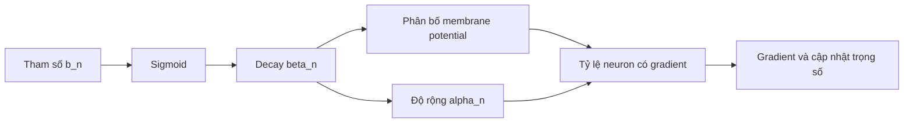

### 9.3. Paper tối ưu điều gì?

- Trực tiếp: classification cross-entropy và các tham số weight/$b_n$ bằng STBP.
- Về cơ chế: giữ đủ nơ-ron trong gradient-available interval nhưng không mở SG quá rộng.
- Về hệ thống: đạt accuracy cạnh tranh với ít timestep; paper không đo energy hoặc latency phần cứng.

### 9.4. Ví dụ trực quan

Cho $V_{th}=0.5$:

| $\beta_n$ | $\alpha_n$ | Ý nghĩa |
|---:|---:|---|
| 0.2 | 1.0198 | Nơ-ron quên nhanh, phân bố tương đối hẹp |
| 0.5 | 1.1180 | Mở rộng vùng gradient |
| 0.8 | 1.2806 | Nơ-ron giữ lịch sử lâu hơn, phân bố rộng hơn |

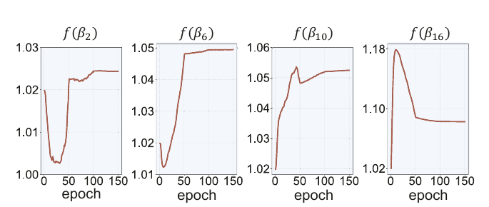

*Các layer hội tụ về độ rộng SG khác nhau. Hình từ Figure 6 của Paper 2.*

### 9.5. Kết quả chính

**Ablation:**

| Dataset | Baseline | Trainable decay | LSG |
|---|---:|---:|---:|
| CIFAR-10 | 92.68% | 93.16% | **94.41%** |
| CIFAR-100 | 73.87% | 74.12% | **76.22%** |
| CIFAR-DVS | 73.80% | 75.40% | **77.50%** |

Table 1 của paper ghi 94.41% cho CIFAR-10, trong khi đoạn văn bên dưới ghi 94.89%; tài liệu này dùng số trong bảng vì nó lặp lại nhất quán ở các bảng khác.

**Độ nhạy với SG cố định trên CIFAR-10, ResNet-19, $T=2$:**

| Cấu hình | Accuracy |
|---|---:|
| $\alpha=0.5$ | 92.12% |
| $\alpha=1.0$ | 92.68% |
| $\alpha=2.5$ | 90.68% |
| $\alpha=5.0$ | 61.54% |
| $\alpha=10.0$ | 30.82% |
| LSG | **94.41%** |

Kết quả này cho thấy “mở rộng SG để có nhiều gradient hơn” không phải lời giải đơn giản.

### 9.6. Ưu điểm

- Ý tưởng đơn giản, overhead tham số rất nhỏ: xấp xỉ một decay parameter cho mỗi layer.
- Liên kết neuron dynamics với gradient estimator thay vì tuning $\alpha$ độc lập.
- Có ablation tách tác dụng của trainable decay và LSG.
- Có bằng chứng gần cơ chế: tỷ lệ nơ-ron nằm trong vùng có gradient theo layer.
- Kết quả tốt ở timestep thấp, hữu ích cho low-latency SNN.

### 9.7. Nhược điểm và giới hạn

- Lý thuyết dựa trên giả định input Gaussian và xấp xỉ $1+\beta^2$; phân bố thật chịu tác động của reset, convolution và spike.
- $\alpha$ không được học tự do; hàm $f(\beta)$ là lựa chọn thiết kế, chưa được chứng minh tối ưu.
- Cùng một $\beta$ vừa điều khiển dynamics forward vừa điều khiển SG backward; hai mục tiêu có thể xung đột.
- Một $\beta$ cho cả layer bỏ qua khác biệt giữa channel/nơ-ron.
- Thực nghiệm chỉ trên CIFAR-10/100 và CIFAR-DVS; chưa có ImageNet trong paper này.
- Kết quả 83.70% trên CIFAR-DVS dùng thêm TET loss và augmentation, nên không thể quy toàn bộ cho LSG.
- Không báo cáo firing rate, training time, memory hay năng lượng.
- SG mismatch vẫn tồn tại vì forward và backward vẫn là hai hàm khác nhau.

### 9.8. Tóm tắt một câu

> LSG không tìm một surrogate function hoàn toàn mới; nó học decay theo layer rồi dùng decay để điều chỉnh độ rộng SG cho phù hợp hơn với phân bố điện thế màng.

---

## 10. Paper 3 - Deep Residual Learning in Spiking Neural Networks

**Nguồn:** Wei Fang và cộng sự, NeurIPS 2021. [PDF trong project](paper3/2102.04159v6.pdf).

### 10.1. Vấn đề nghiên cứu

ResNet trong ANN cho phép mạng rất sâu nhờ **identity mapping**. Một residual block ANN điển hình là:

$$
Y_l=\operatorname{ReLU}(F_l(X_l)+X_l).
$$

Nếu $F_l(X_l)=0$ và $X_l$ đã không âm, block trả đúng $X_l$. Tuy nhiên, Spiking ResNet cũ thường chỉ thay ReLU bằng spiking neuron:

$$
O_l[t]=\operatorname{SN}(F_l(S_l[t])+S_l[t]).
$$

Ngay cả khi $F_l=0$, đầu vào shortcut vẫn phải đi qua một spiking neuron nữa. Khi đó:

- identity mapping phụ thuộc vào neuron model, threshold và trạng thái màng;
- gradient shortcut vẫn phải nhân với surrogate derivative;
- qua nhiều block, tích các surrogate derivative có thể vanishing hoặc exploding.

Đây là lý do “lấy ResNet rồi thay ReLU bằng LIF” chưa đủ.

### 10.2. Phương pháp SEW-ResNet

Paper đưa spiking neuron vào residual branch trước, sau đó kết hợp hai spike tensor bằng phép toán element-wise:

$$
A_l[t]=\operatorname{SN}(F_l(S_l[t])),
$$

$$
O_l[t]=g(A_l[t],S_l[t]).
$$

Ba lựa chọn $g$ được khảo sát:

| Tên | Phép toán |
|---|---|
| ADD | $A+S$ |
| AND | $A\cdot S$ |
| IAND | $(1-A)\cdot S$ |

Với ADD hoặc IAND, chỉ cần khởi tạo/điều khiển residual output $A=0$ thì:

$$g(0,S)=S.$$

Với AND, identity cần $A=1$. Trong điều kiện identity, đạo hàm theo shortcut bằng 1:

$$
\frac{\partial O_{l+k-1}}{\partial S_l}=1,
$$

thay vì phải nhân một chuỗi surrogate derivative. Đây là lập luận trung tâm giúp gradient đi qua nhiều block ổn định hơn.

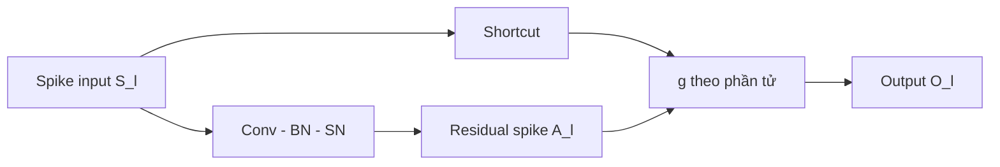

> **Chỉnh một hiểu lầm thường gặp:** SEW không đơn thuần là “đổi vị trí phép cộng”. Điểm cốt lõi là residual branch tạo spike trước, rồi một hàm element-wise được thiết kế để có identity mapping rõ ràng trong spike domain.

### 10.3. Paper tối ưu điều gì?

- Khả năng tối ưu (trainability) của SNN rất sâu.
- Identity mapping không phụ thuộc quá mạnh vào surrogate derivative.
- Accuracy khi tăng depth, với số timestep thấp.
- Giữ hoạt động residual branch tương đối thưa trong nhiều block.

### 10.4. Ví dụ trực quan

Giả sử một chuỗi ba block đều đang gần identity:

- Spiking ResNet cũ có surrogate derivative hiệu dụng $0.2$ mỗi block: gradient shortcut còn $0.2^3=0.008$.
- SEW block ở đúng identity có đạo hàm shortcut bằng 1: gradient shortcut còn $1^3=1$.

Ví dụ này không mô tả toàn bộ gradient thực, vì residual branch vẫn đóng góp thêm gradient; nó chỉ minh họa vì sao một đường identity không đi qua SN cuối block có lợi.

### 10.5. Kết quả chính

**ImageNet, $T=4$, Top-1:**

| Kiến trúc | SEW-ResNet ADD | Spiking ResNet cũ |
|---|---:|---:|
| ResNet-18 | 63.18% | 62.32% |
| ResNet-34 | 67.04% | 61.86% |
| ResNet-50 | 67.78% | 57.66% |
| ResNet-101 | 68.76% | 31.79% |
| ResNet-152 | **69.26%** | 10.03% |

SEW-ResNet tăng accuracy khi depth tăng, trong khi Spiking ResNet cũ biểu hiện degradation rất mạnh.

**DVS Gesture:** SEW-ADD đạt 97.92% với 0.13M tham số và $T=16$. Trong cùng thí nghiệm ablation, Spiking ResNet đạt 90.97%, IAND 95.49%, AND 70.49%. AND dễ làm hoạt động tắt dần vì $A\cdot S\le S$.

**CIFAR10-DVS:** Wide-7B-Net đạt 70.2% ở $T=8$ và 74.4% ở $T=16$; kết quả cho thấy trade-off giữa timestep và accuracy.

### 10.6. Ưu điểm

- Tấn công trực tiếp degradation problem thay vì chỉ tuning SG.
- Identity mapping được phân tích bằng công thức và kiểm tra bằng gradient/firing-rate plots.
- Cho phép direct-training SNN trên 100 layer, là bước tiến lớn vào thời điểm công bố.
- Kết quả nhất quán trên ảnh tĩnh và dữ liệu event-based.
- $T=4$ trên ImageNet thấp hơn nhiều phương pháp ANN-to-SNN conversion được so sánh trong paper.

### 10.7. Nhược điểm và giới hạn

- ADD có thể tạo output lớn hơn 1; output block không còn luôn là spike nhị phân. Paper lập luận mức tăng được kiểm soát, nhưng đường này có thể làm cách đếm SOP/energy phức tạp hơn.
- AND có nguy cơ silence; IAND/ADD hoạt động tốt hơn nhưng lựa chọn $g$ vẫn là hyperparameter kiến trúc.
- Accuracy ImageNet của SEW tại thời điểm paper vẫn thấp hơn một số phương pháp conversion dùng rất nhiều timestep.
- Mạng sâu hơn vẫn làm tăng tham số, memory và số phép tính; “train được sâu” không đồng nghĩa “hiệu quả hơn”.
- Kết quả energy là tiềm năng, không phải phép đo end-to-end trên neuromorphic chip.
- SEW giải quyết gradient qua residual blocks nhưng không loại bỏ non-differentiability, SG mismatch hay chi phí BPTT.

### 10.8. Tóm tắt một câu

> SEW-ResNet tạo một đường identity thật sự phù hợp với spike tensor, giúp gradient đi xuyên qua mạng rất sâu mà không phải liên tục đi qua spiking activation ở cuối mỗi residual block.

---

## 11. Paper 4 - Surrogate Module Learning: Reduce the Gradient Error Accumulation

**Nguồn:** Shikuang Deng, Hao Lin, Yuhang Li, Shi Gu, ICML 2023. [PDF trong project](paper4/deng23d.pdf).

### 11.1. Vấn đề nghiên cứu

Ngay cả khi surrogate gradient được thiết kế tốt, gradient của lớp đầu trong một deep SNN vẫn phải đi qua nhiều spiking layer ở phía sau. Mỗi layer dùng một gradient xấp xỉ, nên sai số có thể tích lũy.

Paper đổi câu hỏi từ “thiết kế SG nào tốt nhất?” thành:

> Có thể tạo một đường backward ngắn hơn, tránh một phần chuỗi spiking layer phía sau hay không?

### 11.2. Kiến trúc SML

Chia backbone SNN thành:

- $f_e$: phần trước điểm gắn module;
- $f_c$: phần SNN còn lại tạo output chính;
- $f_i$: ANN phụ nối từ đặc trưng trung gian.

Đầu ra $f_e$ là chuỗi spike $[T,B,C,H,W]$. Paper lấy trung bình theo thời gian để có firing-rate map:

$$
r_e=\frac{1}{T}\sum_{t=1}^{T}a_e[t],
\qquad [T,B,C,H,W]\rightarrow[B,C,H,W].
$$

ANN phụ nhận $r_e$ và dự đoán cùng nhãn với backbone. Khi backward:

- loss chính đi qua toàn bộ $f_c$ rồi về $f_e$;
- loss phụ đi qua ANN $f_i$ rồi về $f_e$;
- gradient từ nhánh phụ tránh các spiking neuron trong $f_c$.

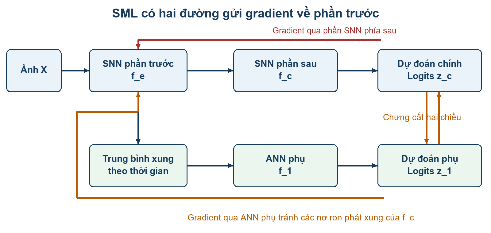

*Nhánh ANN phụ tạo đường gradient ngắn đến phần SNN phía trước. Nhánh được bỏ sau khi train.*

### 11.3. Vì sao cần self-distillation?

Một auxiliary classifier thông thường có thể học một mục tiêu cục bộ khác cách phần sau của backbone sử dụng đặc trưng. SML kéo dự đoán của ANN phụ và SNN chính lại gần nhau bằng **bidirectional self-distillation**.

Loss phân loại:

$$
L_C=\frac{L+\alpha\sum_{i=1}^{N}L_i}{1+N\alpha}.
$$

Loss distillation hai chiều cho module $i$ gồm:

- SNN học từ output ANN đã `detach`;
- ANN học từ output SNN đã `detach`.

Loss tổng:

$$
L_{total}=(1-\lambda)L_C+
\frac{\lambda}{2N}\sum_{i=1}^{N}L_{KL,i}.
$$

`detach` giữ giá trị teacher trong forward nhưng chặn gradient qua teacher ở loss đang xét. Nó không đóng băng teacher đối với các loss khác.

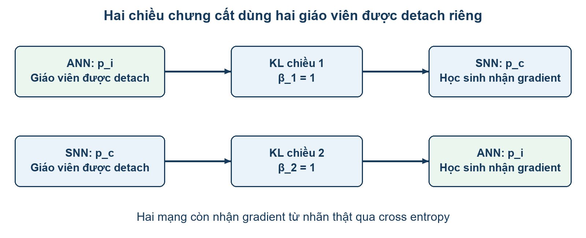

### 11.4. Paper tối ưu điều gì?

- Tăng tỷ lệ tín hiệu gradient hữu ích so với sai số SG ở phần SNN trước module.
- Tăng classification accuracy và tốc độ hội tụ theo epoch.
- Không tăng chi phí inference: ANN phụ bị bỏ sau huấn luyện.

Một cách mô tả giản lược của paper là:

$$
\operatorname{SG}=G+\sigma,
$$

trong đó $G$ là gradient tham chiếu và $\sigma$ là sai số tích lũy. Nếu module tạo thêm gradient hữu ích $S$, tỷ lệ sai số được minh họa từ:

$$
K_{SDT}=\frac{\sigma}{G}
\quad\text{thành gần}\quad
K_{SML}=\frac{\sigma}{G+S}.
$$

Ví dụ $G=1$, $S=1$, $\sigma=0.2$: tỷ lệ từ 20% xuống 10%. Nhưng nếu $S$ ngược hướng $G$, kết luận này không còn đúng; distillation chỉ làm $S$ có khả năng phù hợp hơn, không bảo đảm tuyệt đối.

### 11.5. Kết quả chính

**ImageNet, ResNet-34:**

| Phương pháp | $T$ | Accuracy |
|---|---:|---:|
| tdBN | 6 | 63.72% |
| TET | 6 | 64.79% |
| IM-Loss | 6 | 67.43% |
| SEW-ResNet-34 | 4 | 67.04% |
| SML | 2 | 65.77% |
| SML | 4 | 68.25% |
| SML | 6 | **69.35%** |

So với IM-Loss cùng ResNet-34, $T=6$, mức tăng là 1.92 điểm phần trăm. Abstract nêu mức tăng 3.46%, nhưng baseline tương ứng không xuất hiện rõ trong bảng ImageNet; khi trích dẫn nên phân biệt con số tác giả tuyên bố và phép trừ kiểm chứng được từ bảng.

**Dữ liệu sự kiện:** SML ResNet-18 đạt 83.19% trên DVS-CIFAR10 ở $T=10$; SML+TET đạt 85.23% trong cấu hình ResNet-18. Trên ES-ImageNet, SML đạt 44.76%, nhưng train accuracy 64.7% cho thấy overfitting đáng kể.

**Ablation hai chiều distillation:** trong bảng làm tròn của paper, giữ backbone gradient và dùng cả hai hướng KD đạt 74.5%, cao hơn dùng một hướng (71.8-71.9%) và không dùng KD (70.7%) trong cấu hình đó.

**Overhead huấn luyện với hai module:**

| $T$ | Thời gian tăng | Memory tăng |
|---:|---:|---:|
| 1 | 53.84% | 11.34% |
| 2 | 27.42% | 8.22% |
| 4 | 11.88% | 6.13% |
| 5 | 11.04% | 2.44% |

Overhead tương đối giảm khi $T$ tăng vì backbone SNN ngày càng tốn hơn, không phải vì ANN module tự rẻ đi.

### 11.6. Ưu điểm

- Không cần thay forward/inference của backbone SNN.
- Đường gradient phụ giải quyết một khía cạnh khác với việc chỉ thiết kế lại SG.
- Có ablation về hướng distillation, số module, số channel, vị trí, $\lambda$, $\alpha$ và nhiệt độ.
- Đánh giá trên CIFAR, ImageNet và dữ liệu event-based.
- Phân tách training-time capacity và inference-time model: module bị bỏ sau huấn luyện.

### 11.7. Nhược điểm và giới hạn

- Tăng rõ training time, memory, số hyperparameter và độ phức tạp cài đặt.
- Accuracy tăng có thể đồng thời đến từ deep supervision, regularization, extra capacity và distillation; ablation chưa tách sạch toàn bộ đóng góp.
- Nhánh ANN nhận firing-rate map nên làm mất thứ tự spike theo thời gian.
- Gradient qua chính phần $f_e$ vẫn dùng SG; SML không tạo “gradient chính xác” cho toàn mạng.
- Lập luận lý thuyết dùng biểu thức vô hướng giản lược; output gần nhau không bảo đảm Jacobian gần nhau.
- Module quá nhiều cho lợi ích giảm dần nhưng chi phí tăng mạnh: trong một ablation, từ 2 lên 3 module chỉ tăng 0.29 điểm nhưng thời gian tăng khoảng 31.3%.
- Không có chi phí inference từ module, nhưng backbone SNN vẫn giữ nguyên chi phí theo timestep.

### 11.8. Tóm tắt một câu

> SML dùng ANN phụ và self-distillation để tạo đường gradient ngắn hơn đến các phần đầu của SNN, giảm ảnh hưởng tương đối của sai số SG tích lũy, rồi bỏ toàn bộ nhánh phụ khi inference.

---

## 12. Paper 5 - Directly Training Temporal SNN with Sparse Surrogate Gradient

**Nguồn:** Yang Li, Feifei Zhao, Dongcheng Zhao, Yi Zeng, 2024. [PDF trong project](paper5/2406.19645v1.pdf).

### 12.1. Vấn đề nghiên cứu

SG trơn cung cấp gradient cho nhiều membrane potential, giúp mạng học nhưng làm backward dense hơn gradient lý tưởng của hàm phát spike. Paper muốn cân bằng:

- **learning ability:** cần đủ gradient để tối ưu;
- **gradient sparsity:** tránh quá nhiều cập nhật surrogate có thể gây nhiễu;
- **temporal decoding:** không xem mọi timestep quan trọng như nhau.

Paper đề xuất hai thành phần độc lập: **Masked Surrogate Gradient (MSG)** cho backward và **Temporally Weighted Output (TWO)** cho decoder.

### 12.2. Masked Surrogate Gradient

Với gradient tính bằng SG là $G_{SG}$, sinh mask Bernoulli:

$$
M_b\sim\operatorname{Bernoulli}(1-p),
$$

$$
G=G_{SG}\odot M_b,
\qquad W\leftarrow W-\eta G.
$$

- $p=0$: trở thành SG thông thường.
- $p$ tăng: nhiều phần tử gradient bị đặt về 0.
- $p\rightarrow1$: gần như không còn tín hiệu học, dễ vanishing.

Mask được sinh lại theo layer/minibatch/epoch để các tham số luân phiên có cơ hội cập nhật.

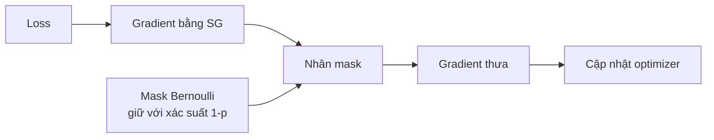

Paper diễn giải MSG như regularization ngẫu nhiên. Với biến thể có chuẩn hóa $G_i m/(1-p)$ và giả định độc lập/Gaussian, variance tăng theo:

$$
\operatorname{Var}(G_i)
=\sigma^2+\frac{p}{1-p}(\mu^2+\sigma^2).
$$

Có một điểm cần thận trọng: phương trình cập nhật chính viết $G_{SG}\odot M_b$, còn phần phân tích variance dùng chia cho $(1-p)$. Khi tái lập phải kiểm tra code để biết scaling chính xác.

### 12.3. Temporally Weighted Output

Ban đầu, mỗi timestep có trọng số $f_t=1/T$. Output riêng tại timestep $t$:

$$
y[t]=f_t I^{(L)}[t].
$$

Paper thống kê tỷ lệ dự đoán đúng của từng timestep rồi cập nhật bằng low-pass filter:

$$
\Delta f_t=\frac{\sum_{i=1}^{N}[y_i[t]=\hat y_i]}{N|y|},
$$

$$
f_t\leftarrow\beta f_t+(1-\beta)\Delta f_t.
$$

Timestep thường dự đoán đúng sẽ được tăng trọng số. TWO không học $f_t$ bằng gradient và $f_t$ được cố định khi inference.

**Ví dụ:** nếu $T=4$ và accuracy lịch sử theo timestep là $[0.45,0.62,0.75,0.78]$, decoder nên tin các bước sau hơn thay vì trung bình đều. Trên ảnh tĩnh lặp lại qua thời gian, chênh lệch này thường ít hơn dữ liệu DVS có diễn tiến sự kiện thật.

### 12.4. Paper tối ưu điều gì?

- MSG: giảm mật độ gradient SG, regularize quá trình học và giảm tác động cập nhật surrogate không phù hợp.
- TWO: tăng chất lượng decoding bằng cách khai thác độ hữu ích khác nhau của timestep.
- Mục tiêu báo cáo: accuracy tốt hơn trong khi firing rate và training time gần baseline.
- Paper chưa chứng minh giảm energy end-to-end trên neuromorphic hardware.

### 12.5. Kết quả chính

**Kết quả benchmark tiêu biểu:**

| Dataset / mô hình | $T$ | Accuracy |
|---|---:|---:|
| CIFAR-10 / CIFARNet, không AutoAugment | 4 | 94.30% |
| CIFAR-10 / CIFARNet, có AutoAugment | 4 | 95.40% |
| CIFAR-100 / CIFARNet, có AutoAugment | 4 | 77.48% |
| ImageNet / SEW-ResNet-34 | 4 | 67.46% |
| DVS-CIFAR10 / ResNet-18 | 10 | 79.35% |
| DVS-CIFAR10 / VGGSNN | 10 | **83.97%** |
| N-Caltech101 / VGGSNN | 10 | 77.70% |

Trên ImageNet, 67.46% thấp hơn TET 68.00% trong bảng của paper; MSG+TWO không phải luôn là SOTA ở mọi cấu hình.

**Ablation:**

| Dataset / mô hình | Baseline | TWO | MSG | MSG + TWO |
|---|---:|---:|---:|---:|
| CIFAR-100 / ResNet-18 | 68.79% | 68.98% | 69.08% | **69.21%** |
| DVS-CIFAR10 / ResNet-18 | 72.90% | 74.40% | 78.30% | **79.10%** |
| DVS-CIFAR10 / VGGSNN | 82.70% | 83.20% | 83.30% | **83.90%** |

TWO giúp nhiều hơn trên dữ liệu event-based và $T$ lớn. MSG tạo phần cải thiện chính trong cấu hình DVS-CIFAR10/ResNet-18.

**Mask probability:** kết quả tốt thường nằm trong khoảng $p=0.4$ đến $0.6$. Gần 0 thì quay về mismatch của SG thường; gần 1 thì gradient quá thưa để học.

**Training time trên DVS-CIFAR10:** Figure 6 báo các cặp Vanilla/MSG lần lượt khoảng 80/70.1 s cho VGGSNN, 30.3/28.4 s cho ResNet-18, 62.9/55 s cho CIFARNet và 32.7/29 s cho SEW-ResNet-18. Đây là kết quả trong cấu hình phần mềm cụ thể, chưa chứng minh sparse speedup tổng quát.

### 12.6. Ưu điểm

- MSG rất dễ gắn vào pipeline hiện có; không đổi neuron hoặc architecture forward.
- TWO không thêm trainable parameter vào backbone.
- Ablation tách MSG và TWO khá rõ.
- Thử nhiều SG, architecture, ảnh tĩnh và neuromorphic dataset.
- Có kiểm tra firing rate và training time, thay vì chỉ accuracy.
- Khơi mở hướng sparse-gradient training và structured mask cho SNN.

### 12.7. Nhược điểm và giới hạn

- Mask ngẫu nhiên không biết phần tử gradient nào thật sự sai; sparsity không đồng nghĩa gradient gần Dirac delta hơn.
- $p$ phải tuning và một $p$ chung có thể không hợp mọi layer/timestep.
- Mask element-wise không thân thiện bằng block/channel sparsity đối với nhiều accelerator.
- Optimizer có momentum khiến weight vẫn có thể thay đổi dù gradient hiện tại bị mask bằng 0.
- TWO dựa vào accuracy lịch sử, có thể phản ứng chậm khi phân phối thay đổi và có thể overfit statistics của training set.
- Công thức $\Delta f_t$ và normalization trong paper không thật sự trực quan; cần kiểm tra code khi tái lập.
- Chưa đo energy, memory traffic, synaptic operations hay latency trên neuromorphic chip.
- Firing rate gần baseline cho thấy không làm forward dày hơn, nhưng không chứng minh spike sparsity tốt hơn baseline.
- Một số benchmark không vượt đối thủ mạnh, đặc biệt ImageNet.

### 12.8. Tóm tắt một câu

> MSG thả ngẫu nhiên một phần surrogate gradient để regularize và làm backward thưa hơn, còn TWO học thống kê độ hữu ích của từng timestep để giải mã output tốt hơn.

---

# Phần III. So sánh và kết nối các paper

## 13. Bảng so sánh tổng hợp

| Tiêu chí | Paper 1: Review | Paper 2: LSG | Paper 3: SEW | Paper 4: SML | Paper 5: MSG + TWO |
|---|---|---|---|---|---|
| Loại đóng góp | Khảo sát/taxonomy | Neuron + gradient | Architecture | Training framework + distillation | Gradient regularization + decoder |
| Vấn đề chính | Tổ chức toàn lĩnh vực | Độ rộng SG cố định | Deep SNN degradation | Gradient error accumulation | Gradient density và temporal decoding |
| Thay đổi forward | Không | Có, qua learnable decay | Có, qua SEW block | Backbone không đổi; thêm nhánh khi train | MSG không; TWO đổi cách tổng hợp output |
| Thay đổi backward | Không | SG phụ thuộc $\beta_l$ | Shortcut gradient tốt hơn | Thêm đường gradient ANN | Mask gradient SG |
| Chi phí inference thêm | Không áp dụng | Rất nhỏ/không đáng kể | Do kiến trúc backbone | Không từ module phụ | TWO cần weighted sum nhỏ |
| Chi phí train thêm | Không áp dụng | Nhỏ | Mạng sâu có thể đắt | Đáng kể | Thêm mask/thống kê, thường gần baseline trong paper |
| Tối ưu chính | Hiểu bài toán | Accuracy và gradient availability | Trainability theo depth | Accuracy và relative gradient error | Accuracy, gradient sparsity, decoding |
| Điểm mạnh | Bản đồ toàn cảnh | Cơ chế gọn, theo layer | SNN trên 100 layer | Bỏ nhánh khi inference | Dễ tích hợp, gồm cả temporal output |
| Rủi ro chính | Rộng nhưng không sâu | Giả định phân bố, coupling $\beta$-$\alpha$ | Output ADD không luôn nhị phân, mạng sâu tốn chi phí | Overhead và nhiều cơ chế trộn lẫn | Mask ngẫu nhiên, chưa có energy measurement |

## 14. Năm paper giải quyết các tầng khác nhau của cùng một pipeline

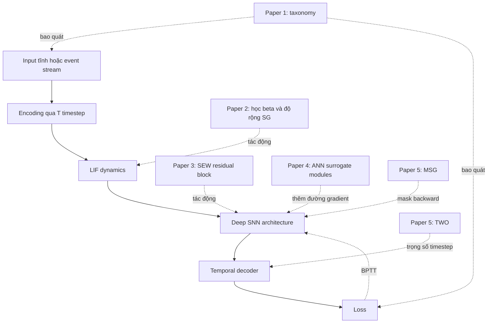

Không paper nào giải quyết toàn bộ SNN:

- LSG làm SG thích nghi nhưng không sửa residual architecture.
- SEW làm mạng sâu train được nhưng vẫn cần SG.
- SML giảm ảnh hưởng tích lũy sai số nhưng tăng chi phí train.
- MSG làm gradient thưa hơn nhưng không biết chính xác phần tử nào nên bỏ.
- TWO cải thiện decoder nhưng không sửa gradient ở các hidden layer.

## 15. Những phương pháp có thể kết hợp

### 15.1. LSG + SEW-ResNet

SEW tạo đường identity tốt theo depth; LSG giữ tỷ lệ nơ-ron có gradient tốt hơn trong residual branch và theo thời gian. Hai cơ chế giải quyết hai vị trí khác nhau nên có khả năng bổ sung.

Rủi ro: cả learnable decay và residual dynamics làm phân bố spike thay đổi; cần theo dõi firing rate và gradient norm theo layer.

### 15.2. SEW-ResNet + SML

SEW rút ngắn đường gradient bằng shortcut bên trong block; SML thêm đường ANN từ intermediate feature đến output. Kết hợp có thể hỗ trợ mạng rất sâu.

Rủi ro: nếu SEW đã giải quyết phần lớn degradation, module SML có thể đem lại lợi ích biên nhỏ so với overhead.

### 15.3. LSG + MSG

LSG điều chỉnh **vùng nào có gradient**, MSG quyết định **phần tử nào trong gradient đó được giữ ở iteration hiện tại**.

Rủi ro: LSG cố gắng tăng gradient availability trong khi MSG lại loại ngẫu nhiên gradient. Nếu mask quá mạnh, lợi ích LSG bị triệt tiêu. Nên dùng $p_l$ theo layer hoặc theo tỷ lệ gradient-available.

### 15.4. SML + structured MSG

Nhánh SML cung cấp tín hiệu phụ, có thể cho phép mask gradient backbone mạnh hơn. Nếu mask theo channel/block thay vì từng phần tử, có cơ hội chuyển sparsity thành speedup thật.

Rủi ro: đồ thị backward có nhiều nguồn gradient; cần xác định mask áp dụng cho tổng gradient hay chỉ gradient backbone, và đo cosine similarity giữa các nguồn.

## 16. Các trade-off quan trọng

### 16.1. Accuracy - timestep - latency

Tăng $T$ thường tăng lượng thông tin nhưng:

- inference cần nhiều vòng mô phỏng hơn;
- BPTT phải lưu nhiều trạng thái hơn;
- gradient có đường thời gian dài hơn;
- năng lượng có thể tăng vì nhiều cơ hội phát spike.

Vì thế $T$ thấp với accuracy tốt là mục tiêu có giá trị, nhưng latency thật còn phụ thuộc implementation và hardware.

### 16.2. Gradient availability - gradient mismatch

- SG hẹp: gradient chính xác cục bộ hơn nhưng dễ vanishing.
- SG rộng: nhiều nơ-ron học được nhưng mismatch lớn.
- LSG tìm thỏa hiệp theo layer.
- MSG giữ SG hiện tại nhưng giảm mật độ cập nhật.
- SML tạo một đường gradient khác thay vì chỉ thay hình SG.

### 16.3. Depth - trainability - computation

SEW cho thấy depth có thể cải thiện accuracy nếu identity mapping đúng. Nhưng số layer tăng vẫn tăng:

- parameter và activation memory;
- số synaptic operations;
- training time;
- độ khó deployment.

Deep hơn chỉ hợp lý nếu mức tăng accuracy hoặc khả năng biểu diễn bù chi phí.

### 16.4. Accuracy - sparsity - hardware efficiency

Ba tuyên bố khác nhau cần được tách:

1. “Spike rate thấp” - đo được trên forward.
2. “Số phép toán thấp” - cần đếm SOP/MAC theo implementation.
3. “Energy thấp” - cần đo trên thiết bị hoặc dùng mô hình năng lượng minh bạch.

Không được suy trực tiếp (3) chỉ từ (1).

## 17. Đề xuất một ma trận thực nghiệm thống nhất

Để so năm hướng một cách công bằng, có thể cố định một backbone và pipeline, sau đó chạy:

| Trục | Giá trị gợi ý |
|---|---|
| Backbone | ResNet-18 hoặc SEW-ResNet-18 |
| Dataset tĩnh | CIFAR-10/100 |
| Dataset event | DVS-CIFAR10 |
| Timestep | $T\in\{2,4,8,10\}$ |
| SG | Rectangular hoặc Arctan cố định |
| Biến thể | Baseline, LSG, SEW, SML, MSG, các tổ hợp chọn lọc |
| Seed | Tối thiểu 3-5 seed |
| Accuracy | Mean ± standard deviation |
| Gradient | Norm, tỷ lệ khác 0, cosine similarity theo layer |
| Activity | Firing rate và spike count theo layer/timestep |
| Hệ thống | Wall-clock, peak memory, SOP estimate, energy nếu có hardware |

Để tránh kết luận sai, augmentation, optimizer, learning-rate schedule, batch size và training epoch phải giống nhau. Nếu một phương pháp buộc dùng cấu hình khác, phải báo rõ.

## 18. Các research gap khả thi từ năm paper

### 18.1. Layer-wise adaptive structured MSG

Thay mask element-wise ngẫu nhiên bằng mask channel/block có xác suất $p_l$ riêng cho từng layer. $p_l$ có thể dựa trên:

- tỷ lệ nơ-ron nằm trong vùng SG;
- gradient norm;
- firing rate;
- độ sâu;
- độ tương đồng giữa gradient backbone và auxiliary gradient.

Mục tiêu là vừa regularize vừa tạo sparsity phần cứng có thể khai thác.

### 18.2. Tách learnable neuron dynamics khỏi learnable SG

Trong LSG, $\beta$ vừa tác động forward dynamics vừa quyết định $\alpha$. Có thể học hai biến riêng nhưng thêm regularization buộc chúng tương quan mềm, rồi kiểm tra liệu coupling cứng của paper có thật sự cần thiết.

### 18.3. Temporal-aware surrogate module

SML lấy trung bình spike theo thời gian trước ANN module, làm mất thứ tự. Có thể thử một module nhẹ giữ temporal bins hoặc temporal attention, sau đó đo trade-off giữa gradient quality và overhead.

### 18.4. Gradient-quality benchmark trên mạng nhỏ

Các paper dùng khái niệm “gradient error” nhưng gradient thật của hàm spike rời rạc không đơn giản. Trên mô hình nhỏ, có thể định nghĩa gradient tham chiếu bằng finite difference/smoothing, rồi đo:

- relative norm error;
- cosine similarity;
- sign agreement;
- thay đổi loss sau một bước cập nhật.

Benchmark này giúp so LSG, SML và MSG trên cùng một định nghĩa.

### 18.5. Hardware-aware evaluation

Một nghiên cứu có giá trị là đưa các phương pháp lên cùng simulator/accelerator và báo cáo:

$$
\text{Accuracy},\quad
\text{spikes},\quad
\text{SOPs},\quad
\text{latency},\quad
\text{joule/sample}.
$$

Đây là khoảng trống chung vì hầu hết kết quả trong năm paper vẫn được đánh giá chủ yếu bằng accuracy và proxy.

## 19. Lộ trình học đề xuất cho sinh viên mới

### Giai đoạn 1 - Hiểu forward

- Tự tính ví dụ LIF 4-5 timestep bằng tay.
- Phân biệt pre-reset potential, post-reset potential và spike.
- Vẽ tensor shape theo $[T,B,C,H,W]$.
- Tính firing rate cho một spike train.

### Giai đoạn 2 - Hiểu backward

- Vẽ hàm Heaviside và một SG.
- Thử ba độ rộng SG và chỉ ra vùng có gradient.
- Trải một nơ-ron qua 3 timestep và lần theo dependency.
- Phân biệt vanishing, mismatch và error accumulation.

### Giai đoạn 3 - Đọc paper theo câu hỏi

1. Paper 1: lĩnh vực có những hướng nào?
2. Paper 2: SG nên thích nghi như thế nào?
3. Paper 3: residual connection nào phù hợp spike?
4. Paper 4: có thể tạo đường gradient phụ hay không?
5. Paper 5: có thể làm backward thưa và decoder temporal tốt hơn không?

### Giai đoạn 4 - Tái lập tối thiểu

- Baseline LIF + fixed SG trên CIFAR-10.
- Log accuracy, firing rate và gradient norm.
- Thêm đúng một phương pháp mỗi lần.
- Chạy nhiều seed trước khi kết luận.
- Chỉ sau đó mới thử tổ hợp.

## 20. Câu hỏi tự kiểm tra

1. Vì sao SNN có thêm chiều thời gian ngay cả khi input là ảnh tĩnh?
2. $T$ khác epoch và số layer như thế nào?
3. Vì sao forward dùng spike thật nhưng backward dùng SG?
4. SG quá hẹp và quá rộng gây hai lỗi khác nhau ra sao?
5. LSG thực sự học trực tiếp $\alpha$ hay học gián tiếp?
6. Vì sao Spiking ResNet cũ không bảo đảm identity mapping?
7. ADD, AND và IAND trong SEW khác nhau thế nào?
8. SML tránh phần nào của chuỗi spiking layer khi backward?
9. Vì sao distillation hai chiều quan trọng trong SML?
10. MSG tạo gradient sparsity hay spike sparsity?
11. TWO phù hợp dữ liệu DVS hơn ảnh tĩnh trong trường hợp nào?
12. Vì sao firing rate thấp chưa đủ để khẳng định energy thấp?

## 21. Bảng thuật ngữ

| Thuật ngữ | Giải thích ngắn |
|---|---|
| ANN | Artificial Neural Network, mạng dùng activation số thực thông thường |
| SNN | Spiking Neural Network, mạng truyền tín hiệu bằng spike theo thời gian |
| Spike | Sự kiện nhị phân 0/1 |
| IF | Integrate-and-Fire, tích lũy rồi phát spike |
| LIF | Leaky Integrate-and-Fire, có thêm cơ chế rò điện thế |
| Membrane potential | Trạng thái tích lũy nội tại của nơ-ron |
| Threshold | Ngưỡng phát spike |
| Decay factor | Tỷ lệ điện thế cũ được giữ lại |
| Timestep | Một bước mô phỏng thời gian |
| Firing rate | Tỷ lệ spike bằng 1 trong vùng quan sát |
| BPTT | Backpropagation Through Time |
| STBP | Spatial-Temporal Backpropagation |
| SG | Surrogate Gradient, đạo hàm xấp xỉ dùng ở backward |
| Gradient mismatch | Gradient xấp xỉ không phản ánh tốt thay đổi spike thật |
| Gradient vanishing | Gradient suy giảm gần 0 |
| Gradient exploding | Gradient tăng mất kiểm soát |
| LSG | Learnable Surrogate Gradient |
| SEW | Spike-Element-Wise residual connection |
| SML | Surrogate Module Learning |
| MSG | Masked Surrogate Gradient |
| TWO | Temporally Weighted Output |
| tdBN | Threshold-dependent Batch Normalization |
| Knowledge distillation | Học để output của student gần teacher |
| Detach | Giữ giá trị tensor nhưng chặn gradient qua tensor đó |
| Spike sparsity | Tính thưa của spike trong forward |
| Gradient sparsity | Tính thưa của gradient trong backward |
| SOP | Synaptic Operation, phép toán synapse khi có spike |
| Neuromorphic hardware | Phần cứng thiết kế cho tính toán thần kinh/event-driven |
| DVS | Dynamic Vision Sensor, camera phát sự kiện theo thay đổi độ sáng |

## 22. Kết luận

Năm paper tạo thành một lộ trình khá hoàn chỉnh về direct-training SNN:

- Paper 1 cho bản đồ vấn đề.
- Paper 2 làm surrogate gradient thích nghi theo dynamics của từng layer.
- Paper 3 thiết kế residual connection phù hợp để SNN có thể rất sâu.
- Paper 4 bổ sung đường gradient phụ nhằm giảm ảnh hưởng tích lũy của sai số SG.
- Paper 5 làm gradient surrogate thưa hơn và giải mã temporal output thích nghi.

Thông điệp chung là không có một chỉ số duy nhất quyết định chất lượng SNN. Một mô hình tốt phải cân bằng **accuracy, timestep, depth, gradient quality, firing activity, training cost và hiệu quả phần cứng**. Các paper đã cải thiện nhiều mắt xích, nhưng bằng chứng về energy end-to-end và benchmark gradient thống nhất vẫn là khoảng trống nghiên cứu rõ ràng.

## 23. Tài liệu nguồn trong project

1. Guo, Y., Huang, X., & Ma, Z. (2023). *Direct learning-based deep spiking neural networks: a review*. [PDF](paper1/fnins-17-1209795.pdf).
2. Lian, S., Shen, J., Liu, Q., Wang, Z., Yan, R., & Tang, H. (2023). *Learnable Surrogate Gradient for Direct Training Spiking Neural Networks*. [PDF](paper2/paper_2.pdf).
3. Fang, W., Yu, Z., Chen, Y., Huang, T., Masquelier, T., & Tian, Y. (2021). *Deep Residual Learning in Spiking Neural Networks*. [PDF](paper3/2102.04159v6.pdf).
4. Deng, S., Lin, H., Li, Y., & Gu, S. (2023). *Surrogate Module Learning: Reduce the Gradient Error Accumulation in Training Spiking Neural Networks*. [PDF](paper4/deng23d.pdf).
5. Li, Y., Zhao, F., Zhao, D., & Zeng, Y. (2024). *Directly Training Temporal Spiking Neural Network with Sparse Surrogate Gradient*. [PDF](paper5/2406.19645v1.pdf).

Các báo cáo chi tiết sẵn có trong project:

- [Báo cáo Paper 1](paper1/Report_p1.md)
- [Báo cáo Paper 2](paper2/Report_02_LSG.md)
- [Báo cáo Paper 3](paper3/report_p3.md)
- [Báo cáo Paper 4](paper4/Bao_cao_SML.md)
- [Báo cáo Paper 5](paper5/report.md)
