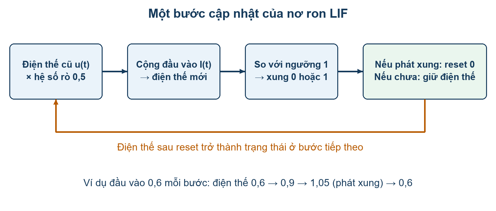
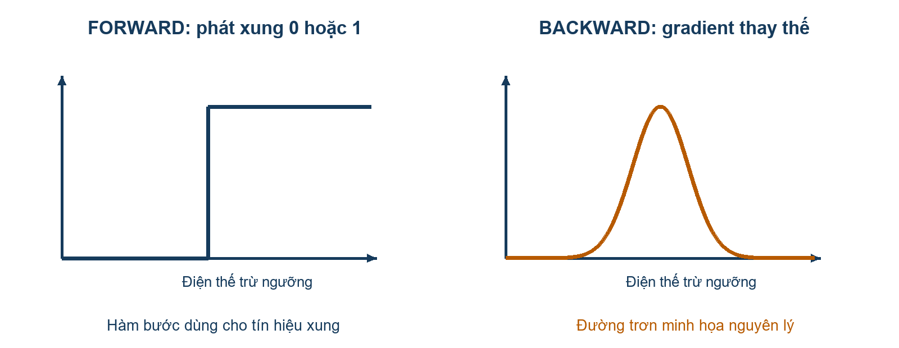
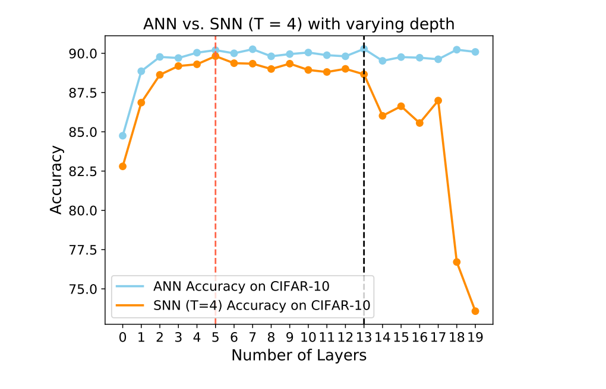
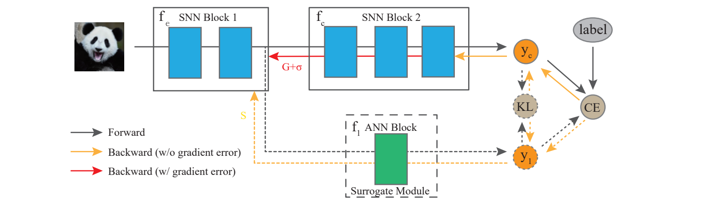
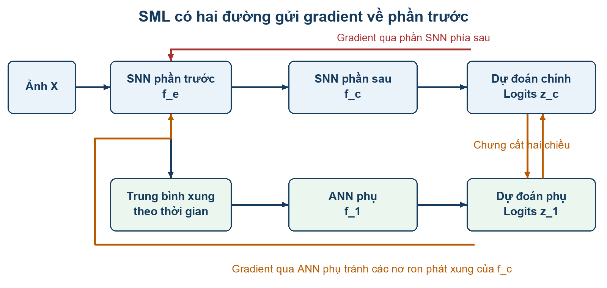
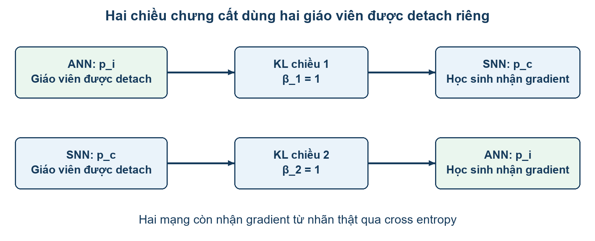
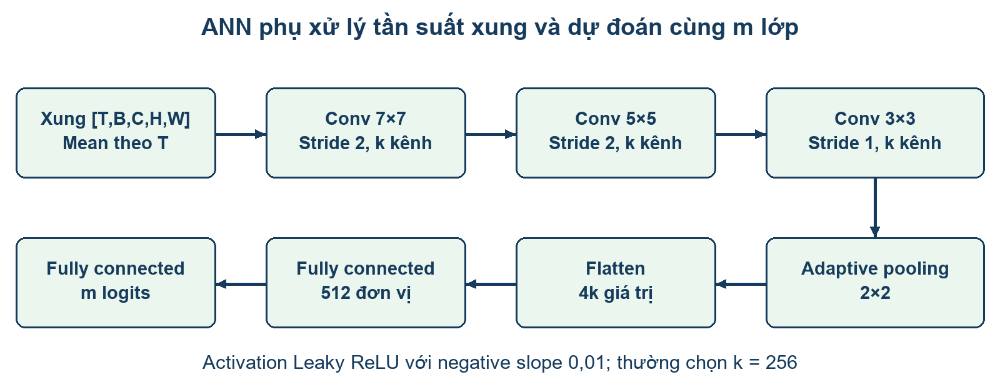
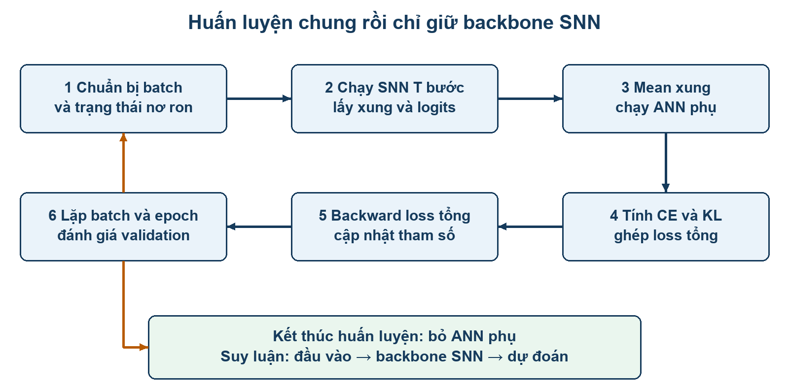
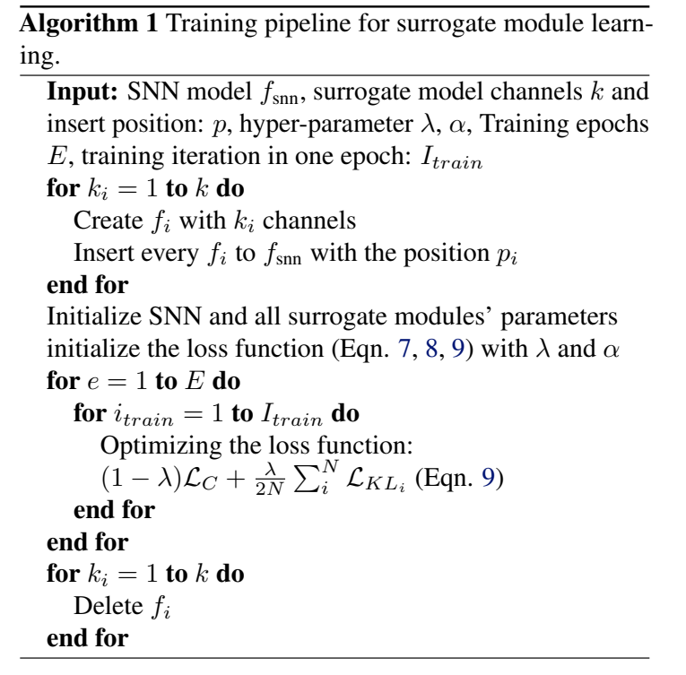
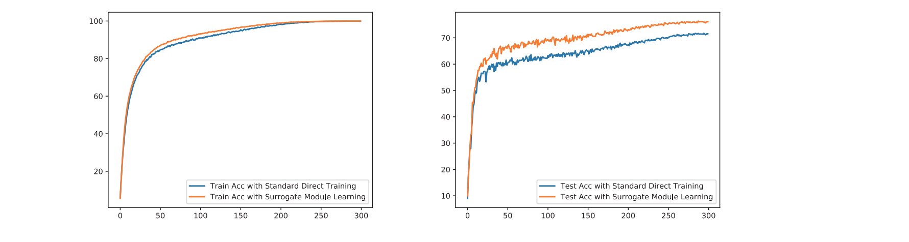

# Báo cáo nghiên cứu Surrogate Module Learning

Giảm ảnh hưởng của sai số gradient khi huấn luyện mạng nơ ron xung

**Bài nghiên cứu:** Surrogate Module Learning: Reduce the Gradient Error Accumulation in Training Spiking Neural Networks.  
**Tác giả:** Shikuang Deng, Hao Lin, Yuhang Li, Shi Gu.  
**Công bố:** ICML 2023, Proceedings of Machine Learning Research, tập 202.  
**Đối tượng:** Nhóm nghiên cứu có thành viên mới tìm hiểu SNN và huấn luyện bằng gradient.  
**Ngày biên soạn:** 18 tháng 9 năm 2026.

Surrogate Module Learning, viết tắt SML, bổ sung các mạng ANN phụ vào một số vị trí trung gian của SNN trong giai đoạn huấn luyện. Các nhánh phụ học phân loại và trao đổi thông tin dự đoán với đầu ra SNN bằng chưng cất hai chiều. Chúng cung cấp thêm đường lan truyền ngược, giúp giảm ảnh hưởng của sai số do gradient thay thế ở phần SNN phía sau vị trí gắn nhánh. Khi huấn luyện kết thúc, các nhánh được bỏ đi; mạng suy luận vẫn là SNN chính.

Báo cáo giải thích từ nơ ron LIF, gradient và tensor theo thời gian đến kiến trúc SML, công thức loss, ví dụ số, thực nghiệm, giới hạn lý thuyết và kế hoạch tái lập. Các kết quả định lượng được lấy từ bài gốc [1]. Ví dụ mèo và chó, sơ đồ tiếng Việt, mã giả và kế hoạch làm việc là phần diễn giải hoặc đề xuất phục vụ học tập, không phải thực nghiệm mới.

## 1 Hướng dẫn đọc và bản đồ nội dung

Người mới nên đọc phần 2 đến 4 để nắm các khái niệm, sau đó xem Hình 1 và Hình 4 cùng ví dụ ở phần 8. Khi đã hiểu hai đường truyền gradient, đọc phần 6 về loss và phần 9 về triển khai. Thành viên phụ trách lý thuyết tập trung vào phần 10; thành viên phụ trách thực nghiệm đọc phần 11 đến 14.

| Phần      | Nội dung cần hiểu                            | Sản phẩm học tập                                     |
| --------- | -------------------------------------------- | ---------------------------------------------------- |
| 2 đến 4   | ANN, SNN, LIF, gradient và vấn đề huấn luyện | Giải thích một nơ ron phát xung và một bước backward |
| 5 đến 7   | Kiến trúc SML, chưng cất, loss và ANN phụ    | Vẽ lại luồng dữ liệu và chỉ ra nhánh nhận gradient   |
| 8 đến 9   | Ví dụ số và quy trình triển khai             | Tính loss và theo dõi shape của tensor               |
| 10        | Lập luận giảm tỷ lệ sai số gradient          | Phân biệt giả định với kết luận tổng quát            |
| 11 đến 13 | Kết quả, ablation và chi phí                 | Đọc đúng baseline, cấu hình và điểm phần trăm        |
| 14 đến 17 | Đánh giá, tái lập, phân công và câu hỏi      | Chuẩn bị thảo luận và kế hoạch thí nghiệm            |
| 18 đến 19 | Thuật ngữ, nguồn và bản đồ đối chiếu         | Tra cứu nhanh khi đọc bài gốc                        |

Ba câu hỏi xuyên suốt báo cáo là: gradient bổ sung đi từ đâu đến đâu; vì sao ANN phụ cần học gần đầu ra SNN; và bằng chứng nào cho thấy cải thiện đủ bù chi phí huấn luyện.

**Điều hướng nhanh:** [Nền tảng ANN và SNN](#2-kiến-thức-nền-về-ann-và-snn) · [Kiến trúc SML](#5-kiến-trúc-và-cơ-chế-surrogate-module-learning) · [Loss và chưng cất](#6-self-distillation-và-hàm-mất-mát) · [Ví dụ mèo và chó](#8-ví-dụ-đầy-đủ-với-bài-toán-mèo-và-chó) · [Triển khai](#9-quy-trình-triển-khai-và-mã-giả) · [Kết quả](#12-kết-quả-chính-và-cách-đọc-so-sánh) · [Phân công](#16-phân-công-tìm-hiểu-và-tổ-chức-thảo-luận).

## 2 Kiến thức nền về ANN và SNN

### 2.1 ANN xử lý tín hiệu như thế nào

Artificial Neural Network, ANN, là mạng nơ ron nhân tạo thông thường. Một lớp thường tính tổ hợp tuyến tính của đầu vào rồi áp dụng hàm kích hoạt. Ví dụ với vector x, trọng số W và bias b, đầu ra có dạng h = activation(Wx + b). Trong mạng ảnh, W thường nằm trong lớp tích chập. Các activation như ReLU hoặc Leaky ReLU tạo ra giá trị thực, không chỉ hai giá trị 0 và 1.

Trong phân loại, lớp cuối tạo m điểm số gọi là logits, với m là số lớp. Softmax chuyển logits thành phân bố xác suất có tổng bằng 1. Logit không phải xác suất; nó có thể âm hoặc lớn hơn 1. Sự phân biệt này rất quan trọng khi cài cross entropy và KL divergence.

### 2.2 SNN có thêm trạng thái và chiều thời gian

Spiking Neural Network, SNN, dùng xung nhị phân làm tín hiệu giữa các nơ ron phát xung. Nơ ron có trạng thái điện thế màng, tích lũy tác động của đầu vào qua nhiều bước thời gian. Mạng vì vậy có cả chiều sâu không gian và chiều thời gian, gần với một mạng hồi quy được trải ra theo thời gian.

T là số bước mô phỏng trong một lượt xử lý đầu vào. T = 4 nghĩa là mô phỏng bốn bước của các nơ ron, không có nghĩa mạng có bốn lớp hay được huấn luyện bốn epoch. Với dữ liệu ảnh tĩnh, cần một cách đưa ảnh vào các bước thời gian; với dữ liệu sự kiện, đầu vào vốn có cấu trúc thời gian. Cách mã hóa đầu vào và cách đọc đầu ra phải thống nhất giữa baseline và SML khi tái lập.

Các tín hiệu xung 0 và 1 có thể giúp giảm phép nhân trong tính toán synapse và khai thác tính thưa trên phần cứng phù hợp. Tuy nhiên, ưu thế điện năng phụ thuộc phần cứng, mật độ xung, cách triển khai và số bước thời gian. Bài này chủ yếu chứng minh hiệu quả huấn luyện bằng độ chính xác; không nên coi các bảng accuracy là phép đo điện năng của thiết bị neuromorphic.

### 2.3 Mô hình nơ ron LIF

Leaky Integrate and Fire, LIF, mô tả ba hành vi: điện thế cũ bị suy giảm, đầu vào mới được tích lũy, và nơ ron phát xung khi điện thế đạt ngưỡng. Báo cáo tách điện thế trước và sau reset để tránh dùng cùng một ký hiệu cho hai trạng thái.



_Hình 1. Sơ đồ tiếng Việt của một bước LIF. Sơ đồ diễn giải công thức 1 đến 3 của bài gốc [1, tr. 3]._

$$
\begin{aligned}
\tilde u(t+1) &= \tau u(t)+I(t)\\
a(t+1) &= \Theta\big(\tilde u(t+1)-V_{\mathrm{th}}\big)\\
u(t+1) &= \tilde u(t+1)\big(1-a(t+1)\big)
\end{aligned}
$$

u(t) là điện thế sau bước trước; I(t) là đầu vào mới; ũ(t+1) là điện thế trước reset; a(t+1) là xung; Vth là ngưỡng; Θ là hàm bước Heaviside. Bài đặt u(0) = 0, Vth = 1 và τ = 0,5. Nếu phát xung, a = 1, điện thế sau reset bằng 0. Nếu chưa phát xung, a = 0, điện thế sau reset giữ giá trị vừa tích lũy.

Ví dụ với đầu vào mỗi bước đều bằng 0,6:

| Bước | Điện thế cũ | Điện thế trước reset   | Xung | Điện thế sau reset |
| ---- | ----------- | ---------------------- | ---- | ------------------ |
| 1    | 0           | 0,5 × 0 + 0,6 = 0,6    | 0    | 0,6                |
| 2    | 0,6         | 0,5 × 0,6 + 0,6 = 0,9  | 0    | 0,9                |
| 3    | 0,9         | 0,5 × 0,9 + 0,6 = 1,05 | 1    | 0                  |
| 4    | 0           | 0,5 × 0 + 0,6 = 0,6    | 0    | 0,6                |

Nơ ron tạo chuỗi [0, 0, 1, 0]. Tần suất xung trong cửa sổ bốn bước là 1/4. Ví dụ này cho thấy đầu ra phụ thuộc lịch sử điện thế, không chỉ đầu vào của một bước.

### 2.4 Forward backward và cập nhật trọng số

Forward là tính đầu ra từ đầu vào với trọng số hiện tại. Loss đo mức sai của dự đoán. Backward tính đạo hàm loss theo trọng số. Optimizer dùng các đạo hàm này để cập nhật trọng số. Với SGD đơn giản, W mới = W cũ − η × gradient, trong đó η là learning rate. Bài dùng AdamW nên cập nhật thực tế có thêm cơ chế moment và weight decay.

Epoch là một vòng đi qua tập huấn luyện; batch là một nhóm mẫu; iteration là một lần xử lý batch và cập nhật. T, epoch và iteration là ba đại lượng khác nhau. Trạng thái nơ ron phải được quản lý để các mẫu độc lập không vô tình chia sẻ điện thế.

## 3 Vì sao gradient thay thế được sử dụng

### 3.1 Điểm nghẽn ở hàm phát xung

Để tính đạo hàm loss theo trọng số W của một nơ ron, quy tắc dây chuyền cần đạo hàm đầu ra a theo điện thế u. Hàm bước có đạo hàm thông thường bằng 0 gần như mọi nơi và không xác định tại ngưỡng. Điều này làm tín hiệu cập nhật trực tiếp qua hàm phát xung không hữu ích cho học bằng gradient.

Trong ngôn ngữ phân phối, đạo hàm hàm bước liên hệ với Dirac delta. Dirac delta không phải một hàm trơn thông thường có thể đưa trực tiếp vào backward số như activation của ANN. Cần phân biệt cách mô tả toán học này với gradient số được optimizer sử dụng.

### 3.2 Forward vẫn phát xung nhưng backward dùng xấp xỉ

Surrogate gradient, SG, thay đạo hàm của hàm phát xung bằng một biểu thức trơn khi backward. Forward vẫn dùng hàm bước và tạo xung nhị phân. Vì vậy SG không yêu cầu đổi SNN thành ANN trong quá trình suy luận.



_Hình 2. Minh họa riêng forward và backward. Đường gradient trong hình là minh họa nguyên lý, không phải kết quả đo và không phải đường Dspike với tham số cụ thể của thí nghiệm._

Bài dùng hàm Dspike với miền mẫu r = 1 [1, công thức 5, tr. 3]. Đường trơn được viết bằng tanh; tham số b kiểm soát độ dốc, khác với nhiệt độ chưng cất Tdis ở phần sau.

$$
\mathrm{Dspike}(x,b)=\frac{\tanh(bx)}{2\tanh(rb)}+\frac12,
\qquad -r\le x\le r,\quad r=1.
$$

Đạo hàm của biểu thức trơn trong miền mẫu có dạng b × sech²(bx) / [2 tanh(rb)]. Khi lập trình custom backward phải kiểm tra quy ước ở ngoài miền mẫu và tham số b trong mã tác giả. Báo cáo không tự đặt b hoặc quy ước biên thành cấu hình thực nghiệm đã được bài xác nhận.

### 3.3 Lan truyền ngược qua không gian và thời gian

Spatial Temporal Backpropagation, STBP, lan truyền gradient qua lớp và qua các trạng thái thời gian của SNN. Biểu thức trong bài cho thấy đóng góp của các bước thời gian được cộng lại và có thừa số đạo hàm a theo u cần SG [1, công thức 4]. Việc triển khai đầy đủ phải xử lý cả phụ thuộc hồi quy của điện thế và cơ chế reset.

Gradient qua một lớp sâu là tích của nhiều Jacobian. Jacobian là ma trận chứa đạo hàm từng thành phần đầu ra theo từng thành phần đầu vào. Khi thay các đạo hàm phát xung bằng SG, đường backward dùng một chuỗi xấp xỉ. Sai số có thể thay đổi cả độ lớn lẫn hướng của tín hiệu cập nhật.

## 4 Vấn đề mà bài nghiên cứu đặt ra

### 4.1 Tích lũy sai số qua độ sâu

Tác giả cho rằng tối ưu hình dạng SG chưa giải quyết hết sai số. Khi phần phía sau có nhiều lớp phát xung, gradient về các lớp đầu phải đi qua nhiều phép xấp xỉ. Bài chuyển câu hỏi từ việc chọn một SG tốt hơn sang việc tạo thêm đường cung cấp gradient cho các phần của mạng.



_Hình 3. Hình 2 gốc trong [1, tr. 4], so sánh ANN và SNN với T = 4 trên CIFAR 10 khi thay đổi số lớp tích chập L được nối sau stem._

Mô hình thử nghiệm có ba lớp stem, tiếp theo là L lớp tích chập và bộ phân loại. Trục ngang là L, không phải toàn bộ số lớp của mô hình. Theo mô tả tác giả, ANN đạt đỉnh tại L = 13 còn SNN đạt đỉnh tại L = 5; khi L tăng lớn, SNN giảm mạnh hơn ANN.

Kết quả này phù hợp với khó khăn tối ưu SNN sâu, nhưng đường accuracy tự nó không đo trực tiếp sai số gradient và không cô lập tất cả nguyên nhân. Mất thông tin nhị phân, cấu trúc mạng và siêu tham số cũng có thể ảnh hưởng. Cần đọc đây là bằng chứng động cơ cho SML trong cấu hình cụ thể, không phải định luật rằng mọi SNN sâu đều huấn luyện thất bại.

### 4.2 Hướng giải quyết

SML tạo các đường ANN phụ từ đặc trưng trung gian đến bài toán phân loại. ANN phụ có activation liên tục, nên backward trong nhánh tránh SG ở các lớp SNN phía sau mà nó đại diện. Self distillation kéo đầu ra các nhánh gần đầu ra chính, giúp nhiệm vụ phụ phù hợp hơn với mục tiêu của mạng chính.

### 4.3 SML nằm ở đâu giữa các hướng huấn luyện

**Huấn luyện trực tiếp bằng SG:** tối ưu ngay trọng số SNN với tín hiệu xung trong forward. Hướng này có thể làm việc với dữ liệu thời gian và số bước mô phỏng nhỏ, nhưng gặp vấn đề đạo hàm phát xung. SML thuộc hướng huấn luyện trực tiếp, bổ sung cơ chế nhánh và chưng cất để hỗ trợ nó.

**Chuyển đổi ANN sang SNN:** thường bắt đầu từ một ANN đã huấn luyện rồi xây SNN tương ứng. Mục tiêu là giữ hành vi của ANN bằng biểu diễn xung. Đây là một hướng khác; thuật toán SML trong bài không yêu cầu một ANN giáo viên được huấn luyện trước rồi chuyển toàn bộ trọng số sang backbone.

**Tandem learning:** dùng ANN liên hệ chặt với SNN, chẳng hạn chia sẻ tham số, để hỗ trợ tính gradient. Trong khi đó các mô đun SML được gắn tại một số điểm, có kiến trúc và tham số riêng, không cần giống toàn bộ phần SNN phía sau.

**Auxiliary learning và local learning:** auxiliary learning thêm loss trung gian nhưng có thể vẫn giữ gradient toàn mạng. Local learning chia mạng thành các phần và cắt gradient giữa các phần, mỗi phần học từ một mục tiêu cục bộ. SML đầy đủ giữ đường gradient backbone và thêm nhánh ANN được chưng cất. Các cấu hình cắt gradient trong bài là thí nghiệm đối chứng để tìm hiểu vai trò từng đường.

BYOT là một hướng tự chưng cất dùng các đầu ra trung gian học từ đầu ra cuối. SML kiểm tra thêm chiều ngược: đầu ra cuối SNN cũng học từ đầu ra ANN phụ. Bài xem sự đồng thuận hai chiều là yếu tố quan trọng để nhánh đóng vai trò thay thế. Các mô tả này tóm lược vị trí của phương pháp theo mục Related Work [1, tr. 2], không thay cho việc đọc riêng từng công trình.

### 4.4 Liên hệ sinh học được bài đề cập

Tác giả lấy động cơ từ các kết nối phản hồi xa trong não, có thể mang thông tin lỗi từ vùng xử lý cao về các mô đun phía trước. Đây là giả thuyết giúp gợi ý một đường học bổ sung. Kết quả phân loại của SML không chứng minh não thực sự dùng thuật toán này hoặc rằng backward của mô hình tương đương cơ chế sinh học. Khi trình bày với nhóm, cần tách động cơ sinh học khỏi đóng góp kỹ thuật đã được thử nghiệm.

## 5 Kiến trúc và cơ chế Surrogate Module Learning

### 5.1 Chia mạng thành phần trước và phần sau

Ký hiệu fe là phần trích xuất đặc trưng trước vị trí gắn nhánh; fc là toàn bộ phần còn lại tạo đầu ra cuối. Với tham số θe và θc, mạng chính có dạng fc(fe(X)). fc không nhất thiết chỉ là lớp fully connected; nó có thể chứa nhiều block SNN.

Một ANN phụ f1 được nối từ đầu ra fe. Đầu vào thực tế của ANN phụ là tần suất phát xung của đặc trưng trung gian. f1 có tham số θ1 riêng; phương pháp được mô tả trong bài không yêu cầu f1 chia sẻ trọng số hoặc có kiến trúc giống fc.



_Hình 4. Hình 1 gốc trong [1, tr. 3]. fe và fc là hai phần SNN; f1 là ANN phụ; yc là đầu ra cuối; y1 là đầu ra phụ; CE là cross entropy; KL là loss chưng cất. Phần trong nét đứt được bỏ sau huấn luyện._



_Hình 5. Sơ đồ diễn giải tiếng Việt. Forward từ trái sang phải; gradient quay về phần trước qua cả SNN phía sau và ANN phụ. Đường ANN tránh các nơ ron phát xung của phần phía sau, nhưng phần trước vẫn là SNN._

### 5.2 Đường forward

Đầu vào X được đưa qua fe trong T bước thời gian. Chuỗi xung trung gian tiếp tục đi vào fc để tạo đầu ra chính. Đồng thời, lấy trung bình xung theo thời gian để tạo bản đồ tần suất và đưa vào f1. Hai nhánh đều tạo m logits cho cùng m lớp. ANN phụ không thay thế đường forward của fc và không gửi đầu ra của nó vào fc trong kiến trúc mô tả này.

Với nhiều nhánh, mỗi nhánh lấy đặc trưng tại vị trí riêng và dự đoán cùng bài toán cuối. Những lớp nằm trước vị trí gắn nhánh nhận gradient từ nhánh đó. Các lớp nằm sau vị trí gắn nhánh không nhận gradient của loss phân loại phụ qua đường ANN đó; chúng vẫn được cập nhật qua đầu ra SNN và các loss chưng cất liên quan.

### 5.3 Đường backward

Loss chính truyền gradient qua fc về fe. Loss phụ truyền gradient qua f1 và phép lấy trung bình thời gian về fe. Loss chưng cất tạo thêm các đóng góp thông qua đầu ra học sinh của từng chiều. Gradient tổng tại trọng số của fe là tổng các đóng góp từ các đường có liên hệ trong đồ thị tính toán.

Ưu điểm là fe nhận thêm tín hiệu học mà không phải chờ gradient đi ngược qua tất cả các lớp phát xung của fc. Tuy nhiên, khi gradient đi vào chính các nơ ron phát xung trong fe, nó vẫn cần SG. Vì vậy không nên nói nhánh ANN tạo gradient chính xác cho toàn bộ SNN.

### 5.4 Vì sao nhánh phụ cần trở thành mô đun thay thế

Chỉ thêm một đầu phân loại phụ là auxiliary learning hoặc deep supervision. Nó cho fe thêm một mục tiêu, nhưng mục tiêu đó có thể khác cách fc khai thác đặc trưng. Hai bộ phân loại đều dự đoán đúng nhãn vẫn có thể có mức tự tin và Jacobian rất khác nhau.

SML dùng chưng cất để kéo dự đoán của f1 gần với fc. Tác giả kỳ vọng khi nhánh phụ đại diện tốt hơn cho phần mạng phía sau, gradient từ nó phù hợp hơn với việc cải thiện đầu ra cuối. Tên surrogate module nói đến vai trò đại diện chức năng trong huấn luyện; không có nghĩa sao chép trọng số của ANN phụ sang SNN trong thuật toán thực nghiệm.

### 5.5 Huấn luyện xong thì giữ lại gì

Giữ trọng số backbone SNN đã học, bỏ các ANN phụ và các loss huấn luyện. Trọng số backbone đã nhận tác động của các nhánh trong quá trình tối ưu, nên lợi ích có thể còn sau khi loại nhánh. Trong suy luận, chỉ chạy đường SNN chính. Cần kiểm tra trực tiếp rằng tắt nhánh không thay logits của backbone với cùng đầu vào và cùng trạng thái nơ ron.

## 6 Self distillation và hàm mất mát

### 6.1 Phân biệt logit xác suất và nhãn

Báo cáo dùng zc và zi cho logits của SNN và nhánh i; pc và pi cho phân bố xác suất; ŷ cho nhãn one hot; y cho chỉ số lớp. Bài gốc dùng ký hiệu yc và yi ở nhiều biểu thức, nên khi cài đặt cần xác định biến nào là logits và biến nào là xác suất.

Cross entropy trong các thư viện thường nhận logits và chỉ số lớp. Nếu đã softmax logits trước rồi lại gọi một hàm cross entropy có softmax bên trong, phép tính sẽ khác mục tiêu dự kiến. KL divergence lại cần log xác suất và xác suất theo đúng giao diện thư viện.

### 6.2 Loss phân loại của mạng chính và nhánh phụ

$$
L_C=\frac{L+\alpha\sum_{i=1}^{N}L_i}{1+N\alpha}.
$$

L là cross entropy của SNN chính; Li là cross entropy của nhánh i; N là số nhánh; α là trọng số loss phân loại của từng nhánh. Mẫu số 1 + Nα chuẩn hóa tổng trọng số. Khi N = 0, LC trở về L. Với N = 2 và α = 0,5, LC = (L + 0,5L1 + 0,5L2)/2 [1, công thức 7, tr. 4].

α không phải trọng số chưng cất và không phải learning rate. Tăng α làm phần phân loại của các nhánh phụ có vai trò lớn hơn tương đối so với phân loại đầu ra chính.

### 6.3 Nhiệt độ chưng cất

$$
p_j=\frac{\exp(z_j/T_{\mathrm{dis}})}{\sum_{k=1}^{m}\exp(z_k/T_{\mathrm{dis}})},
\qquad
D_{\mathrm{KL}}(p\Vert q)=\sum_j p_j\ln\frac{p_j}{q_j}.
$$

Tdis là nhiệt độ chưng cất; T là số bước mô phỏng SNN. Đây là hai tham số độc lập. Tdis cao làm phân bố mềm hơn, thể hiện quan hệ giữa các lớp chưa được chọn. Tdis quá cao có thể làm mất tín hiệu phân biệt; quá thấp có thể làm mục tiêu quá sắc. Phụ lục bài tìm được Tdis = 3 là tốt nhất trong phép quét được báo cáo [1, Bảng 11, tr. 12].

Ví dụ logits [2, 0] cho xác suất xấp xỉ [0,881; 0,119] ở nhiệt độ 1, và [0,661; 0,339] ở nhiệt độ 3. Đây là minh họa softmax, không phải kết quả phân loại của SML.

### 6.4 Hai chiều chưng cất và ý nghĩa detach



_Hình 6. Mỗi chiều có một học sinh nhận gradient và một giáo viên được detach. Vai trò giáo viên và học sinh thay đổi giữa hai phép loss._

Theo ký hiệu công thức 8 của bài:

$$
\begin{aligned}
L_{\mathrm{KL},i}={}&\beta_1\mathrm{KL}(y_c,D(y_i),T_{\mathrm{dis}})\\
&+\beta_2\mathrm{KL}(y_i,D(y_c),T_{\mathrm{dis}}).
\end{aligned}
$$

Đối số đầu của KL trong biểu thức này được hiểu là đầu ra học sinh; D(.) là detach đối với đầu ra giáo viên. β1 bật chiều SNN học từ ANN, β2 bật chiều ANN học từ SNN. Khi β1 = β2 = 1, dùng cả hai chiều. Khi chỉ β2 = 1, ANN phụ học từ SNN, gần với hướng chưng cất của BYOT được bài dùng để so sánh.

Detach giữ nguyên giá trị tensor trong forward nhưng chặn đạo hàm qua tensor đó trong phép loss đang xét. Detach logits giáo viên không có nghĩa đóng băng toàn bộ mạng giáo viên: mạng đó vẫn nhận gradient từ loss phân loại và từ chiều chưng cất còn lại.

Để tránh nhầm thứ tự đối số giữa ký hiệu bài và giao diện thư viện, có thể định nghĩa rõ KD(student, teacher) = DKL(pteacher đã detach || pstudent). Nếu dùng hệ số Tdis² theo quy ước chưng cất thông dụng, phải ghi hệ số đó trong định nghĩa KD. Công thức tổng của bài không tách riêng hệ số này; khi tái lập cần đối chiếu helper KL trong mã tác giả, vì hệ số ảnh hưởng độ lớn gradient và ý nghĩa λ.

### 6.5 Loss tổng

$$
L_{\mathrm{total}}=(1-\lambda)L_C
+\frac{\lambda}{2N}\sum_{i=1}^{N}L_{\mathrm{KL},i}.
$$

λ cân bằng phân loại và chưng cất. Với λ = 0 chỉ có LC; với λ lớn hơn, hai nhánh được yêu cầu đồng thuận mạnh hơn. Hệ số 2N chuẩn hóa theo số nhánh và hai chiều chưng cất [1, công thức 9, tr. 5]. Không nên đặt λ = 1 trong ví dụ huấn luyện từ đầu rồi giả định mạng sẽ tự học nhãn: khi đó mất đóng góp trực tiếp từ nhãn thật trong biểu thức này.

Một giáo viên dự đoán kém vẫn có thể tạo hiệu ứng làm mềm nhãn, như tác giả thảo luận. Đây không phải bảo đảm mọi giáo viên kém đều giúp. Nếu hai nhánh sai giống nhau, loss chưng cất có thể nhỏ trong khi accuracy vẫn thấp. Vì vậy phải theo dõi cả cross entropy, KL và accuracy riêng từng nhánh.

## 7 Thiết kế ANN phụ và hình dạng tensor

### 7.1 Từ chuỗi xung sang bản đồ tần suất

$$
r_e=\frac1T\sum_{t=1}^{T}a_e(t),
\qquad [T,B,C,H,W]\longrightarrow[B,C,H,W].
$$

Nếu tensor trung gian có shape [T, B, C, H, W], phép mean theo T tạo [B, C, H, W]. B là batch size; C là số kênh; H và W là chiều cao và chiều rộng. mean phải nằm trong đồ thị gradient của SML đầy đủ, không được detach đặc trưng trước ANN phụ.

Đạo hàm phép mean theo từng phần tử xung là 1/T. Tín hiệu từ ANN được phân phối về từng bước của chuỗi xung, rồi đi tiếp vào các phép tính SNN trước đó. Phép lấy trung bình không tự làm gradient của hàm phát xung trở nên chính xác.

Tần suất làm đầu vào ANN gọn hơn việc chạy ANN riêng ở từng bước, nhưng bỏ bớt thứ tự thời gian. Hai chuỗi [1,0,1,0] và [0,1,0,1] có cùng tần suất 0,5 dù thứ tự khác nhau. Nhánh phụ vì vậy có thể khó đại diện đầy đủ một bộ phân loại phía sau khai thác mạnh thời gian.

### 7.2 Cấu trúc ANN phụ trong bài



_Hình 7. Ba lớp tích chập, pooling và hai fully connected. Kernel lớn giúp nhánh ít lớp vẫn có vùng tiếp nhận rộng; hai stride 2 giảm kích thước không gian._

| Thành phần       | Cấu hình được bài mô tả               | Vai trò                                             |
| ---------------- | ------------------------------------- | --------------------------------------------------- |
| Conv 1           | Kernel 7 × 7, stride 2, k kênh đầu ra | Xử lý đặc trưng và giảm không gian                  |
| Conv 2           | Kernel 5 × 5, stride 2, k kênh đầu ra | Tăng khả năng biểu diễn và tiếp tục giảm không gian |
| Conv 3           | Kernel 3 × 3, stride 1, k kênh đầu ra | Hoàn thiện đặc trưng của nhánh                      |
| Activation       | Leaky ReLU, negative slope 0,01       | Tạo phi tuyến với backward liên tục từng đoạn       |
| Adaptive pooling | Đầu ra không gian 2 × 2               | Tạo kích thước cố định trước classifier             |
| FC thứ nhất      | 512 đơn vị                            | Chuyển đặc trưng thành biểu diễn phân loại          |
| FC cuối          | m đầu ra                              | Tạo logits cho m lớp                                |

Bài chọn k = 256 trong nhiều thí nghiệm [1, mục 4.3, tr. 5]. k là số kênh của nhánh, N là số nhánh; hai đại lượng không được dùng thay nhau. Bài không trình bày đủ mọi chi tiết như padding và quy ước normalization trong đoạn mô tả này; cần đối chiếu mã tác giả trước khi tuyên bố tái lập chính xác.

### 7.3 Ví dụ shape có giả định padding rõ ràng

Giả sử tensor xung lấy sau một block là [4, 32, 128, 8, 8] và k = 256. mean theo thời gian cho [32,128,8,8]. Nếu dùng padding giữ kích thước tương ứng cho các kernel lẻ, hai stride 2 đưa không gian từ 8 về 4 rồi 2; Conv 3 giữ 2. Pooling cho [32,256,2,2], flatten cho [32,1024], FC512 cho [32,512], và FC cuối cho [32,m].

Đây là ví dụ thiết kế shape với giả định padding, không phải xác nhận shape của toàn bộ cấu hình ResNet trong bài. Khi triển khai, phải lấy shape thực của backbone để xác định số kênh đầu vào từng nhánh.

## 8 Ví dụ đầy đủ với bài toán mèo và chó

### 8.1 Đầu vào và hai dự đoán

Xét một ảnh mèo, nhãn one hot là [1,0]. Sau phần A của SNN, bốn nơ ron tạo các chuỗi xung sau. Phần B tiếp tục xử lý chuỗi xung; ANN phụ nhận tần suất.

| Nơ ron | Chuỗi xung với T = 4 | Tần suất |
| ------ | -------------------- | -------- |
| 1      | [1,0,1,1]            | 0,75     |
| 2      | [0,0,1,0]            | 0,25     |
| 3      | [1,1,1,1]            | 1,00     |
| 4      | [0,0,0,0]            | 0,00     |

Giả sử xác suất SNN là pc = [0,40; 0,60], ANN là p1 = [0,80; 0,20]. SNN chọn chó nên sai; ANN chọn mèo nên đúng. Các số trong phần 8 được đặt để giải thích phép tính, không lấy từ bài gốc.

### 8.2 Tính loss phân loại

Với nhãn mèo, cross entropy SNN là −ln(0,40) = 0,9163; cross entropy ANN là −ln(0,80) = 0,2231. Chọn một nhánh N = 1 và α = 1:

LC = (0,9163 + 0,2231)/2 = 0,5697.

Cả hai nhánh đều có mục tiêu tăng xác suất mèo. SNN có lỗi lớn hơn, nhưng gradient theo trọng số còn phụ thuộc Jacobian của từng nhánh; không thể suy độ lớn gradient của mọi trọng số chỉ từ giá trị loss.

### 8.3 Tính chưng cất hai chiều

Để phép tính ngắn gọn, ví dụ dùng Tdis = 1 và không có hệ số nhiệt độ bổ sung. Dùng quy ước KD(student, teacher) = DKL(teacher || student):

SNN học từ ANN: DKL(p1 || pc) = 0,8 ln(0,8/0,4) + 0,2 ln(0,2/0,6) = 0,3348.

ANN học từ SNN: DKL(pc || p1) = 0,4 ln(0,4/0,8) + 0,6 ln(0,6/0,2) = 0,3819.

Tổng hai chiều LKL,1 = 0,7167. Chọn λ = 1/3, loss tổng là (2/3) × 0,5697 + (1/6) × 0,7167 = 0,4993. Việc tổng loss nhỏ hơn LC không phải bằng chứng mô hình đã tốt hơn; các thành phần đang được nhân hệ số khác nhau.

### 8.4 Chiều kéo logits có thể hiểu bằng đạo hàm

Ở nhiệt độ 1, đạo hàm cross entropy theo logits là p − ŷ. Với SNN, vector đạo hàm là [−0,60; +0,60]. Gradient descent có xu hướng tăng logit mèo và giảm logit chó. Với ANN, vector là [−0,20; +0,20].

Với KD từ ANN sang SNN, đạo hàm theo logits học sinh là pc − p1 = [−0,40; +0,40]. Nó cũng đẩy SNN về mèo. Với KD từ SNN sang ANN, đạo hàm là p1 − pc = [+0,40; −0,40], kéo ANN mềm hơn để gần SNN.

Trong ví dụ α = 1, λ = 1/3, hệ số CE cho mỗi nhánh là 1/3 và hệ số KD mỗi chiều là 1/6. Đạo hàm tổng theo logits SNN là [−0,2667; +0,2667]. Đạo hàm tổng theo logits ANN bằng [0;0] tại đúng các xác suất đang giả sử, do lực CE và lực KD cân bằng. Giá trị loss vẫn dương; điều này minh họa rằng các mục tiêu có thể hỗ trợ hoặc triệt tiêu nhau tại một thời điểm.

Ví dụ không có nghĩa ANN sẽ ngừng học trong thực tế: gradient thay đổi khi xác suất, batch và trọng số thay đổi. Nó cũng cho thấy lựa chọn λ và α ảnh hưởng cơ chế, không chỉ làm thay đổi một số trong bảng cấu hình.

### 8.5 Gradient quay về phần A như thế nào

Với một trọng số w trong phần A, hai đường đều góp vào đạo hàm loss theo w. Giả sử sau mọi hệ số loss, đường SNN đóng góp +0,10 và đường ANN đóng góp +0,20. Tổng là +0,30. Với SGD minh họa η = 0,01, w mới = w cũ − 0,003.

Đây là ví dụ riêng về cộng gradient, không được suy ra từ bốn tần suất và hai phân bố bên trên vì chưa cung cấp trọng số và Jacobian của các mạng. Trong thực tế gradient là tensor, có phần tử cùng chiều và có phần tử ngược chiều. SML kỳ vọng nhánh phụ cung cấp tín hiệu phù hợp hơn sau khi hai nhánh được chưng cất.

### 8.6 Khi bỏ ANN phụ

Sau nhiều batch, giả sử SNN dự đoán mèo 0,91 và ANN dự đoán mèo 0,93. Bỏ ANN phụ không đưa SNN trở về trọng số ban đầu. Phần A và phần B giữ trọng số đã được huấn luyện. Ảnh mới chỉ chạy qua A rồi B; ANN đã hoàn thành vai trò hỗ trợ học.

## 9 Quy trình triển khai và mã giả

### 9.1 Cấu hình nhánh và vị trí gắn

Với ResNet 18, bài dùng hai nhánh sau basic block thứ 3 và thứ 6. Một basic block chứa nhiều phép toán và khác một lớp tích chập đơn. Với ResNet 34 trên ImageNet, ba vị trí là 3, 7 và 13. Bài chủ yếu phân chia tương đối đều chuỗi block thay vì tìm kiến trúc nhánh và vị trí bằng neural architecture search.



_Hình 8. Trình tự một iteration, lặp qua các epoch và chuyển sang suy luận sau khi bỏ nhánh._

### 9.2 Trình tự một iteration

1. Chuẩn bị batch và trạng thái nơ ron cho các mẫu độc lập theo quy ước framework.
2. Chạy SNN T bước, lấy logits chính và chuỗi xung tại các vị trí đã chọn.
3. Tính mean theo thời gian cho từng chuỗi trung gian và chạy ANN phụ.
4. Tính cross entropy chính, cross entropy phụ và LC.
5. Tính KD hai chiều cho từng cặp đầu ra chính và phụ, detach phía giáo viên.
6. Tính Ltotal, gọi backward một lần trên loss tổng và cập nhật toàn bộ tham số cần học.
7. Ghi loss, accuracy, thời gian và bộ nhớ; bảo đảm trạng thái không rò sang batch độc lập tiếp theo.

SML đầy đủ không detach đặc trưng trung gian và không cắt đường backward của backbone. Detach chỉ được dùng ở đầu ra giáo viên của từng loss KD. Cắt đường backbone tại điểm gắn là biến thể local learning được dùng trong ablation, không phải cấu hình SML đầy đủ tốt nhất.

### 9.3 Mã giả loss theo phong cách PyTorch

Đoạn dưới định nghĩa loss rõ ràng, không phải mã chính thức hay một chương trình tái lập đầy đủ. forward_snn và quản lý trạng thái phụ thuộc framework. Main logits được giả sử đã là đầu ra dùng cho phân loại của backbone; cách tổng hợp đầu ra theo thời gian phải đối chiếu implementation tác giả.

```python
def kd(student_logits, teacher_logits, temp):
    # Một quy ước KD minh bạch cho ví dụ triển khai.
    log_ps = F.log_softmax(student_logits / temp, dim=-1)
    pt = F.softmax(teacher_logits.detach() / temp, dim=-1)
    return F.kl_div(log_ps, pt, reduction="batchmean") * temp**2

reset_state_if_required(snn)
optimizer.zero_grad()
main_logits, spike_features = forward_snn(x, T, positions)
aux_logits = [
    head(spikes.mean(dim=0))
    for head, spikes in zip(aux_heads, spike_features)
]
N = len(aux_logits)
assert N > 0
cls = F.cross_entropy(main_logits, labels)
cls += alpha * sum(F.cross_entropy(z, labels) for z in aux_logits)
cls /= 1 + N * alpha
distill = sum(
    beta1 * kd(main_logits, z, temp)
    + beta2 * kd(z, main_logits, temp)
    for z in aux_logits
)
loss = (1 - lam) * cls + lam * distill / (2 * N)
loss.backward()
optimizer.step()
```

Hệ số temp² trong mã là lựa chọn quy ước được nêu rõ, không phải khẳng định bài có hệ số riêng này trong công thức 8. Nếu helper tác giả dùng quy ước khác, phải thay để khớp baseline. Trường hợp N = 0 cần nhánh xử lý riêng bằng loss huấn luyện baseline, không chia cho 2N.

### 9.4 Các điểm kiểm tra quan trọng

Kiểm tra optimizer có cả tham số backbone và tất cả ANN phụ. Kiểm tra lấy mean đúng chiều T, không lấy mean nhầm chiều batch. Với một batch nhỏ, kiểm tra loss phụ có gradient tới các tham số trước điểm gắn. Với mỗi KD riêng, kiểm tra giáo viên không nhận gradient qua loss đó nhưng học sinh có nhận. Sau khi tắt nhánh, kiểm tra đầu ra chính không đổi trong chế độ eval với trạng thái được khởi tạo giống nhau.

Đối với baseline và SML, giữ kiến trúc, T, data augmentation, budget huấn luyện và cách đánh giá giống nhau nếu muốn kết luận riêng về SML. Không dùng test set để chọn λ hoặc α. Ghi seed và báo cáo nhiều lượt chạy khi tài nguyên cho phép; không gán ý nghĩa thống kê cho độ lệch ± nếu chưa biết bài dùng số lần chạy và loại thống kê nào.

### 9.5 Thuật toán gốc



_Hình 9. Algorithm 1 trong [1, tr. 6]. Tinh thần là tạo nhánh, tối ưu loss chung rồi bỏ nhánh. Khi diễn giải bằng mã, dùng vòng lặp i = 1 đến N cho số nhánh; phân biệt với k là số kênh, vì ký hiệu đầu vào và vòng lặp ở bản in có thể gây nhầm._

## 10 Phân tích lý thuyết và điều kiện áp dụng

### 10.1 Cách tác giả biểu diễn gradient

Tác giả xét một nhánh và giai đoạn đầu ra hai nhánh đã gần nhau: y1 = yc + ε với ε nhỏ. Với cross entropy và softmax, đạo hàm theo logits là p − ŷ. Vì vậy khi hai phân bố xác suất gần nhau, đạo hàm loss theo logits cũng gần nhau. Công thức 10 trong bài cần được đọc với quy ước logit và xác suất phù hợp, không áp dụng trực tiếp p − ŷ như đạo hàm CE theo xác suất.

Tác giả viết gradient tính qua SG thành G + σ. G là gradient tham chiếu đủ chính xác theo cách định nghĩa trong bài, có thể ước lượng bằng các phương pháp như FDG hoặc NA với chi phí lớn; σ là phần sai số tích lũy. G không được hiểu là một gradient trơn thông thường luôn tồn tại cho ánh xạ xung rời rạc nguyên thủy.

$$
\mathrm{SG}=G+\sigma,\qquad K_{\mathrm{SDT}}=\frac{\sigma}{G}.
$$

Trong trường hợp giản lược với α = 1 và gradient nhánh phụ phù hợp:

$$
K_{\mathrm{SML}}\approx\frac{\sigma}{G+S}.
$$

S ký hiệu gradient qua mô đun phụ. Trong lập luận giản lược, thêm S làm phần tín hiệu hữu ích tăng so với phần sai số σ. Bài mô tả tỷ lệ sai số SML nằm giữa các biểu thức σ/(G+S) và σ/(G+αS); khi S = G và α = 1, tỷ lệ xấp xỉ bằng một nửa trường hợp chỉ có G.

### 10.2 Ví dụ về tỷ lệ sai số

Giả sử theo một chiều gradient hữu ích, G = 1, σ = 0,2 và S = 1, α = 1. Tỷ lệ minh họa từ 0,2/1 = 20% thành 0,2/(1+1) = 10%. Sai số tuyệt đối 0,2 không nhất thiết biến mất; phần đóng góp hữu ích tăng khiến tỷ lệ sai số giảm.

Nếu S ngược chiều G, ví dụ S = −0,9, mẫu số chỉ còn 0,1. Khi đó phép minh họa không còn cho kết luận cải thiện. Chưng cất và học cùng nhãn nhằm làm nhánh phù hợp hơn, nhưng cần đánh giá thực nghiệm chứ không giả định mọi S đều có lợi.

### 10.3 Các giả định cần kiểm tra

Thứ nhất, đầu ra hai nhánh phải đủ gần trong giai đoạn được phân tích. Thứ hai, gradient từ nhánh phụ phải hữu ích và phù hợp với mục tiêu backbone. Thứ ba, các phần sai khác ε, ε′ và số hạng nhỏ trong công thức 13 được xem là không đáng kể. Thứ tư, nhánh đủ biểu đạt và được tối ưu đủ tốt.

Đầu ra gần nhau không bảo đảm Jacobian gần nhau. Trong ví dụ hàm số thực, f(x) = x và g(x) = x + ε sin(Mx) có chênh lệch đầu ra không quá ε, nhưng đạo hàm chênh εM cos(Mx), có thể lớn khi M lớn. Ví dụ này minh họa giới hạn logic, không bác bỏ kết quả thực nghiệm của SML.

Trong mạng, gradient là vector hoặc tensor; các phép chia σ/G trong bài là cách mô tả giản lược. Muốn kiểm tra chặt hơn, nhóm có thể đo chuẩn sai khác gradient và cosine similarity với gradient tham chiếu được định nghĩa rõ trên mô hình nhỏ. Không nên suy một bất đẳng thức chắc chắn cho mọi tensor chỉ từ biểu thức vô hướng.

### 10.4 Kết luận lý thuyết có thể sử dụng

Lập luận của bài cung cấp cơ chế hợp lý: đường phụ phù hợp bổ sung tín hiệu hữu ích và có thể giảm ảnh hưởng tương đối của sai số SG từ phần phía sau. Nó không chứng minh SML loại bỏ mọi sai số, luôn giảm sai số đúng một nửa, hay biến toàn bộ SNN thành mạng có gradient chính xác.

## 11 Thiết lập thực nghiệm của bài

### 11.1 Các bộ dữ liệu

CIFAR 10 và CIFAR 100 là bài toán ảnh tĩnh với 10 và 100 lớp. ImageNet là bài toán ảnh tĩnh quy mô lớn; bài mô tả hơn 1,28 triệu ảnh huấn luyện và 50 nghìn ảnh validation. DVS CIFAR10 là dữ liệu sự kiện. ES ImageNet là dữ liệu event stream được tạo từ ImageNet; bài ghi khoảng 1,257 triệu mẫu huấn luyện và 50 nghìn mẫu đánh giá [1, tr. 5, 7, 8].

Dữ liệu sự kiện có chiều thời gian và nhiễu khác ảnh tĩnh, nên hiệu quả SML trên ảnh tĩnh không tự bảo đảm cùng mức cải thiện trên mọi dữ liệu sự kiện.

### 11.2 Cấu hình chính

| Thí nghiệm            | Nhánh và vị trí                          | Loss và kênh              | Huấn luyện                            |
| --------------------- | ---------------------------------------- | ------------------------- | ------------------------------------- |
| CIFAR 10 và 100       | N = 2, sau block 3 và 6                  | k = 256, λ = 0,9, α = 0,5 | 300 epoch, LR 0,01, batch 256         |
| ImageNet ResNet 18    | N = 2, sau block 3 và 6                  | k = 256, λ = 1/3, α = 1   | Lịch tăng T và cosine LR              |
| ImageNet ResNet 34    | N = 3, sau block 3, 7, 13                | k = 256, λ = 1/3, α = 1   | Lịch tăng T và cosine LR              |
| DVS CIFAR10 ResNet 18 | N = 2, sau block 3 và 6                  | k = 256, λ = 1/3, α = 1   | So sánh riêng SML và SML kết hợp TET  |
| ES ImageNet ResNet 18 | Theo thiết lập ImageNet được bài dẫn lại | Theo thiết lập ImageNet   | 50 epoch từ đầu, LR 0,0004, batch 192 |

Optimizer chung là AdamW, weight decay 0,02; LR giảm cosine về 0. Thí nghiệm ablation ở phần chính dùng ResNet 18, T = 2, 200 epoch, LR 0,01 [1, tr. 6]. Không trộn số liệu ablation 200 epoch với bảng so sánh chính 300 epoch để kết luận một cấu hình tái lập thất bại.

### 11.3 Lịch tăng số bước thời gian trên ImageNet

| Giai đoạn | T   | Epoch bổ sung | Learning rate đầu giai đoạn       | Batch size                      |
| --------- | --- | ------------- | --------------------------------- | ------------------------------- |
| 1         | 2   | 160           | 0,004                             | 512                             |
| 2         | 4   | 80            | 0,0004                            | 256                             |
| 3         | 6   | 40            | Theo lịch tiếp tục được bài mô tả | Không nêu lại rõ trong đoạn văn |

Bài gọi đây là TIT, dùng để giảm thời gian huấn luyện. Không tự điền LR và batch size giai đoạn cuối nếu chưa đối chiếu mã tác giả. Kiến trúc ImageNet cũng có thay đổi downsampling: bỏ max pooling ban đầu và đặt stride của basic block đầu thành 2 theo tdBN [1, tr. 8].

## 12 Kết quả chính và cách đọc so sánh

### 12.1 CIFAR với ResNet 18

| Dataset   | T   | Dspike đối chứng | SML          | Chênh lệch điểm phần trăm |
| --------- | --- | ---------------- | ------------ | ------------------------- |
| CIFAR 100 | 2   | 71,68 ± 0,12     | 76,44 ± 0,15 | +4,76                     |
| CIFAR 100 | 4   | 73,35 ± 0,14     | 77,36 ± 0,14 | +4,01                     |
| CIFAR 100 | 6   | 74,24 ± 0,10     | 78,00 ± 0,19 | +3,76                     |

Các dòng cùng kiến trúc và T trong Bảng 3 của bài cho thấy SML có accuracy cao hơn kết quả Dspike được dẫn. Tuy nhiên, để quy toàn bộ mức tăng cho SML, nhóm phải kiểm soát optimizer, augmentation và budget trong thí nghiệm riêng. Bảng tổng hợp các công trình không phải lúc nào cũng là thí nghiệm chỉ thay đúng một yếu tố.

Với CIFAR 10, SML ResNet 18 đạt 94,58 ± 0,18 ở T = 2; 95,01 ± 0,08 ở T = 4; 95,12 ± 0,10 ở T = 6. Các ký hiệu ± được giữ theo bản in; báo cáo không tự gán chúng là độ lệch chuẩn của một số lượng seed cụ thể vì phần mô tả chưa xác định rõ.

### 12.2 ResNet 19 và tăng cường dữ liệu

| Dataset   | T   | SML không có dấu sao | SML có AutoAugment và Cutout |
| --------- | --- | -------------------- | ---------------------------- |
| CIFAR 10  | 4   | 95,54 ± 0,03         | 96,82 ± 0,13                 |
| CIFAR 100 | 4   | 79,18 ± 0,13         | 81,70 ± 0,17                 |

Dấu sao trong Bảng 3 là dùng AutoAugment và Cutout. Không nên trình bày 96,82% và 81,70% như kết quả không có augmentation bổ sung. ResNet 19 trong bài cũng lớn hơn ResNet 18: bài ghi 2,22 so với 0,56 GFLOPs trong bối cảnh CIFAR. So sánh ResNet 19 với ResNet 18 không chỉ phản ánh khác biệt phương pháp học.

### 12.3 ImageNet

| Phương pháp   | Kiến trúc     | T   | Accuracy     |
| ------------- | ------------- | --- | ------------ |
| tdBN          | ResNet 34     | 6   | 63,72        |
| TET           | ResNet 34     | 6   | 64,79        |
| TEBN          | ResNet 34     | 4   | 64,29        |
| IM Loss       | ResNet 34     | 6   | 67,43 ± 0,11 |
| SEW có dấu †  | SEW ResNet 34 | 4   | 67,04        |
| GLIF có dấu † | ResNet 34     | 4   | 67,52        |
| SML           | ResNet 34     | 2   | 65,77        |
| SML           | ResNet 34     | 4   | 68,25        |
| SML           | ResNet 34     | 6   | 69,35        |

Nguồn là Bảng 5 [1, tr. 8]. Dấu † đánh dấu các phương pháp mà tác giả xem là đưa thêm phép nhân số thực vào SNN. SML bỏ nhánh khi suy luận, nhưng điều này không có nghĩa mọi phép tính trong backbone đều là phép cộng hoặc mọi tầng vào ra đều nhị phân.

So với IM Loss ở cùng ResNet 34 và T = 6, chênh lệch là 69,35 − 67,43 = 1,92 điểm phần trăm. So với TET trong bảng là +4,56; so với tdBN là +5,63. Con số +3,46 được tác giả nhấn mạnh trong abstract không khớp trực tiếp với một dòng baseline hiển thị ở Bảng 5. Nếu lấy 69,35 làm đầu ra thì baseline tương ứng về số học là 65,89, nhưng không được tự xem 65,89 là kết quả thực nghiệm đã được bảng xác nhận. Khi trình bày, nên ghi đây là mức tăng tác giả báo cáo và dùng các phép trừ có baseline rõ ràng cho so sánh kiểm chứng được.

SML ResNet 18 đạt 62,49 ở T = 2 và 64,53 ở T = 4. Không so accuracy ResNet 18 với ResNet 34 rồi kết luận riêng về ảnh hưởng của số nhánh.

### 12.4 Dữ liệu sự kiện

| Dataset     | Cấu hình                                 | Accuracy     |
| ----------- | ---------------------------------------- | ------------ |
| DVS CIFAR10 | SML ResNet 18, T = 10                    | 83,19 ± 0,41 |
| DVS CIFAR10 | SML kết hợp TET, VGGSNN, T = 10          | 84,60        |
| DVS CIFAR10 | SML kết hợp TET, ResNet 18, T = 10       | 85,23 ± 0,52 |
| ES ImageNet | Công trình ES ImageNet, ResNet 18, T = 8 | 39,89        |
| ES ImageNet | Bridge Conversion, ResNet 18, T = 8      | 43,74        |
| ES ImageNet | ConvECLIF2D A có †, ResNet 18, T = 8     | 44,25        |
| ES ImageNet | SML ResNet 18, T = 8                     | 44,76        |

Trên ES ImageNet, so với dòng ResNet 18 của công trình gốc, mức tăng là 4,87 điểm phần trăm. Bài ghi train accuracy 64,7% nhưng test accuracy 44,76%, cho thấy overfitting đáng kể. Vì vậy tác giả thừa nhận sai số gradient có thể không phải nguyên nhân quan trọng nhất giới hạn test accuracy trong trường hợp này.

## 13 Ablation chi phí và phụ lục

### 13.1 Nhánh phụ trên ANN

| Dataset   | ANN AdamW | ANN SGD | ANN AdamW có mô đun phụ |
| --------- | --------- | ------- | ----------------------- |
| CIFAR 10  | 94,73     | 95,60   | 95,25                   |
| CIFAR 100 | 71,00     | 78,45   | 78,14                   |

Bảng 1 [1, tr. 6] cho thấy nhánh giúp nhiều so với AdamW trong cấu hình được chọn, nhưng vẫn thấp hơn baseline SGD tương ứng 0,35 và 0,31 điểm. Vì optimizer và hyperparameter khác nhau, thí nghiệm này không cô lập hoàn toàn cơ chế sai số SG. Nó cũng cho thấy thêm nhánh không tự bảo đảm vượt cách huấn luyện ANN tốt.

### 13.2 Hai chiều chưng cất và local learning

βLocal = 1 nghĩa là cắt gradient backbone tại vị trí gắn nhánh, phần trước chủ yếu học từ ANN phụ. βLocal = 0 giữ đường backbone. Các dòng sau chép giá trị làm tròn ở Bảng 2.

| βLocal | β1  | β2  | Accuracy |
| ------ | --- | --- | -------- |
| 1      | 0   | 0   | 68,8     |
| 1      | 1   | 0   | 69,7     |
| 1      | 0   | 1   | 69,7     |
| 1      | 1   | 1   | 72,4     |
| 0      | 0   | 0   | 70,7     |
| 0      | 1   | 0   | 71,8     |
| 0      | 0   | 1   | 71,9     |
| 0      | 1   | 1   | 74,5     |

Hai chiều tốt hơn một chiều trong cả hai chế độ. Giữ đường backbone và dùng cả hai chiều cho kết quả cao nhất. Lưu ý dòng [0,0,0] vẫn thuộc thiết lập có nhánh và LC; nó không đồng nghĩa chắc chắn với một backbone không có auxiliary classifier. Phần văn bản gọi nó là đối chứng end to end, nên nhóm cần kiểm tra mã trước khi đồng nhất nó với N = 0.

Phần văn bản ghi một số chênh lệch với độ chính xác cao hơn bảng làm tròn, như +3,79 và +2,06. Không dùng các giá trị bảng chỉ có một chữ số thập phân để tái tạo chính xác toàn bộ các chênh lệch đó.

### 13.3 Chi phí huấn luyện

| T   | Thời gian tăng | Bộ nhớ tăng |
| --- | -------------- | ----------- |
| 1   | 53,84%         | 11,34%      |
| 2   | 27,42%         | 8,22%       |
| 3   | 20,86%         | 8,56%       |
| 4   | 11,88%         | 6,13%       |
| 5   | 11,04%         | 2,44%       |

Nguồn là Bảng 4, ResNet 18 có hai mô đun [1, tr. 7]. Overhead tương đối giảm khi T tăng vì chi phí SNN theo thời gian tăng còn ANN xử lý tần suất. Đây là giải thích cơ chế, không phải định luật thời gian cho mọi GPU. Bộ nhớ không giảm đều ở mọi bước: giá trị T = 3 cao hơn T = 2.

Tại T = 4, nếu baseline mất 100 phút thì overhead 11,88% tương ứng khoảng 111,88 phút theo cùng điều kiện đo. Ví dụ này chỉ quy đổi tỷ lệ. Không có chi phí chạy nhánh ở suy luận, nhưng thay T hoặc backbone vẫn có thể đổi latency của cấu hình cuối.

### 13.4 Số mô đun và số kênh

| N   | Accuracy | Thời gian huấn luyện giây |
| --- | -------- | ------------------------- |
| 0   | 69,65    | 6043                      |
| 1   | 72,10    | 6868                      |
| 2   | 72,84    | 7583                      |
| 3   | 73,13    | 9959                      |

Từ N = 2 lên N = 3 chỉ tăng 0,29 điểm nhưng tăng thêm 2376 giây, khoảng 31,3% so với N = 2. Đây là lý do thực dụng để chọn hai nhánh cho ResNet 18 trong bài [1, Bảng 6, tr. 11]. Các tỷ lệ thời gian trong đoạn văn phụ lục được mô tả gần đúng; nên dùng số thời gian bảng nếu cần tính lại.

| k   | Accuracy | Thời gian huấn luyện giây |
| --- | -------- | ------------------------- |
| 64  | 73,64    | 6570                      |
| 128 | 74,14    | 6870                      |
| 256 | 74,49    | 7583                      |
| 512 | 74,31    | 9400                      |

Nhánh quá nhỏ có thể thiếu khả năng đại diện; tăng k quá lớn làm tăng chi phí và không cho lợi ích trong phép quét này. k = 256 đạt accuracy cao nhất trong Bảng 7. Không kết luận đây là k tối ưu phổ quát cho mọi bộ dữ liệu.

### 13.5 Vị trí và trọng số loss

| Vị trí một nhánh p | Accuracy |
| ------------------ | -------- |
| Sau block 2        | 72,05    |
| Sau block 4        | 72,10    |
| Sau block 6        | 72,16    |

Trong phép thử này vị trí ảnh hưởng ít, nhưng kết quả chỉ bao phủ ba vị trí trên một cấu hình [1, Bảng 8].

| λ      | Accuracy |
| ------ | -------- |
| 0      | 70,69    |
| 1/5    | 72,64    |
| 1/3    | 72,84    |
| 1/2    | 73,03    |
| 2/3    | 73,82    |
| 3/4    | 73,97    |
| 9/10   | 74,10    |
| 99/100 | 73,97    |

Phép quét Bảng 9 giữ N = 2, k = 256, α = 1. Khi chọn λ = 0,9 rồi quét α, Bảng 10 cho 74,31 ở α = 1/4; 74,49 ở 1/2; 73,97 ở 3/4; 74,10 ở 1. Đây là greedy search: tối ưu từng tham số theo thứ tự, không phải quét toàn bộ mọi tổ hợp.

| Tdis | Accuracy |
| ---- | -------- |
| 1    | 72,80    |
| 2    | 74,20    |
| 3    | 74,49    |
| 4    | 73,87    |
| 5    | 73,60    |

Tdis = 3 tốt nhất trong Bảng 11. λ = 0,9 không có nghĩa gradient KD luôn chiếm đúng 90%: độ lớn thực còn phụ thuộc normalization, nhiệt độ và gradient từng thành phần.

### 13.6 Số bước thời gian dài và tốc độ hội tụ

| T   | Huấn luyện trực tiếp SDT | SML   | Chênh lệch điểm phần trăm |
| --- | ------------------------ | ----- | ------------------------- |
| 4   | 71,95                    | 76,62 | +4,67                     |
| 6   | 72,54                    | 77,08 | +4,54                     |
| 8   | 72,29                    | 77,22 | +4,93                     |
| 10  | 72,22                    | 77,20 | +4,98                     |

Trong Bảng 12, SDT đạt đỉnh ở T = 6 rồi giảm 0,32 điểm tại T = 10. SML đạt đỉnh ở T = 8 và chỉ giảm 0,02 tại T = 10. Kết quả phù hợp với khả năng hỗ trợ cả khó khăn theo thời gian, nhưng không tách riêng mọi yếu tố tối ưu.



_Hình 10. Hình 3 gốc [1, tr. 13], so sánh tốc độ huấn luyện SDT và SML trên CIFAR 100._

Tác giả nhận xét SML cần khoảng một nửa số epoch để đạt cùng mức hiệu năng trong đồ thị này. Ít epoch hơn không tự động đồng nghĩa nhanh hơn đúng hai lần theo thời gian thực, vì mỗi epoch SML tốn hơn. Muốn kiểm chứng tốc độ cần đo wall clock để đạt một ngưỡng validation accuracy định trước.

## 14 Đánh giá nghiên cứu và những điểm cần thận trọng

### 14.1 Điểm mạnh

SML tách chi phí hỗ trợ học khỏi kiến trúc suy luận: có thể thêm capacity trong huấn luyện rồi bỏ đi. Phương pháp tương đối dễ tích hợp vào backbone có các điểm lấy đặc trưng. Bài có cả dữ liệu ảnh tĩnh và sự kiện, nhiều mức T, ablation về hướng chưng cất, số nhánh, kênh và trọng số loss. Việc giữ cả đường backbone lẫn đường ANN được kiểm tra thay vì chỉ dựa vào trực giác.

### 14.2 Giới hạn về cơ chế và thực nghiệm

Accuracy tốt hơn có thể đến từ nhiều yếu tố cùng lúc: deep supervision, regularization, distillation và đường gradient qua ANN. Các kết quả hiện có không tự cô lập tỷ lệ đóng góp của từng cơ chế. Một nhánh đủ mạnh có thể hỗ trợ học, nhưng cũng tăng số tham số, thời gian và bộ nhớ. Nhánh dựa trên tần suất có thể bỏ mất thứ tự thời gian quan trọng.

So sánh giữa công trình khác optimizer, augmentation hoặc architecture không có mức kiểm soát như một ablation nội bộ. Mức tăng lớn không nên được diễn đạt như bảo đảm tái lập trên mọi seed và mọi GPU. Kết luận tiết kiệm năng lượng cần phép đo phần cứng hoặc mô hình năng lượng được mô tả, không chỉ FLOPs và accuracy.

### 14.3 Các điểm chưa thống nhất trong bản in

| Vị trí trong bài             | Điểm cần kiểm tra                                                        | Cách báo cáo                                           |
| ---------------------------- | ------------------------------------------------------------------------ | ------------------------------------------------------ |
| Bảng 3 và đoạn CIFAR trang 8 | CIFAR 100 có augmentation: bảng ghi 81,70 ± 0,17; văn bản ghi 81,86      | Dùng số bảng, ghi rõ sai khác                          |
| Abstract và Bảng 5           | Mức tăng ImageNet +3,46 không có baseline tương ứng trực tiếp trong bảng | Gọi là mức tăng tác giả báo cáo; không tự tạo baseline |
| Bảng 2 và phần diễn giải     | Bảng làm tròn một chữ số, đoạn văn dùng chênh lệch chi tiết hơn          | Phân biệt số làm tròn với số trong văn bản             |
| Algorithm 1                  | k vừa xuất hiện như cấu hình kênh vừa gây nhầm trong vòng tạo nhánh      | Khi triển khai dùng i từ 1 đến N, ki cho số kênh       |
| Công thức 10                 | Ký hiệu đầu ra dễ lẫn giữa xác suất và logits                            | Dùng ∂CE/∂z = p − ŷ                                    |

Những điểm này không đủ để kết luận phương pháp không hiệu quả. Chúng là các mục cần xác minh trước khi tái lập hoặc trích dẫn số liệu trong báo cáo kết quả của nhóm.

## 15 Kế hoạch tái lập cho nhóm nghiên cứu

### 15.1 Mục tiêu và phạm vi đề xuất

Bắt đầu với CIFAR 100 và ResNet 18 ở T = 2 hoặc 4, vì dễ quan sát cải thiện hơn so với CIFAR 10 và nhẹ hơn ImageNet. Mục tiêu ban đầu là xác nhận luồng gradient và xu hướng accuracy, sau đó mới đối chiếu con số bảng. Đây là kế hoạch đề xuất của báo cáo, không phải thí nghiệm đã chạy.

Baseline phải dùng cùng data split, backbone, neuron model, T, augmentation, optimizer và budget. Cần lưu cấu hình để phân biệt tái lập công thức SML với tái lập chính xác một dòng kết quả của bài.

### 15.2 Các giai đoạn thực hiện

1. Chạy một nơ ron LIF và xác nhận bảng điện thế ở phần 2. Kiểm tra reset giữa các mẫu độc lập.
2. Chạy baseline SNN trên một tập con nhỏ để kiểm tra pipeline, không dùng kết quả tập con làm benchmark chính.
3. Gắn một ANN phụ, kiểm tra shape, gradient trước điểm gắn và đường backbone còn nguyên.
4. Thêm KD một chiều rồi hai chiều; kiểm tra detach bằng từng loss riêng.
5. Chạy thí nghiệm kiểm soát đủ budget trên train và validation split được xác định trước.
6. Tắt nhánh, đối chiếu logits và đánh giá backbone. Sau khi chọn cấu hình bằng validation, dùng test để báo cáo cuối.

### 15.3 Ma trận thí nghiệm tối thiểu

| Mã  | N   | Chưng cất      | Đường backbone   | Câu hỏi                                       |
| --- | --- | -------------- | ---------------- | --------------------------------------------- |
| A   | 0   | Không          | Giữ              | Baseline SNN học đến mức nào                  |
| B   | 2   | Không          | Giữ              | Auxiliary classification tự nó giúp bao nhiêu |
| C   | 2   | ANN học từ SNN | Giữ              | Một chiều kiểu BYOT giúp bao nhiêu            |
| D   | 2   | SNN học từ ANN | Giữ              | Chiều ngược có hữu ích không                  |
| E   | 2   | Hai chiều      | Giữ              | SML đầy đủ có cải thiện không                 |
| F   | 2   | Hai chiều      | Cắt tại điểm gắn | Vai trò của gradient backbone là gì           |

Để so riêng hướng KD, giữ normalization và hệ số loss có ý thức; tắt một chiều mà vẫn chia 2N làm tổng sức nặng KD giảm. Đây có thể là đúng thiết lập ablation của bài, nhưng phải ghi rõ nếu nhóm chọn điều chỉnh để giữ tổng sức nặng chưng cất.

### 15.4 Các chỉ số cần ghi

Ghi train và validation accuracy của backbone, accuracy từng nhánh, CE chính, CE phụ, KD từng chiều, learning rate, thời gian mỗi epoch và peak GPU memory. Để nghiên cứu cơ chế, ghi cosine similarity giữa gradient đường chính và phụ tại một số tham số trước điểm gắn. Cosine dương cho thấy cùng hướng tương đối, nhưng không tự chứng minh hướng đó đúng so với gradient tham chiếu.

Ghi thêm T, N, k, vị trí, λ, α, Tdis, định nghĩa KD, seed, framework, GPU, precision, augmentation và tổng số epoch. Nếu có nhiều seed, báo cáo mean và loại độ phân tán đã dùng cùng số lượt chạy. Không so wall clock giữa hai máy khác cấu hình mà bỏ thông tin phần cứng.

### 15.5 Tiêu chí hoàn thành

Nhóm hoàn thành phần tái lập cơ bản khi có cấu hình chạy được, kiểm tra gradient đúng đường, log thí nghiệm so sánh có kiểm soát, backbone giữ nguyên đầu ra khi tắt nhánh, và bảng kết quả ghi đủ điều kiện. Nếu số liệu chưa khớp bài, báo cáo chênh lệch cùng những yếu tố đã đối chiếu thay vì sửa siêu tham số bằng test set để ép khớp.

## 16 Phân công tìm hiểu và tổ chức thảo luận

### 16.1 Sáu mảng công việc

| Mảng                   | Nội dung phụ trách                             | Đầu ra có thể kiểm tra                       |
| ---------------------- | ---------------------------------------------- | -------------------------------------------- |
| A Nền tảng SNN         | LIF, T, reset, SG, STBP                        | Bảng điện thế và giải thích forward backward |
| B Kiến trúc SML        | Điểm gắn, tần suất xung, ANN phụ, shape        | Sơ đồ tiếng Việt và bảng tensor              |
| C Loss và distillation | CE, KL, detach, nhiệt độ, α và λ               | Ví dụ số phần 8 và kiểm tra KD riêng         |
| D Lý thuyết            | G, σ, S, giả định đầu ra gần, Jacobian         | Trình bày cơ chế cùng điều kiện giới hạn     |
| E Thực nghiệm          | Bảng 1 đến 12, baseline, augmentation, chi phí | Bảng so sánh và danh sách sai khác bản in    |
| F Tái lập              | Pipeline, config, log, seed, bỏ nhánh          | Kế hoạch chạy và báo cáo kiểm tra            |

Không gán tên thành viên hoặc deadline khi nhóm chưa xác định. Nhóm ba người có thể ghép A với B, C với D, E với F; nhóm sáu người có thể tách theo bảng. Thành viên mới nên đọc phần nền tảng chung trước khi tập trung mảng riêng để tránh dùng cùng ký hiệu với nghĩa khác nhau.

### 16.2 Trình tự một buổi thảo luận

Buổi đầu dành cho nơ ron LIF và SG, sau đó cùng vẽ Hình 5 mà không nhìn tài liệu. Buổi tiếp theo tính ví dụ mèo chó, xác định detach và thảo luận vì sao output gần chưa đủ bảo đảm gradient gần. Buổi cuối đọc bảng kết quả, chọn baseline tái lập và chốt ma trận thí nghiệm. Các buổi và thứ tự là đề xuất, có thể điều chỉnh theo kiến thức và tài nguyên của nhóm.

Mỗi mảng nên trình bày một hình, một ví dụ hoặc bảng số và một câu hỏi còn mở. Người trình bày phải phân biệt phát biểu của tác giả, phép diễn giải của báo cáo và giả thuyết cần kiểm tra bằng thực nghiệm.

## 17 Câu hỏi tự kiểm tra và đáp án gợi ý

### 17.1 Câu hỏi nền tảng

**T = 4 có nghĩa gì?** Mạng được mô phỏng bốn bước thời gian cho một lượt xử lý; không phải bốn lớp hoặc bốn epoch.

**SG thay đổi forward hay backward?** Forward vẫn phát xung nhị phân; backward dùng đạo hàm xấp xỉ tại nơ ron phát xung.

**ANN phụ nhận gì?** Bản đồ tần suất xung của đặc trưng trung gian, thường là mean theo thời gian của tensor xung.

**Surrogate module và surrogate gradient có giống nhau không?** Một bên là mạng ANN phụ có tham số; một bên là phép xấp xỉ đạo hàm. SML vẫn cần SG trong backbone.

### 17.2 Câu hỏi cơ chế

**Nhánh phụ gửi gradient đến đâu?** Qua điểm gắn về các phép tính và tham số tổ tiên của đặc trưng đó. Loss phụ không tự cập nhật các lớp backbone nằm sau điểm gắn qua đường ANN.

**Detach giáo viên có đóng băng cả mạng không?** Không. Nó chỉ chặn gradient qua tensor giáo viên trong phép KD đang xét; mạng vẫn nhận các gradient khác.

**Tại sao ANN đúng vẫn học từ SNN sai?** Hai chiều nhằm tạo sự đồng thuận; loss nhãn thật tiếp tục tạo lực phân loại đúng. Hai lực có thể cạnh tranh nên cần chọn hệ số và kiểm tra chất lượng.

**Nếu KL bằng 0 thì accuracy có bằng 100% không?** Không. Hai nhánh có thể dự đoán giống nhau nhưng cùng sai.

**Đầu ra gần nhau có bảo đảm gradient gần nhau không?** Không. Cần xét Jacobian và các điều kiện bổ sung; xem ví dụ hàm sin ở phần 10.

### 17.3 Câu hỏi thực nghiệm

**Tăng từ 67,43 lên 69,35 là tăng bao nhiêu?** 1,92 điểm phần trăm. Tăng tương đối là khoảng 2,85%; hai cách diễn đạt khác nhau.

**Có thể so hai dòng khác backbone và T để chứng minh SML tốt hơn không?** Có thể mô tả cấu hình đạt kết quả nào, nhưng không cô lập tác động riêng của SML.

**Ít epoch hơn có luôn nhanh hơn cùng tỷ lệ không?** Không, phải đo thời gian thực vì mỗi epoch SML có overhead.

**Bỏ ANN phụ có làm mất toàn bộ lợi ích không?** Không, backbone giữ trọng số đã học nhờ loss chung. Cần kiểm tra bỏ nhánh không đổi forward của backbone.

**Bài có chứng minh mọi SNN đều tiết kiệm điện nhờ SML không?** Không. Bài báo cáo accuracy và overhead huấn luyện; đánh giá năng lượng cần điều kiện phần cứng và phép đo riêng.

## 18 Bảng thuật ngữ và ký hiệu

| Thuật ngữ hoặc ký hiệu | Ý nghĩa                                              |
| ---------------------- | ---------------------------------------------------- |
| ANN                    | Mạng nơ ron nhân tạo thông thường                    |
| SNN                    | Mạng nơ ron dùng tín hiệu xung                       |
| LIF                    | Nơ ron tích lũy, rò điện thế và phát xung            |
| SG                     | Gradient thay thế cho đạo hàm phát xung              |
| SML                    | Học với mô đun ANN phụ và chưng cất                  |
| STBP                   | Lan truyền ngược theo không gian và thời gian        |
| Backbone               | Mạng chính được giữ khi suy luận                     |
| fe và fc               | Phần trước và phần sau điểm gắn nhánh                |
| fi                     | ANN phụ thứ i                                        |
| θe θc θi               | Các tham số của từng phần mạng                       |
| T                      | Số bước mô phỏng SNN                                 |
| Tdis                   | Nhiệt độ chưng cất                                   |
| N và k                 | Số nhánh và số kênh mỗi nhánh                        |
| p trong bảng vị trí    | Chỉ số block gắn nhánh                               |
| pc và pi               | Phân bố xác suất đầu ra                              |
| zc và zi               | Logits trước softmax                                 |
| CE và KL               | Cross entropy và Kullback Leibler divergence         |
| α và λ                 | Trọng số phân loại phụ và cân bằng chưng cất         |
| β1 β2 βLocal           | Công tắc hai chiều KD và local learning              |
| Detach                 | Giữ giá trị nhưng ngắt đạo hàm qua tensor            |
| G σ S                  | Gradient tham chiếu, sai số SG và gradient nhánh phụ |
| Ablation               | Thay hoặc tắt thành phần để kiểm tra vai trò         |
| Điểm phần trăm         | Hiệu trực tiếp của hai tỷ lệ phần trăm               |
| Epoch batch iteration  | Vòng qua dữ liệu, nhóm mẫu, lượt cập nhật            |
| Jacobian               | Ma trận đạo hàm đầu ra theo đầu vào                  |

## 19 Tài liệu và bản đồ đối chiếu bài gốc

[1] Deng, S., Lin, H., Li, Y., và Gu, S. (2023). Surrogate Module Learning: Reduce the Gradient Error Accumulation in Training Spiking Neural Networks. Proceedings of the 40th International Conference on Machine Learning, PMLR 202. Bản PDF được sử dụng: deng23d.pdf, 13 trang.

[2] [Kho mã nguồn do bài công bố](https://github.com/brain-intelligence-lab/surrogate_module_learning). Đây là địa chỉ được dẫn từ bài gốc; báo cáo chưa xác nhận phiên bản mã, commit hoặc kết quả chạy kho này. Nhóm tái lập cần ghi commit thực tế sử dụng. Có thể đối chiếu với [bản PDF gốc](deng23d.pdf) đặt cùng thư mục báo cáo.

Các thuật ngữ Dspike, TET, tdBN, BYOT, SEW, GLIF và các phương pháp so sánh được giới thiệu theo bài [1]. Khi nghiên cứu sâu từng phương pháp, thành viên cần đọc công trình tương ứng trong danh mục References ở trang 9 và 10, thay vì xem phần mô tả ngắn ở đây là khảo sát đầy đủ.

| Nội dung báo cáo              | Vị trí đối chiếu trong PDF gốc               |
| ----------------------------- | -------------------------------------------- |
| Mục tiêu và đóng góp          | Abstract trang 1, Introduction trang 1 đến 2 |
| LIF và Dspike                 | Mục 3, công thức 1 đến 5, trang 3            |
| Độ sâu và khó khăn tối ưu     | Mục 4.1, Hình 2, trang 3 đến 4               |
| Auxiliary và surrogate module | Mục 4.2, công thức 6 và 7, trang 4           |
| Chưng cất và loss tổng        | Công thức 8 và 9, trang 4 đến 5              |
| Kiến trúc ANN phụ             | Mục 4.3, trang 5                             |
| Lý thuyết                     | Mục 4.4, công thức 10 đến 13, trang 5        |
| Thuật toán và optimizer       | Algorithm 1 và mục 5.1, trang 6              |
| Hướng KD và local learning    | Mục 5.2, Bảng 1 và 2, trang 6                |
| CIFAR và chi phí              | Bảng 3 và 4, trang 7                         |
| ImageNet và ES ImageNet       | Bảng 5 và mục 5.3, trang 8                   |
| N k và vị trí                 | Phụ lục A đến C, Bảng 6 đến 8, trang 11      |
| λ α và Tdis                   | Phụ lục D, Bảng 9 đến 11, trang 12           |
| Thời gian mô phỏng dài        | Phụ lục E, Bảng 12, trang 12 đến 13          |
| Đường hội tụ                  | Phụ lục F và Hình 3, trang 12 đến 13         |

Các hình gốc trong báo cáo được trích từ [1], giữ nhãn gốc và có chú thích tiếng Việt đi kèm. Các sơ đồ tiếng Việt là hình diễn giải mới. Các số liệu thực nghiệm chưa được chạy lại trong phạm vi báo cáo này.
